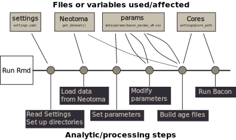

 [](https://www.tidyverse.org/lifecycle/#experimental)  [](https://travis-ci.org/NeotomaDB/bulk-baconizing) [](https://nsf.gov/awardsearch/showAward?AWD_ID=1550707) [](https://nsf.gov/awardsearch/showAward?AWD_ID=1241868) [](https://nsf.gov/awardsearch/showAward?AWD_ID=1740694)


# Bulk Baconizing

For cases where a large number of records need to be processed using Bacon, this repository serves as a template to generate the required age files in an organized fashion.  It provides default parameters for initial runs, and provides a tracking module to indicate whether any issues were encountered in the construction of the geochronological table.

## Contributions

Please note that this project is released with a [Contributor Code of Conduct](CODE_OF_CONDUCT.md). By participating in this project you agree to abide by its terms.

*   [Simon Goring](http://goring.org) [](https://orcid.org/0000-0002-2700-4605)
*   Andria Dawson
*   Allison Stegner [](https://orcid.org/0000-0002-1412-8203)
*   Yue Wang [](https://orcid.org/0000-0002-9826-3276)

## Maintenance Files

### Continuous Integration and Quality Assurance

`.travis.yaml`, `Makefile` and `DESCRIPTION` are used to integrate this repository with the [Travis Continuous Integration](https://travis-ci.org/) platform.  You can keep these files, or not, but they are required to support a process in which each new commit to the master branch is independently loaded in a virtual machine hosted by Travis.  For more on the use of [Continuous Integration](https://en.wikipedia.org/wiki/Continuous_integration) with RMarkdown, please visit the post [Adding CI to RMarkdown Documents](http://www.goring.org/resources/Adding_CI_To_RMarkdown.html).

### Organizational Files

The files `CODE_OF_CONDUCT.md`, the `LICENSE` file and this `README.md` file are part of best practices for public code.  The [Code of Conduct](https://help.github.com/articles/adding-a-code-of-conduct-to-your-project/) helps define how we as an organization expect to be treated and defines how we should aspire to treat others.  It also governs how individuals who interact with this repository and others should expect to be treated, and should treat others.

The `LICENSE` file uses an MIT license.  This license is a permissive license with conditions only requiring preservation of copyright and license notices.  Neotoma is funded by the National Sciences Foundation.  Neotoma maintains a [Data Policy](https://www.neotomadb.org/data/category/use) that governs the use of data from the Database itself.

The `.gitignore` file is used to ensure that local files on the developers' systems do not clutter the master repository.

## How to Use This Repository

This is intended to be used as a template for users, and not as a solution in and of itself.  The process for generating chronologies is itterative, as such, the use of this Rmd script is intended to be an itterative process, whereby you select sites, run Bacon, revise parameters and run the script again.  Each itteration will involve modifying the parameters file, and also the `settings.yaml` file.  Please be sure to check carefully as you do this.  Errors may result in long wait times, or runs that provide no new useful information.



The key steps of the workflow process are:

1.  Running the Rmd file.
2.  Reading in the `settings.yaml` file.
3.  Loading data from Neotoma using the [`neotoma` package](http://github.com/ropensci/neotoma).
4.  Setting default parameters for the Bacon runs (accumulation rates, memory, etc.)
5.  Updating parameters based on past runs (if you have files with alternate settings)
6.  Building age files based on chronological controls from Neotoma
7.  Running Bacon

The implied final step in this process would be modifying the settings file after the first run of this workflow, and adjusting the the parameters in the parameters file generated by the run, to ensure that the Bacon runs for each core reflect the best possible age models.  When the Rmd is re-run with the `settings.yaml` and parameters file adjusted (see Rmd for details), it is possible to do runs faster, since the script is set to run only core that do not have successful runs, so it is possible to tinker with the settings for one or a few cores, while leaving the rest unchanged.

### Running with RStudio

Open the file using RStudio and click the `knit` button.


### Running from the command line

Navigate to the working directory and execute the command:

```
Rscript -e "rmarkdown::render('bulk_baconizing.Rmd')
```

## Feedback, Suggestions and Comments

Please use the [issue tracker](https://github.com/neotomadb/bulk-baconizing/issues) or email a package maintainer directly.


