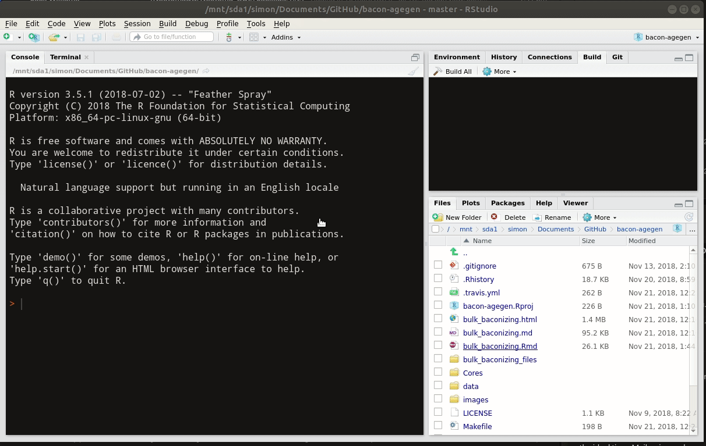

 [](https://www.tidyverse.org/lifecycle/#experimental)

# Bulk Baconizing

For cases where a large number of records need to be processed using Bacon, this repository serves as a template to generate the required age files in an organized fashion.  It provides default parameters for initial runs, and provides a tracking module to indicate whether any issues were encountered in the construction of the geochronological table.

## Contributions

Please note that this project is released with a [Contributor Code of Conduct](CODE_OF_CONDUCT.md). By participating in this project you agree to abide by its terms.

*   [Simon Goring](http://goring.org) [](https://orcid.org/0000-0002-2700-4605)
*   Andria Dawson
*   Allison Stegner [](https://orcid.org/0000-0002-1412-8203)
*   Yue Wang

## How to Use

This is intended to be used as a template for users, and not as a solution in and of itself.  The process for generating chronologies is itterative.  The use of this Rmd script is intended to be an itterative process, whereby you select sites, run Bacon, revise parameters and run the script again.  Each itteration will involve modifying the parameters file, and also the `settings.yaml` file.  Please be sure to check carefully as you do this.  Errors may result in long wait times, or runs that provide

### Running with RStudio

Open the file using RStudio and click the `knit` button.



### Running from the command line

Navigate to the working directory and execute the command:

```
Rscript -e "rmarkdown::render('bulk_baconizing.Rmd')
```

## Feedback, Suggestions and Comments

Please use the [issue tracker](https://github.com/neotomadb/bulk-baconizing/issues) or email a package maintainer directly.
