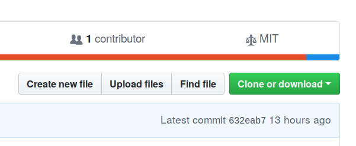

```{r setup, include=FALSE}
knitr::opts_chunk$set(echo = TRUE)
```

## Introduction

Over the course of working with the Neotoma Paleoecology Database [@williams2017neotoma] and the age modeling software Bacon [@blaauw2011flexible] it has often become neccessary to run a large number of Bacon models in an itterative process (for example the [Stepps-Baconizing GitHub repository](https://github.com/PalEON-Project/stepps-baconizing)).  The process of building and re-building a large number of age models is often complicated and can result in a large amount of code.  This code might involve fine-tuning results for single sites, using information from multiple runs, the generation of multiple data files and a set of R code that can span hundreds of lines.

This repository makes use of experience obtained in working through several projects [@kujawa2016theeffect;@dawson2016quantifying], and uses data from several projects as the basis for establishing certain prior values.  We make an effort in this document to clearly explain the steps neccessary to undertake such a project in a fairly straightforward manner.

### The workflow

The general workflow is encoded in this current document, which knits together descriptive text and R commands ([read more about RMarkdown documents](https://bookdown.org/yihui/rmarkdown/)).  This document is intended to provide context but to also operate as a stand-alone tool to generate a number of age records.  The R code embedded in the `Rmd` file does the following:

1.  Read a set of pre-defined settings and load the neccessary R libraries.
2.  Fetch a set of datasets from Neotoma and download the relevant records.
3.  Generate a table with default parameters for Bacon.
4.  Given any prior information from the user, optionally adjust site-level default parameters for thickness, accumulation rates, etc.
5.  For each dataset with sufficient chronological information, write the neccessary files to a core folder, along with relevant core depths.
6.  For each core with a sufficient number of chronological controls, run Bacon.
7.  Write the ghost plots to file and produce a table of posterior estimates for each depth.

This code is provided as an RMarkdown document, to help guide the user, and it can support extensive customization if a user chooses to make changes anywhere in the code.

### Executing the code

Many people working with R may choose to use RStudio.  If you are using RStudio you can customize elements of this document (for example, removing this header information) and then use the *knit* button to compile the document into an HTML document, while generating the neccessary output files.

Users who use the R Console without any other editor can move to the appropriate working directory (using `setwd()`) and then run the entire document using the following command:

```R
library(rmarkdown)
render('bulk_baconizing.Rmd')
```

This can be shortened to: `rmarkdown::render('bulk_baconizing.Rmd')`.  Similarly, if you wish to execute the code from a console or terminal you can navigate to the working directory and execute the following:

```bash
Rscript -e "rmarkdown::render('bulk_baconizing.Rmd')"
```

Note the use of two different quotations.  The inner and outer quotations must be different (e.g., double on the outside, single on the inside, or *vice versa*).  Whether you customize the code, or choose to run it as is (for just the US state of Michigan), these three methods of executing the code are your main options.

### Providing Feedback

If, in any place instructions are not clear or more details are required please feel free to contact us by either [raising a GitHub Issue for this repository](https://github.com/neotomadb/bulk-baconizing), or by mailing me directly at [goring@wisc.edu](mailto:goring@wisc.edu).

## Setting up the System

### Getting Started

There are several ways of working with this code base. If you are not familiar with [Github](http://github.com) and wish to run the code locally, navigate to the [GitHub repository for this project](http://github.com/NeotomaDB/bulk_baconizing), and click the green **Clone or download** button.  From there, select **Download ZIP**.



If you are familiar with GitHub and wish to use `git` as part of your workflow then you can also choose to clone the repository.  To do this, you can either [fork the repository](https://help.github.com/articles/fork-a-repo/), which would make a copy of it under your own personal GitHub account, or you can clone it directly and [make a new branch](https://git-scm.com/book/en/v2/Git-Branching-Basic-Branching-and-Merging).

In either case, if you make changes to the repository that are specific to your application, that's great!  If you make changes that are possibly of note to all users, consider making a [pull request](https://help.github.com/articles/about-pull-requests/).  We welcome all contributions.

### Defining Your Settings

Because there are a number of elements to this project, it was decided to place some of the main elements into a single, easy to use file.  The project stores these settings in the parent directory in a file called `settings.yaml`.  By default these settings are:

```{r settings_file, echo=FALSE}
cat(paste0(readLines('settings.yaml'), '\n'))
```

A `yaml` file is a special kind of markup that uses a `key`: `value` pairing, with `#` to indicate a comment.  We assign parameters to the various keys here so that we can define the behaviour of the model runs.  In the following section we explain each parameter and its behaviour:

*   `clean_run`: (default `true`) Should we clear all the files and parameters and start from scratch? Can take either `true` or `false`.

*   `version`: (default `1`) The use of a version key allows you to keep track of your Bacon parameters if, over the course of a project, you make changes in your choices about how you want to run your analysis.  If the version number changes a new parameter file will be generated.  You can assign any value to this parameter.

*   `reset_parameters`: (default `true`) Bulk generation of chronologies is an itterative process.  In general default parameters will be set, and then, over the course of running bacon, parameters for individual cores might be changed.  In the initial stages it might be worth modifying all default values in the code below and then setting `reset_parameters` to `true` so that the full table is re-written.  Otherwise, edit the value to `false` so that the table is not overwritten each time the scripts are run.

*   `core_path`: (default `Cores/`) Bacon needs to output files to a particular location, this tells Bacon where core files will be stored.  You can use any directory in your working folder but that directory must exist.

*   `date`: (default `today`) In cases where files might be overwritten, the default is to overwrite but store the old file with a date-stamp.  The default is to use the current date, but it might be that you want to associate a date stamp with a particular version.  In that case you can change the setting from `today` (which will use the current date) to a date of format `YYYY-MM-DD`.

*   `modern`: (default `true`) In Goring et al (2012) and elsewhere it is shown that modern sediment often has a higher accumulation rate than earlier sediment.  One solution is to initiate an instantaneous hiatus at an identified "settlement" horizon, and then set the accumulation rate of the upper sediment to a higher `acc.mean` rate.  If `modern` is set to `true`, the program will place a hiatus at the modern horizon.  If `false` it will not.

*   `thickness`: (default `false`) There is a file included in the repository called `data/paleon_thick.csv`, however, it may be the case that in previous runs you have adjusted thickness values.  For example, in `version` 2 of your runs you could point to the `params` file generated in version 1 by pointing to `data/params/bacon_params_v1.csv`.  If you modify thicknesses you must also modify the content of the chunk `prior_thickness` below, so that you point to the correct thickness and dataset ID columns.

*   `settlement`: (default `false`) In Kujawa et al (2017) and in Dawson et al (2018) an expert-assessment exercise was undertaken to evaluate the presence and location of biostratigraphic markers for Euro-American settlement in the Upper Midwestern United States.  This file is included for reference.  With columns indicating `datasetid` and `depth`, if the parameter is set to a file location, such as `data/expert_assessment.csv`, then any indicator of Settlement will be revised, otherwise (e.g., `settlement: false`) the chronological controls for the records will remain as-is.

*   `accumulation`: (default `false`) Similar to thickness, if modifications have been made to accumulation rates, a file can be defined here.

*   `parallel`: (default `true`) Should the code try to run Bacon in parallel?  This is either the value `false` or the maximum number of cores to attempt (e.g., `3`).  This means it is possible to run your script on fewer cores than your system has available to allow you to continue work on other projects.  The code used in this script uses the `mclapply()` function, which means that the parallel operations, which use [parallel forking in R](https://garthtarr.com/parallel-computation-in-r/), are not available for Windows systems.

#### Modifying the Settings

Throughout your workflow you will likely change some of these settings.  For example, if you are changing the search parameters for your dataset search, you may want to keep some prior information, but increment the `version`, or set `clean_run` to `true`, however, as you begin fine tuning your results, you will want to set `clean_run` back to `false`, and `reset_parameters` to `false` as well.  This will prevent unneccessary errors, and reduce the amount of time required for the runs to complete, since it will accept completed runs and not attempt to re-run them.

```{r setup_runs, echo=TRUE, results='hide', message=FALSE, warning=FALSE}
source('R/setup_runs.R', echo=FALSE, verbose=FALSE)
```

There are a number of libraries used in this project.  It is likely that you may be missing one or several.  If this is the case you might be interested in [this bash script](https://gist.github.com/SimonGoring/fe3b0bf6b4cb9b8f0a2aa6cdce10bb29) for Mac or Linux.  You may also be interested in the [autoinst package for R](https://github.com/jimhester/autoinst). Otherwise, take some time to look at `R/setup_runs.R` and ensure you install all packages listed.

## Getting Core Data

Here we download the sedimentary data.  The key component here is the `get_dataset()` function.  The newest version of `neotoma` (version >= 1.7.3) allows a user to pass in a vector of dataset IDs, so you can either get datasets using a set of parameters in the `get_dataset()` function (see [help for the get_dataset() function](https://www.rdocumentation.org/packages/neotoma/versions/1.7.0/topics/get_dataset)), or you can pass in a vector of dataset IDs (for example, if you've already picked a set of sites to be examined).  In this example I am using the state, Michigan, as my search parameter:

```{r datasets_and_downloads, echo=TRUE, results='hide', message=FALSE, warnings=FALSE}
# Define using state names here.  Could also use altitudes, locations,
#  dataset types. . .

dataset_list <- get_dataset(datasettype='pollen',
                            gpid = c('Michigan','Wisconsin','Minnesota'),
                            ageyoung=0)

#  The load_downloads() function will download the datasets if either:
#  there is not currently a downloaded object saved with the same dataset version
#  or the setup parameter is TRUE, which calls for the whole data file to be re-written.

downloads <- load_downloads(dataset_list,
                            version = settings$version,
                            setup = settings$clean_run)

```

It might be the case that you want to do further validation on samples based on parameters in the `downloads` object (*e.g.*, only sites with a certain taxon).  The downloads are required for the generation of the core depths file used by Bacon.  If you want to further adjust the records, do so with the dataset object, not the `downloads`.  For example, you can remove elements of a list by setting them to `NULL`, so if you know you want to remove the dataset in the 5th position, you could assign `dataset_list[[5]] <- NULL`.  You would then need to re-run `load_downloads()` and ensure that `setup` was `TRUE` in `load_downloads()`:

```r
# This code is not run:

dataset_list <- get_dataset(gpid = 'Michigan')

# Only accept sites with a site description:

for (i in length(dataset_list):1) {
  if (is.na(dataset_list[[i]]$site$description)) {
    dataset_list[[i]] <- NULL
  }
}

# We would go from approximately 810 datasets to 502.

downloads <- load_downloads(dataset_list,
                            version = settings$version,
                            setup = TRUE)
```

## Parameters

The Baconizing tool records parameters in a parameter `data.frame` called `params`.  This `data.frame` is generated and the saved to file to ensure that errors in the Bacon run do not affect any information stored in the parameters.  The `data.frame` includes a number of columns.

One unique element in this workflow is the use of two accumulation rates, one identified as `mod` and one identified as `old`.  This comes from work by Goring et al. [-@goring2012deposition] and Dawson et al [-@dawson2016quantifying] who identifiy a break in accumulation rates at or around a European settlement horizon.  This treatment of modern sediments is the default, however, the `modern` flag in the `settings.yaml` file can be set to `false` if you do not wish to use these modern/historical settings.

| Column | Default | Purpose |
| -------- | -------- | ---------------------------------------------------- |
| handle | none | The unique text identifer for the dataset collection unit. |
| datasetid | none | The unique dataset identifier. |
| acc.mean.mod | 3.02 | Accumulation rate for *modern* sediment (above an identified Settlement Horizon).  If the `settings.yaml` flag `modern` is set to `false` this will be the same as `acc.mean.old`. |
| acc.mean.old | 15 | Accumulation rate for sediment if no horizon is identified, or the `modern` flag is set to `false`. |
| acc.shape.mod | 0.53 | Shape parameter for modern sediment (as above). |
| acc.shape.old | 0.9 | Shape parameter for sediement (as above). |
| mem.strength | 2 | Memory (accumulation autocorrelation parameter) |
| mem.mean | 0.5 | Mean value for memory. |
| hiatus | NA | Location of a hiatus, either set at settlement, or a known hiatus. |
| thick | 5 | Section thickness (cm) to be used by Bacon. |
| age.type | NA | From the dataset, what is the original age type for the core chronology. |
| run |  NA | Has the model been run by Bacon? |
| suitable | NA | Is the model suitable for a Bacon run? |
| ndates | NA | How many dates are used in the chronology? |
| success | NA | Did Bacon run and return a result successfully? |
| notes | `.` | Any notes associated with the run. |

Any of these parameters can be changed simply by altering the values in the code below before running the document.  If you have already run the document using a set of parameters and decide to change defaults, you can either change the `version` in `settings.yaml` or choose to set `reset_parameters` to `true`.

```{r create_params, echo=TRUE, warning=FALSE}

existing_params <- file.exists(paste0('data/params/bacon_params_v', settings$version, '.csv'))

if ((!existing_params) | settings$reset_parameters == TRUE) {

  message("Writing a new parameters file.")

  if (existing_params) {
    file.copy(paste0('data/params/bacon_params_v', settings$version, '.csv'),
              paste0('data/params/bacon_params_v', settings$version, '_', lubridate::round_date(lubridate::now("UTC"), unit="day"),'.csv'))
  }
  ds_handles <- sapply(dataset_list, function(x) { x$dataset.meta$collection.handle })
  ds_ids <- as.integer(sapply(dataset_list, function(x) { x$dataset.meta$dataset.id }))

  params <- data.frame(handle = ds_handles,
                       datasetid = ds_ids,
                       acc.mean.mod = 3.02,
                       acc.mean.old = 15.,
                       acc.shape.mod = 0.53,
                       acc.shape.old = 0.9,
                       mem.strength = 2.,
                       mem.mean = 0.5,
                       hiatus = as.numeric(NA),
                       thick = 5.,
                       age.type = as.character(NA),
                       run = FALSE,
                       suitable = NA,
                       ndates = as.integer(NA),
                       success = NA,
                       reliableold = NA,
                       reliableyoung = NA,
                       notes = ".",
                       stringsAsFactors = FALSE)

  default <- params

  readr::write_csv(x = params,
                   path = paste0('data/params/bacon_params_v', settings$version, '.csv'))
} else {
  params <- readr::read_csv(paste0('data/params/bacon_params_v', settings$version, '.csv'),
                            col_types = paste0(c('c','i', rep('n',8),'c', 'l','l','i','l','c'), collapse=''))
}

```

### Prior thicknesses

In the case that there has been a prior run or some prior assessment of thicknesses the user should set the `thickness` value of `settings.yaml` to point to the correct file location.  Otherwise the value should be set to `false`.

```{r prior_thickness, echo = TRUE, results = 'asis'}

if(is.null(settings$thickness) | settings$thickness == FALSE | "character" %in% class(settings$thickness)) {

  if ("character" %in% class(settings$thickness)) {
    if (file.exists(settings$thickness)) {
      params <- add_thickness(file = settings$thickness,
                              id_col = 1,
                              thick_col = 4,
                              parameters = params)
        readr::write_csv(x = params,
                   path = paste0('data/params/bacon_params_v', settings$version, '.csv'))

    } else {
      stop("The file defined in `settings.yaml` does not exist.")
    }
  } else {
    message("No thickness file is defined.")
  }
} else {
  stop("The setting for thickness in `settings.yaml` is not set correctly.")
}

```

### Prior accumulations

In the case that there has been a prior run or some prior assessment of accumulation rates the user should set the `accumulation` value of `settings.yaml` to point to the correct file location.  Otherwise the value should be set to `false`.

```{r prior_accumulation, echo = TRUE, results = 'asis'}

if(is.null(settings$accumulation) | settings$accumulation == FALSE | "character" %in% class(settings$accumulation)) {

  if ("character" %in% class(settings$accumulation)) {
    if (file.exists(settings$accumulation)) {
      params <- add_accumulation(file = settings$accumulation,
                              id_col = 1,
                              accum_col = 4,
                              parameters = params)
    } else {
      stop("The file defined in `settings.yaml` does not exist.")
    }
  } else {
    message("No accumulation file is defined.")
  }
} else {
  stop("The setting for accumulations in `settings.yaml` is not set correctly.")
}

```

## Add Core Files

Here we begin to generate the `csv` files for the cores to allow Bacon to run.  This requires calling Neotoma's API and then resolving the return so that it is turned into a `csv`.  There are several decisions that go into the construction of the CSV file.  These decisions are documented both using the `notes` column of the parameter file, and also commented in the file `R/build_agefiles.R`.  The main decisions are:

1.  Given the age model precedence for chronologies in Neotoma (*Calendar years BP > Calibrated radiocarbon years BP > Varve years BP > Calendar years BP (Ma) > Radiocarbon years BP*), always choose the chronological controls used for the "best" age type.  **This is the default and no message is raised in the `notes` field**.
2.  Given that each age type has a default model, choose the chronologies used in the default model for the best age type. **This is the default and no message is raised in the `notes` field**.
3.  In cases where a chronology exists for the best age type, but there is no assigned default model, choose the chonology that is most recent, based either on creation date or chronology id. **Raises a message in `notes`**
4.  In cases where a chronology exists for the best age type, but there are multiple assigned default model, choose the chonology that is most recent, based either on creation date or chronology id. **Raises a message in `notes`**

```{r write_agefiles, echo = TRUE, results='hide'}

ageorder <- get_table('agetypes')

for (i in 1:nrow(params)) {

  params[i, ] <- build_agefiles(param = params[i,],
                                ageorder = ageorder,
                                datasets = dataset_list,
                                downloads = downloads,
                                settings = settings)
  readr::write_csv(x = params,
                 path = paste0("data/params/bacon_params_v", settings$version, ".csv"))

}

```

## Possible warnings raised

The script is set up so that places where there is an objective choice, a clear notation of that choice is made and added to the parameter file's `notes` column as a semi-colon separated list.  In addition to notes regarding the choice of age file, notes are also raised if:

*   There are significantly high accumulation rates (more than 100yr/cm)
*   There are adjusted indicators for Euro-american settlement (defined in a file reported in `settings.yaml`.)
*   If there is a core top with missing age information (age is assigned `-60`, to be adjusted by the user).
*   If there are no uncertainty constraints on an age that is not associated with geochronological information (uncertainties are assigned to `0`).
*   If the chronological control is not associated with a geochronological object and comes from an age estimate such as `Guess`, or `Deglaciation` (age is dropped)
*   If a geochronological object does not have a proper lab ID associated with it.
*   If the geochronological object has a NULL age.
*   If a 210Pb age has an assigned age greater than 500 (may have been assigned years AD/BC)
*   If there was no uncertainty associated with a 210Pb age.
*   If there was no uncertainty associated with a geochronological age other than 210Pb.
*   If there is only one chronological constraint.
*   If core files already existed in the `Cores` directory associated with the record.
*   If for one reason or another something prevented the core file from being written.

## Running Bacon

The final step, once all the files have been written, is to run Bacon.  Using the `rbacon` package we can simplify everything:

```{r baconruns, eval=TRUE, results="hide", messages = FALSE, warning=FALSE, fig.show="hide"}
params <- run_batch(params, settings = settings)
readr::write_csv(x = params,
                 path = paste0("data/params/bacon_params_v", settings$version, ".csv"))
```

The ultimate product here is a Cores directory with a folder for each dataset that generates a suitable chronology for Bacon, a parameters file (in `data/params/`) that records the parameters used in the Bacon model, along with any notes about elements that may have been changed or were of note in the Bacon runs.

A file has been added to the standard Bacon output.  In each directory the file **`handle`**`_XXX_posteriorout.csv` represents draws from the posterior provided by Bacon.  You will see NAs in this result (but not in the Bacon `ages` file)

## Run Summary

### Success / Failure

```{r svg_box, echo=FALSE, result="as-is"}

success <- round(sum(params$success == 1, na.rm=TRUE) / length(dataset_list) * 400, 0)
fail <- round((1 - sum(params$success == 1, na.rm=TRUE) / length(dataset_list)) * 400, 0)

htmltools::HTML(paste0('<svg width="400" height="110">
 <rect y="0" x="0" width="',success,'" height="100" style="fill:rgb(102,102,255);stroke-width:1;stroke:rgb(0,0,0)" />
 <rect y="0" x="',success,'" width="',fail,'" height="100" style="fill:rgb(255,153,153);stroke-width:1;stroke:rgb(0,0,0)" />
</svg>'))

```

Here we summarize some elements of the run that was conducted with this document:

*   Number of datasets obtained from Neotoma: `r length(dataset_list)`
*   Number of sites with suitable chronologies: `r sum(params$suitable == 1, na.rm=TRUE)`
*   Number of sites with Bacon runs: `r sum(params$run == 1, na.rm=TRUE)`
*   Number of sites with successful Bacon runs: `r sum(params$success == 1, na.rm=TRUE)`

### All Dataset Notes

This interactive table allows you to page through your records for each site to examine the notes associated with each record.  You can use the filters at the bottom of the table to search for individual records, or certain fields.  The dataset IDs link to [Neotoma Explorer](http://apps.neotomadb.org/Explorer) and can be used to investigate sites further.

```{r echo=FALSE}
params %>%
  filter((!notes == ".")) %>%
  select(handle, datasetid, suitable, run, success, notes) %>%
  mutate(notes = stringr::str_replace_all(notes, ";", "\\n")) %>%
  mutate(datasetid = paste0("<a href=http://apps.neotomadb.org/explorer/?datasetid=", datasetid, " target='_blank'>",datasetid,"</a>")) %>%
  DT::datatable(filter = "bottom", escape = FALSE)

```

### Successful Runs

```{r echo=FALSE}
params %>%
  filter(success == 1) %>%
  select(handle, datasetid, reliableyoung, reliableold, notes) %>%
  mutate(notes = stringr::str_replace_all(notes, ";", "\\n")) %>%
  mutate(datasetid = paste0('<a href=http://apps.neotomadb.org/explorer/?datasetid=', datasetid, ' target="_blank">',datasetid,'</a>')) %>%
  DT::datatable(filter = 'bottom', escape = FALSE)

```

## References
