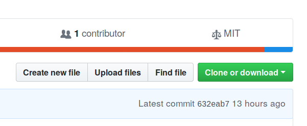

## Introduction

Over the course of working with the Neotoma Paleoecology Database [@williams2017neotoma] and the age modeling software Bacon [@blaauw2011flexible] it has often become neccessary to run a large number of Bacon models in an itterative process (for example the [Stepps-Baconizing GitHub repository](https://github.com/PalEON-Project/stepps-baconizing)).  The process of building and re-building a large number of age models is often complicated and can result in a large amount of code.  This code might involve fine-tuning results for single sites, using information from multiple runs, the generation of multiple data files and a set of R code that can span hundreds of lines.

This repository makes use of experience obtained in working through several projects [@kujawa2016theeffect;@dawson2016quantifying], and uses data from several projects as the basis for establishing certain prior values.  We make an effort in this document to clearly explain the steps neccessary to undertake such a project in a fairly straightforward manner.

### The workflow

The general workflow is encoded in this current document, which knits together descriptive text and R commands ([read more about RMarkdown documents](https://bookdown.org/yihui/rmarkdown/)).  This document is intended to provide context but to also operate as a stand-alone tool to generate a number of age records.  The R code embedded in the `Rmd` file does the following:

1.  Read a set of pre-defined settings and load the neccessary R libraries.
2.  Fetch a set of datasets from Neotoma and download the relevant records.
3.  Generate a table with default parameters for Bacon.
4.  Given any prior information from the user, optionally adjust site-level default parameters for thickness, accumulation rates, etc.
5.  For each dataset with sufficient chronological information, write the neccessary files to a core folder, along with relevant core depths.
6.  For each core with a sufficient number of chronological controls, run Bacon.
7.  Write the ghost plots to file and produce a table of posterior estimates for each depth.

This code is provided as an RMarkdown document, to help guide the user, and it can support extensive customization if a user chooses to make changes anywhere in the code.

### Executing the code

Many people working with R may choose to use RStudio.  If you are using RStudio you can customize elements of this document (for example, removing this header information) and then use the *knit* button to compile the document into an HTML document, while generating the neccessary output files.

Users who use the R Console without any other editor can move to the appropriate working directory (using `setwd()`) and then run the entire document using the following command:

```R
library(rmarkdown)
render('bulk_baconizing.Rmd')
```

This can be shortened to: `rmarkdown::render('bulk_baconizing.Rmd')`.  Similarly, if you wish to execute the code from a console or terminal you can navigate to the working directory and execute the following:

```bash
Rscript -e "rmarkdown::render('bulk_baconizing.Rmd')"
```

Note the use of two different quotations.  The inner and outer quotations must be different (e.g., double on the outside, single on the inside, or *vice versa*).  Whether you customize the code, or choose to run it as is (for just the US state of Michigan), these three methods of executing the code are your main options.

### Providing Feedback

If, in any place instructions are not clear or more details are required please feel free to contact us by either [raising a GitHub Issue for this repository](https://github.com/neotomadb/bulk-baconizing), or by mailing me directly at [goring@wisc.edu](mailto:goring@wisc.edu).

## Setting up the System

### Getting Started

There are several ways of working with this code base. If you are not familiar with [Github](http://github.com) and wish to run the code locally, navigate to the [GitHub repository for this project](http://github.com/NeotomaDB/bulk_baconizing), and click the green **Clone or download** button.  From there, select **Download ZIP**.



If you are familiar with GitHub and wish to use `git` as part of your workflow then you can also choose to clone the repository.  To do this, you can either [fork the repository](https://help.github.com/articles/fork-a-repo/), which would make a copy of it under your own personal GitHub account, or you can clone it directly and [make a new branch](https://git-scm.com/book/en/v2/Git-Branching-Basic-Branching-and-Merging).

In either case, if you make changes to the repository that are specific to your application, that's great!  If you make changes that are possibly of note to all users, consider making a [pull request](https://help.github.com/articles/about-pull-requests/).  We welcome all contributions.

### Defining Your Settings

Because there are a number of elements to this project, it was decided to place some of the main elements into a single, easy to use file.  The project stores these settings in the parent directory in a file called `settings.yaml`.  By default these settings are:

#  Should the program remove any existing files in the Cores directory and start again?
 clean_run: true
 
 #  What version of the run is this?  This will create a new parameters file if none exists.
 version: 1
 
 # If a parameters file exists with the current version number should that file overwritten?
 reset_parameters: true
 
 # Where will the Bacon core files go?
 core_path: 'Cores'
 
 #  For any records with assigned dates, what date should be used (either 'YYYY-MM-DD' or 'today')
 date: 'today'
 
 # Use modern hiatus break:
 modern: true
 
 # Prior thickness
 thickness: data/paleon_thick.csv
 
 # Settlement indicators
 settlement: data/expert_assessment.csv
 
 # In some work we have assignments for accumulation rates set as defauly.  Others may not.
 accumulation: false
 
 # How many processing cores should be used.
 parallel: 3

A `yaml` file is a special kind of markup that uses a `key`: `value` pairing, with `#` to indicate a comment.  We assign parameters to the various keys here so that we can define the behaviour of the model runs.  In the following section we explain each parameter and its behaviour:

*   `clean_run`: (default `true`) Should we clear all the files and parameters and start from scratch? Can take either `true` or `false`.

*   `version`: (default `1`) The use of a version key allows you to keep track of your Bacon parameters if, over the course of a project, you make changes in your choices about how you want to run your analysis.  If the version number changes a new parameter file will be generated.  You can assign any value to this parameter.

*   `reset_parameters`: (default `true`) Bulk generation of chronologies is an itterative process.  In general default parameters will be set, and then, over the course of running bacon, parameters for individual cores might be changed.  In the initial stages it might be worth modifying all default values in the code below and then setting `reset_parameters` to `true` so that the full table is re-written.  Otherwise, edit the value to `false` so that the table is not overwritten each time the scripts are run.

*   `core_path`: (default `Cores/`) Bacon needs to output files to a particular location, this tells Bacon where core files will be stored.  You can use any directory in your working folder but that directory must exist.

*   `date`: (default `today`) In cases where files might be overwritten, the default is to overwrite but store the old file with a date-stamp.  The default is to use the current date, but it might be that you want to associate a date stamp with a particular version.  In that case you can change the setting from `today` (which will use the current date) to a date of format `YYYY-MM-DD`.

*   `modern`: (default `true`) In Goring et al (2012) and elsewhere it is shown that modern sediment often has a higher accumulation rate than earlier sediment.  One solution is to initiate an instantaneous hiatus at an identified "settlement" horizon, and then set the accumulation rate of the upper sediment to a higher `acc.mean` rate.  If `modern` is set to `true`, the program will place a hiatus at the modern horizon.  If `false` it will not.

*   `thickness`: (default `false`) There is a file included in the repository called `data/paleon_thick.csv`, however, it may be the case that in previous runs you have adjusted thickness values.  For example, in `version` 2 of your runs you could point to the `params` file generated in version 1 by pointing to `data/params/bacon_params_v1.csv`.  If you modify thicknesses you must also modify the content of the chunk `prior_thickness` below, so that you point to the correct thickness and dataset ID columns.

*   `settlement`: (default `false`) In Kujawa et al (2017) and in Dawson et al (2018) an expert-assessment exercise was undertaken to evaluate the presence and location of biostratigraphic markers for Euro-American settlement in the Upper Midwestern United States.  This file is included for reference.  With columns indicating `datasetid` and `depth`, if the parameter is set to a file location, such as `data/expert_assessment.csv`, then any indicator of Settlement will be revised, otherwise (e.g., `settlement: false`) the chronological controls for the records will remain as-is.

*   `accumulation`: (default `false`) Similar to thickness, if modifications have been made to accumulation rates, a file can be defined here.

*   `parallel`: (default `true`) Should the code try to run Bacon in parallel?  This is either the value `false` or the maximum number of cores to attempt (e.g., `3`).  This means it is possible to run your script on fewer cores than your system has available to allow you to continue work on other projects.  The code used in this script uses the `mclapply()` function, which means that the parallel operations, which use [parallel forking in R](https://garthtarr.com/parallel-computation-in-r/), are not available for Windows systems.

#### Modifying the Settings

Throughout your workflow you will likely change some of these settings.  For example, if you are changing the search parameters for your dataset search, you may want to keep some prior information, but increment the `version`, or set `clean_run` to `true`, however, as you begin fine tuning your results, you will want to set `clean_run` back to `false`, and `reset_parameters` to `false` as well.  This will prevent unneccessary errors, and reduce the amount of time required for the runs to complete, since it will accept completed runs and not attempt to re-run them.


```r
source('R/setup_runs.R', echo=FALSE, verbose=FALSE)
```

There are a number of libraries used in this project.  It is likely that you may be missing one or several.  If this is the case you might be interested in [this bash script](https://gist.github.com/SimonGoring/fe3b0bf6b4cb9b8f0a2aa6cdce10bb29) for Mac or Linux.  You may also be interested in the [autoinst package for R](https://github.com/jimhester/autoinst). Otherwise, take some time to look at `R/setup_runs.R` and ensure you install all packages listed.

## Getting Core Data

Here we download the sedimentary data.  The key component here is the `get_dataset()` function.  The newest version of `neotoma` (version >= 1.7.3) allows a user to pass in a vector of dataset IDs, so you can either get datasets using a set of parameters in the `get_dataset()` function (see [help for the get_dataset() function](https://www.rdocumentation.org/packages/neotoma/versions/1.7.0/topics/get_dataset)), or you can pass in a vector of dataset IDs (for example, if you've already picked a set of sites to be examined).  In this example I am using the state, Michigan, as my search parameter:


```r
# Define using state names here.  Could also use altitudes, locations,
#  dataset types. . .

dataset_list <- get_dataset(datasettype='pollen',
                            gpid = c('Michigan', 'Wisconsin', 'Minnesota'),
                            ageyoung=0)

#  The load_downloads() function will download the datasets if either:
#  there is not currently a downloaded object saved with the same dataset version
#  or the setup parameter is TRUE, which calls for the whole data file to be re-written.

downloads <- load_downloads(dataset_list,
                            version = settings$version,
                            setup = settings$clean_run)
```

```
## Warning: 
## There were multiple entries for Eucalyptus suspension 
## get_download has mapped aliases for the taxa in the taxon.list.
```

```
## Warning in FUN(X[[i]], ...): This dataset has no defined default chronology.  Please use caution.
## Using the first chronology, NAPD 1 as the default.
```

```
## Warning: 
## There were multiple entries for Microsphere suspension 
## get_download has mapped aliases for the taxa in the taxon.list.

## Warning: 
## There were multiple entries for Microsphere suspension 
## get_download has mapped aliases for the taxa in the taxon.list.

## Warning: 
## There were multiple entries for Microsphere suspension 
## get_download has mapped aliases for the taxa in the taxon.list.
```

```
## Warning: 
## There were multiple entries for Eucalyptus suspension 
## get_download has mapped aliases for the taxa in the taxon.list.

## Warning: 
## There were multiple entries for Eucalyptus suspension 
## get_download has mapped aliases for the taxa in the taxon.list.
```

```
## Warning: 
## There were multiple entries for Unknown 
## get_download has mapped aliases for the taxa in the taxon.list.

## Warning: 
## There were multiple entries for Unknown 
## get_download has mapped aliases for the taxa in the taxon.list.
```

```
## Warning: 
## There were multiple entries for Eucalyptus suspension 
## get_download has mapped aliases for the taxa in the taxon.list.

## Warning: 
## There were multiple entries for Eucalyptus suspension 
## get_download has mapped aliases for the taxa in the taxon.list.
```

```
## Warning in FUN(X[[i]], ...): This dataset has no defined default chronology.  Please use caution.
## Using the first chronology, NAPD 1 as the default.
```

```
## Warning: 
## There were multiple entries for Microsphere suspension 
## get_download has mapped aliases for the taxa in the taxon.list.
```

```
## Warning: 
## There were multiple entries for Eucalyptus tablets 
## get_download has mapped aliases for the taxa in the taxon.list.
```

```
## Warning in FUN(X[[i]], ...): This dataset has no defined default chronology.  Please use caution.
## Using the first chronology, Almendinger 1992 as the default.
```

```
## Warning: 
## There were multiple entries for Eucalyptus suspension 
## get_download has mapped aliases for the taxa in the taxon.list.
```

```
## Warning: 
## There were multiple entries for Unknown 
## get_download has mapped aliases for the taxa in the taxon.list.
```

```
## Warning: 
## There were multiple entries for Eucalyptus suspension 
## get_download has mapped aliases for the taxa in the taxon.list.

## Warning: 
## There were multiple entries for Eucalyptus suspension 
## get_download has mapped aliases for the taxa in the taxon.list.
```

```
## Warning: 
## There were multiple entries for Microsphere suspension 
## get_download has mapped aliases for the taxa in the taxon.list.

## Warning: 
## There were multiple entries for Microsphere suspension 
## get_download has mapped aliases for the taxa in the taxon.list.
```

```
## Warning: 
## There were multiple entries for Eucalyptus suspension 
## get_download has mapped aliases for the taxa in the taxon.list.

## Warning: 
## There were multiple entries for Eucalyptus suspension 
## get_download has mapped aliases for the taxa in the taxon.list.

## Warning: 
## There were multiple entries for Eucalyptus suspension 
## get_download has mapped aliases for the taxa in the taxon.list.
```

```
## Warning: 
## There were multiple entries for Unknown 
## get_download has mapped aliases for the taxa in the taxon.list.
```

```
## Warning in FUN(X[[i]], ...): This dataset has no defined default chronology.  Please use caution.
## Using the first chronology, Almendinger 1992 as the default.
```

```
## Warning: 
## There were multiple entries for Eucalyptus suspension 
## get_download has mapped aliases for the taxa in the taxon.list.

## Warning: 
## There were multiple entries for Eucalyptus suspension 
## get_download has mapped aliases for the taxa in the taxon.list.
```

```
## Warning: 
## There were multiple entries for Microsphere suspension 
## get_download has mapped aliases for the taxa in the taxon.list.

## Warning: 
## There were multiple entries for Microsphere suspension 
## get_download has mapped aliases for the taxa in the taxon.list.

## Warning: 
## There were multiple entries for Microsphere suspension 
## get_download has mapped aliases for the taxa in the taxon.list.

## Warning: 
## There were multiple entries for Microsphere suspension 
## get_download has mapped aliases for the taxa in the taxon.list.
```

```
## Warning: 
## There were multiple entries for Unknown 
## get_download has mapped aliases for the taxa in the taxon.list.
```

```
## Warning: 
## There were multiple entries for Eucalyptus tablets 
## get_download has mapped aliases for the taxa in the taxon.list.
```

```
## Warning: 
## There were multiple entries for Microsphere suspension 
## get_download has mapped aliases for the taxa in the taxon.list.
```

```
## Warning: 
## There were multiple entries for Unknown 
## get_download has mapped aliases for the taxa in the taxon.list.
```

```
## Warning in FUN(X[[i]], ...): This dataset has no defined default chronology.  Please use caution.
## Using the first chronology, COHMAP chron 1 as the default.
```

```
## Warning: 
## There were multiple entries for Unknown 
## get_download has mapped aliases for the taxa in the taxon.list.
```

```
## Warning: 
## There were multiple entries for Microsphere suspension 
## get_download has mapped aliases for the taxa in the taxon.list.

## Warning: 
## There were multiple entries for Microsphere suspension 
## get_download has mapped aliases for the taxa in the taxon.list.
```

```
## Warning in FUN(X[[i]], ...): This dataset has no defined default chronology.  Please use caution.
## Using the first chronology, Almendinger 1992 as the default.
```

```
## Warning: 
## There were multiple entries for Dinoflagellata 
## get_download has mapped aliases for the taxa in the taxon.list.
```

```
## Warning: 
## There were multiple entries for Microsphere suspension 
## get_download has mapped aliases for the taxa in the taxon.list.
## There were multiple entries for Pollen concentration 
## get_download has mapped aliases for the taxa in the taxon.list.
## There were multiple entries for Eucalyptus tablets 
## get_download has mapped aliases for the taxa in the taxon.list.
```

```
## Warning: 
## There were multiple entries for Microsphere suspension 
## get_download has mapped aliases for the taxa in the taxon.list.

## Warning: 
## There were multiple entries for Microsphere suspension 
## get_download has mapped aliases for the taxa in the taxon.list.

## Warning: 
## There were multiple entries for Microsphere suspension 
## get_download has mapped aliases for the taxa in the taxon.list.

## Warning: 
## There were multiple entries for Microsphere suspension 
## get_download has mapped aliases for the taxa in the taxon.list.

## Warning: 
## There were multiple entries for Microsphere suspension 
## get_download has mapped aliases for the taxa in the taxon.list.

## Warning: 
## There were multiple entries for Microsphere suspension 
## get_download has mapped aliases for the taxa in the taxon.list.

## Warning: 
## There were multiple entries for Microsphere suspension 
## get_download has mapped aliases for the taxa in the taxon.list.

## Warning: 
## There were multiple entries for Microsphere suspension 
## get_download has mapped aliases for the taxa in the taxon.list.

## Warning: 
## There were multiple entries for Microsphere suspension 
## get_download has mapped aliases for the taxa in the taxon.list.

## Warning: 
## There were multiple entries for Microsphere suspension 
## get_download has mapped aliases for the taxa in the taxon.list.
```

```
## Warning: 
## There were multiple entries for Lycopodium tablets 
## get_download has mapped aliases for the taxa in the taxon.list.
```

```
## Warning: 
## There were multiple entries for Microsphere suspension 
## get_download has mapped aliases for the taxa in the taxon.list.

## Warning: 
## There were multiple entries for Microsphere suspension 
## get_download has mapped aliases for the taxa in the taxon.list.
```

```
## Warning: 
## There were multiple entries for Lycopodium suspension 
## get_download has mapped aliases for the taxa in the taxon.list.
```

```
## Warning: 
## There were multiple entries for Lycopodium tablets 
## get_download has mapped aliases for the taxa in the taxon.list.

## Warning: 
## There were multiple entries for Lycopodium tablets 
## get_download has mapped aliases for the taxa in the taxon.list.

## Warning: 
## There were multiple entries for Lycopodium tablets 
## get_download has mapped aliases for the taxa in the taxon.list.

## Warning: 
## There were multiple entries for Lycopodium tablets 
## get_download has mapped aliases for the taxa in the taxon.list.
```

```
## Warning: 
## There were multiple entries for Microsphere suspension 
## get_download has mapped aliases for the taxa in the taxon.list.
```

```
## Warning: 
## There were multiple entries for Eucalyptus suspension 
## get_download has mapped aliases for the taxa in the taxon.list.
```

```
## Warning: 
## There were multiple entries for Microsphere suspension 
## get_download has mapped aliases for the taxa in the taxon.list.

## Warning: 
## There were multiple entries for Microsphere suspension 
## get_download has mapped aliases for the taxa in the taxon.list.

## Warning: 
## There were multiple entries for Microsphere suspension 
## get_download has mapped aliases for the taxa in the taxon.list.

## Warning: 
## There were multiple entries for Microsphere suspension 
## get_download has mapped aliases for the taxa in the taxon.list.
```

```
## Warning: 
## There were multiple entries for Lycopodium suspension 
## get_download has mapped aliases for the taxa in the taxon.list.

## Warning: 
## There were multiple entries for Lycopodium suspension 
## get_download has mapped aliases for the taxa in the taxon.list.
```

```
## Warning: 
## There were multiple entries for Lycopodium tablets 
## get_download has mapped aliases for the taxa in the taxon.list.

## Warning: 
## There were multiple entries for Lycopodium tablets 
## get_download has mapped aliases for the taxa in the taxon.list.

## Warning: 
## There were multiple entries for Lycopodium tablets 
## get_download has mapped aliases for the taxa in the taxon.list.
```

It might be the case that you want to do further validation on samples based on parameters in the `downloads` object (*e.g.*, only sites with a certain taxon).  The downloads are required for the generation of the core depths file used by Bacon.  If you want to further adjust the records, do so with the dataset object, not the `downloads`.  For example, you can remove elements of a list by setting them to `NULL`, so if you know you want to remove the dataset in the 5th position, you could assign `dataset_list[[5]] <- NULL`.  You would then need to re-run `load_downloads()` and ensure that `setup` was `TRUE` in `load_downloads()`:

```r
# This code is not run:

dataset_list <- get_dataset(gpid = 'Michigan')

# Only accept sites with a site description:

for (i in length(dataset_list):1) {
  if (is.na(dataset_list[[i]]$site$description)) {
    dataset_list[[i]] <- NULL
  }
}

# We would go from approximately 810 datasets to 502.

downloads <- load_downloads(dataset_list,
                            version = settings$version,
                            setup = TRUE)
```

## Parameters

The Baconizing tool records parameters in a parameter `data.frame` called `params`.  This `data.frame` is generated and the saved to file to ensure that errors in the Bacon run do not affect any information stored in the parameters.  The `data.frame` includes a number of columns.

One unique element in this workflow is the use of two accumulation rates, one identified as `mod` and one identified as `old`.  This comes from work by Goring et al. [-@goring2012deposition] and Dawson et al [-@dawson2016quantifying] who identifiy a break in accumulation rates at or around a European settlement horizon.  This treatment of modern sediments is the default, however, the `modern` flag in the `settings.yaml` file can be set to `false` if you do not wish to use these modern/historical settings.

| Column | Default | Purpose |
| -------- | -------- | ---------------------------------------------------- |
| handle | none | The unique text identifer for the dataset collection unit. |
| datasetid | none | The unique dataset identifier. |
| acc.mean.mod | 3.02 | Accumulation rate for *modern* sediment (above an identified Settlement Horizon).  If the `settings.yaml` flag `modern` is set to `false` this will be the same as `acc.mean.old`. |
| acc.mean.old | 15 | Accumulation rate for sediment if no horizon is identified, or the `modern` flag is set to `false`. |
| acc.shape.mod | 0.53 | Shape parameter for modern sediment (as above). |
| acc.shape.old | 0.9 | Shape parameter for sediement (as above). |
| mem.strength | 2 | Memory (accumulation autocorrelation parameter) |
| mem.mean | 0.5 | Mean value for memory. |
| hiatus | NA | Location of a hiatus, either set at settlement, or a known hiatus. |
| thick | 5 | Section thickness (cm) to be used by Bacon. |
| age.type | NA | From the dataset, what is the original age type for the core chronology. |
| run |  NA | Has the model been run by Bacon? |
| suitable | NA | Is the model suitable for a Bacon run? |
| ndates | NA | How many dates are used in the chronology? |
| success | NA | Did Bacon run and return a result successfully? |
| notes | `.` | Any notes associated with the run. |

Any of these parameters can be changed simply by altering the values in the code below before running the document.  If you have already run the document using a set of parameters and decide to change defaults, you can either change the `version` in `settings.yaml` or choose to set `reset_parameters` to `true`.


```r
existing_params <- file.exists(paste0('data/params/bacon_params_v', settings$version, '.csv'))

if ((!existing_params) | settings$reset_parameters == TRUE) {

  message("Writing a new parameters file.")

  if (existing_params) {
    file.copy(paste0('data/params/bacon_params_v', settings$version, '.csv'),
              paste0('data/params/bacon_params_v', settings$version, '_', lubridate::round_date(lubridate::now("UTC"), unit="day"),'.csv'))
  }
  ds_handles <- sapply(dataset_list, function(x) { x$dataset.meta$collection.handle })
  ds_ids <- as.integer(sapply(dataset_list, function(x) { x$dataset.meta$dataset.id }))

  params <- data.frame(handle = ds_handles,
                       datasetid = ds_ids,
                       acc.mean.mod = 3.02,
                       acc.mean.old = 15.,
                       acc.shape.mod = 0.53,
                       acc.shape.old = 0.9,
                       mem.strength = 2.,
                       mem.mean = 0.5,
                       hiatus = as.numeric(NA),
                       thick = 5.,
                       age.type = as.character(NA),
                       run = FALSE,
                       suitable = NA,
                       ndates = as.integer(NA),
                       success = NA,
                       reliableold = NA,
                       reliableyoung = NA,
                       notes = ".",
                       stringsAsFactors = FALSE)

  default <- params

  readr::write_csv(x = params,
                   path = paste0('data/params/bacon_params_v', settings$version, '.csv'))
} else {
  params <- readr::read_csv(paste0('data/params/bacon_params_v', settings$version, '.csv'),
                            col_types = paste0(c('c','i', rep('n',8),'c', 'l','l','i','l','c'), collapse=''))
}
```

```
## Writing a new parameters file.
```

### Prior thicknesses

In the case that there has been a prior run or some prior assessment of thicknesses the user should set the `thickness` value of `settings.yaml` to point to the correct file location.  Otherwise the value should be set to `false`.


```r
if(is.null(settings$thickness) | settings$thickness == FALSE | "character" %in% class(settings$thickness)) {

  if ("character" %in% class(settings$thickness)) {
    if (file.exists(settings$thickness)) {
      params <- add_thickness(file = settings$thickness,
                              id_col = 1,
                              thick_col = 4,
                              parameters = params)
        readr::write_csv(x = params,
                   path = paste0('data/params/bacon_params_v', settings$version, '.csv'))

    } else {
      stop("The file defined in `settings.yaml` does not exist.")
    }
  } else {
    message("No thickness file is defined.")
  }
} else {
  stop("The setting for thickness in `settings.yaml` is not set correctly.")
}
```

```
## Parsed with column specification:
## cols(
##   dataset_id = col_integer(),
##   name = col_character(),
##   handle = col_character(),
##   thick = col_integer()
## )
```

```
## Modifying 29 records to update thicknesses.
```

### Prior accumulations

In the case that there has been a prior run or some prior assessment of accumulation rates the user should set the `accumulation` value of `settings.yaml` to point to the correct file location.  Otherwise the value should be set to `false`.


```r
if(is.null(settings$accumulation) | settings$accumulation == FALSE | "character" %in% class(settings$accumulation)) {

  if ("character" %in% class(settings$accumulation)) {
    if (file.exists(settings$accumulation)) {
      params <- add_accumulation(file = settings$accumulation,
                              id_col = 1,
                              accum_col = 4,
                              parameters = params)
    } else {
      stop("The file defined in `settings.yaml` does not exist.")
    }
  } else {
    message("No accumulation file is defined.")
  }
} else {
  stop("The setting for accumulations in `settings.yaml` is not set correctly.")
}
```

```
## No accumulation file is defined.
```

## Add Core Files

Here we begin to generate the `csv` files for the cores to allow Bacon to run.  This requires calling Neotoma's API and then resolving the return so that it is turned into a `csv`.  There are several decisions that go into the construction of the CSV file.  These decisions are documented both using the `notes` column of the parameter file, and also commented in the file `R/build_agefiles.R`.  The main decisions are:

1.  Given the age model precedence for chronologies in Neotoma (*Calendar years BP > Calibrated radiocarbon years BP > Varve years BP > Calendar years BP (Ma) > Radiocarbon years BP*), always choose the chronological controls used for the "best" age type.  **This is the default and no message is raised in the `notes` field**.
2.  Given that each age type has a default model, choose the chronologies used in the default model for the best age type. **This is the default and no message is raised in the `notes` field**.
3.  In cases where a chronology exists for the best age type, but there is no assigned default model, choose the chonology that is most recent, based either on creation date or chronology id. **Raises a message in `notes`**
4.  In cases where a chronology exists for the best age type, but there are multiple assigned default model, choose the chonology that is most recent, based either on creation date or chronology id. **Raises a message in `notes`**


```r
ageorder <- get_table('agetypes')

for (i in 1:nrow(params)) {

  params[i, ] <- build_agefiles(param = params[i,],
                                ageorder = ageorder,
                                datasets = dataset_list,
                                downloads = downloads,
                                settings = settings)
  readr::write_csv(x = params,
                 path = paste0('data/params/bacon_params_v', settings$version, '.csv'))

}
```

```
## Annual laminations defined in the age models but ages and depths not aligned.
```

```
## Annual laminations defined in the age models.
## Annual laminations defined in the age models.
```

```
## Annual laminations defined in the age models but ages and depths not aligned.
## Annual laminations defined in the age models but ages and depths not aligned.
## Annual laminations defined in the age models but ages and depths not aligned.
## Annual laminations defined in the age models but ages and depths not aligned.
```

```
## There are multiple default models defined for the "best" age type.
```

```
## Annual laminations defined in the age models.
```

```
## Annual laminations defined in the age models but ages and depths not aligned.
```

## Possible warnings raised

The script is set up so that places where there is an objective choice, a clear notation of that choice is made and added to the parameter file's `notes` column as a semi-colon separated list.  In addition to notes regarding the choice of age file, notes are also raised if:

*   There are significantly high accumulation rates (more than 100yr/cm)
*   There are adjusted indicators for Euro-american settlement (defined in a file reported in `settings.yaml`.)
*   If there is a core top with missing age information (age is assigned `-60`, to be adjusted by the user).
*   If there are no uncertainty constraints on an age that is not associated with geochronological information (uncertainties are assigned to `0`).
*   If the chronological control is not associated with a geochronological object and comes from an age estimate such as `Guess`, or `Deglaciation` (age is dropped)
*   If a geochronological object does not have a proper lab ID associated with it.
*   If the geochronological object has a NULL age.
*   If a 210Pb age has an assigned age greater than 500 (may have been assigned years AD/BC)
*   If there was no uncertainty associated with a 210Pb age.
*   If there was no uncertainty associated with a geochronological age other than 210Pb.
*   If there is only one chronological constraint.
*   If core files already existed in the `Cores` directory associated with the record.
*   If for one reason or another something prevented the core file from being written.

## Running Bacon

The final step, once all the files have been written, is to run Bacon.  Using the `rbacon` package we can simplify everything:


```r
params <- run_batch(params, settings = settings)
```

The ultimate product here is a Cores directory with a folder for each dataset that generates a suitable chronology for Bacon, a parameters file (in `data/params/`) that records the parameters used in the Bacon model, along with any notes about elements that may have been changed or were of note in the Bacon runs.

A file has been added to the standard Bacon output.  In each directory the file **`handle`**`_XXX_posteriorout.csv` represents draws from the posterior provided by Bacon.  You will see NAs in this result (but not in the Bacon `ages` file)

## Run Summary

### Success / Failure

<!--html_preserve--><svg width="400" height="110">
 <rect y="0" x="0" width="325" height="100" style="fill:rgb(102,102,255);stroke-width:1;stroke:rgb(0,0,0)" />
 <rect y="0" x="325" width="75" height="100" style="fill:rgb(255,153,153);stroke-width:1;stroke:rgb(0,0,0)" />
</svg><!--/html_preserve-->

Here we summarize some elements of the run that was conducted with this document:

*   Number of datasets obtained from Neotoma: 283
*   Number of sites with suitable chronologies: 267
*   Number of sites with Bacon runs: 267
*   Number of sites with successful Bacon runs: 230

### All Dataset Notes

This interactive table allows you to page through your records for each site to examine the notes associated with each record.  You can use the filters at the bottom of the table to search for individual records, or certain fields.  The dataset IDs link to [Neotoma Explorer](http://apps.neotomadb.org/Explorer) and can be used to investigate sites further.

<!--html_preserve--><div id="htmlwidget-57decf5055a4dba82986" style="width:100%;height:auto;" class="datatables html-widget"></div>
<script type="application/json" data-for="htmlwidget-57decf5055a4dba82986">{"x":{"filter":"bottom","filterHTML":"<tr>\n  <td><\/td>\n  <td data-type=\"character\" style=\"vertical-align: top;\">\n    <div class=\"form-group has-feedback\" style=\"margin-bottom: auto;\">\n      <input type=\"search\" placeholder=\"All\" class=\"form-control\" style=\"width: 100%;\"/>\n      <span class=\"glyphicon glyphicon-remove-circle form-control-feedback\"><\/span>\n    <\/div>\n  <\/td>\n  <td data-type=\"character\" style=\"vertical-align: top;\">\n    <div class=\"form-group has-feedback\" style=\"margin-bottom: auto;\">\n      <input type=\"search\" placeholder=\"All\" class=\"form-control\" style=\"width: 100%;\"/>\n      <span class=\"glyphicon glyphicon-remove-circle form-control-feedback\"><\/span>\n    <\/div>\n  <\/td>\n  <td data-type=\"number\" style=\"vertical-align: top;\">\n    <div class=\"form-group has-feedback\" style=\"margin-bottom: auto;\">\n      <input type=\"search\" placeholder=\"All\" class=\"form-control\" style=\"width: 100%;\"/>\n      <span class=\"glyphicon glyphicon-remove-circle form-control-feedback\"><\/span>\n    <\/div>\n    <div style=\"display: none; position: absolute; width: 200px;\">\n      <div data-min=\"0\" data-max=\"1\"><\/div>\n      <span style=\"float: left;\"><\/span>\n      <span style=\"float: right;\"><\/span>\n    <\/div>\n  <\/td>\n  <td data-type=\"number\" style=\"vertical-align: top;\">\n    <div class=\"form-group has-feedback\" style=\"margin-bottom: auto;\">\n      <input type=\"search\" placeholder=\"All\" class=\"form-control\" style=\"width: 100%;\"/>\n      <span class=\"glyphicon glyphicon-remove-circle form-control-feedback\"><\/span>\n    <\/div>\n    <div style=\"display: none; position: absolute; width: 200px;\">\n      <div data-min=\"0\" data-max=\"1\"><\/div>\n      <span style=\"float: left;\"><\/span>\n      <span style=\"float: right;\"><\/span>\n    <\/div>\n  <\/td>\n  <td data-type=\"number\" style=\"vertical-align: top;\">\n    <div class=\"form-group has-feedback\" style=\"margin-bottom: auto;\">\n      <input type=\"search\" placeholder=\"All\" class=\"form-control\" style=\"width: 100%;\"/>\n      <span class=\"glyphicon glyphicon-remove-circle form-control-feedback\"><\/span>\n    <\/div>\n    <div style=\"display: none; position: absolute; width: 200px;\">\n      <div data-min=\"0\" data-max=\"1\"><\/div>\n      <span style=\"float: left;\"><\/span>\n      <span style=\"float: right;\"><\/span>\n    <\/div>\n  <\/td>\n  <td data-type=\"character\" style=\"vertical-align: top;\">\n    <div class=\"form-group has-feedback\" style=\"margin-bottom: auto;\">\n      <input type=\"search\" placeholder=\"All\" class=\"form-control\" style=\"width: 100%;\"/>\n      <span class=\"glyphicon glyphicon-remove-circle form-control-feedback\"><\/span>\n    <\/div>\n  <\/td>\n<\/tr>","data":[["1","2","3","4","5","6","7","8","9","10","11","12","13","14","15","16","17","18","19","20","21","22","23","24","25","26","27","28","29","30","31","32","33","34","35","36","37","38","39","40","41","42","43","44","45","46","47","48","49","50","51","52","53","54","55","56","57","58","59","60","61","62","63","64","65","66","67","68","69","70","71","72","73","74","75","76","77","78","79","80","81","82","83","84","85","86","87","88","89","90","91","92","93","94","95","96","97","98","99","100","101","102","103","104","105","106","107","108","109","110","111","112","113","114","115","116","117","118"],["HELLSKIT","ANDRUSC2","BECKMNBG","BIGJOHN","BILLYS","BLUMOUND","BOGD","BROWNSBY","BURNTSDE","CAMP11LK","CHIPPEWA","CUB2","DARKLAKE","DEMONTLK","DEVILSWI","DOGFISH","FRAINSLK","FRENCH","GREENLK","HANSEN","IRVIN","JACOBSN2","KITCHNER","KOTIRANT","LAKE16","LAKE27","LAKEANNF","LILYLAKE","LITTBASS","LITTLPIN","LKCLDSA","LKCLDSH","LKCLDSSW","LOSTLAKE","MABEL","MCNRNY2A","MCNRNY3A","MCNRNY4A","MINNIEO","MYRTLE","NELSLK","NELSONPD","ONDRISPD","PGONIABG","PORTAGE","RUBYLAKE","RUTZLAKE","RYERSE","SHAGAWA","SPIRIT","TAMARACK","TERHELL","VESTABRG","WENTZEL","WILWRDPD","WINTERGR","WOLVERIN","YELLOWDG","CANYONMI","LTDOLLAR","IRWINSMT","ADELINE","ELEVENS","ESKALAKE","FALLISON","GLIMML1","BASSK","TOWER1","TOWER4","TOWER6","TOWER7","HELLHOLE","LILY","KELLYDUD","MARTHA","MINNREG","AMBER","CAMP","CRYSTAL","FISHL","FISHS","EAGLEL","EMILY_NE","FULLER","LAKEMINA","ELKGR-89","NELSONMI","MUDLKMI","LILYMI","MNCLEB","MNCLEC","MNCLEL","MNHBLS","MNHNLL","ESOLDIER","GUARD","TROUTLBG","MNHNWB","COWDEN","HICKSMI","MORRIMI","BUCKMI","WARNERWI","KERRMI","CROOKEDN","CROOKEDR","CROOKEDU","JAYLAKE","ITASCAMB","BEAVERWI","LORRAINE","PENEGOR","MADELIA","LONESTAR","LILY04","SRHODY","MINDEN","OTTERMI"],["<a href=http://apps.neotomadb.org/explorer/?datasetid=3131 target=\"_blank\">3131<\/a>","<a href=http://apps.neotomadb.org/explorer/?datasetid=205 target=\"_blank\">205<\/a>","<a href=http://apps.neotomadb.org/explorer/?datasetid=3062 target=\"_blank\">3062<\/a>","<a href=http://apps.neotomadb.org/explorer/?datasetid=272 target=\"_blank\">272<\/a>","<a href=http://apps.neotomadb.org/explorer/?datasetid=275 target=\"_blank\">275<\/a>","<a href=http://apps.neotomadb.org/explorer/?datasetid=287 target=\"_blank\">287<\/a>","<a href=http://apps.neotomadb.org/explorer/?datasetid=298 target=\"_blank\">298<\/a>","<a href=http://apps.neotomadb.org/explorer/?datasetid=314 target=\"_blank\">314<\/a>","<a href=http://apps.neotomadb.org/explorer/?datasetid=325 target=\"_blank\">325<\/a>","<a href=http://apps.neotomadb.org/explorer/?datasetid=332 target=\"_blank\">332<\/a>","<a href=http://apps.neotomadb.org/explorer/?datasetid=369 target=\"_blank\">369<\/a>","<a href=http://apps.neotomadb.org/explorer/?datasetid=532 target=\"_blank\">532<\/a>","<a href=http://apps.neotomadb.org/explorer/?datasetid=546 target=\"_blank\">546<\/a>","<a href=http://apps.neotomadb.org/explorer/?datasetid=679 target=\"_blank\">679<\/a>","<a href=http://apps.neotomadb.org/explorer/?datasetid=684 target=\"_blank\">684<\/a>","<a href=http://apps.neotomadb.org/explorer/?datasetid=717 target=\"_blank\">717<\/a>","<a href=http://apps.neotomadb.org/explorer/?datasetid=847 target=\"_blank\">847<\/a>","<a href=http://apps.neotomadb.org/explorer/?datasetid=850 target=\"_blank\">850<\/a>","<a href=http://apps.neotomadb.org/explorer/?datasetid=982 target=\"_blank\">982<\/a>","<a href=http://apps.neotomadb.org/explorer/?datasetid=1004 target=\"_blank\">1004<\/a>","<a href=http://apps.neotomadb.org/explorer/?datasetid=1153 target=\"_blank\">1153<\/a>","<a href=http://apps.neotomadb.org/explorer/?datasetid=3138 target=\"_blank\">3138<\/a>","<a href=http://apps.neotomadb.org/explorer/?datasetid=1524 target=\"_blank\">1524<\/a>","<a href=http://apps.neotomadb.org/explorer/?datasetid=1548 target=\"_blank\">1548<\/a>","<a href=http://apps.neotomadb.org/explorer/?datasetid=1580 target=\"_blank\">1580<\/a>","<a href=http://apps.neotomadb.org/explorer/?datasetid=1581 target=\"_blank\">1581<\/a>","<a href=http://apps.neotomadb.org/explorer/?datasetid=3468 target=\"_blank\">3468<\/a>","<a href=http://apps.neotomadb.org/explorer/?datasetid=1633 target=\"_blank\">1633<\/a>","<a href=http://apps.neotomadb.org/explorer/?datasetid=1639 target=\"_blank\">1639<\/a>","<a href=http://apps.neotomadb.org/explorer/?datasetid=1643 target=\"_blank\">1643<\/a>","<a href=http://apps.neotomadb.org/explorer/?datasetid=1649 target=\"_blank\">1649<\/a>","<a href=http://apps.neotomadb.org/explorer/?datasetid=3482 target=\"_blank\">3482<\/a>","<a href=http://apps.neotomadb.org/explorer/?datasetid=3483 target=\"_blank\">3483<\/a>","<a href=http://apps.neotomadb.org/explorer/?datasetid=1665 target=\"_blank\">1665<\/a>","<a href=http://apps.neotomadb.org/explorer/?datasetid=1685 target=\"_blank\">1685<\/a>","<a href=http://apps.neotomadb.org/explorer/?datasetid=1725 target=\"_blank\">1725<\/a>","<a href=http://apps.neotomadb.org/explorer/?datasetid=3485 target=\"_blank\">3485<\/a>","<a href=http://apps.neotomadb.org/explorer/?datasetid=3486 target=\"_blank\">3486<\/a>","<a href=http://apps.neotomadb.org/explorer/?datasetid=3492 target=\"_blank\">3492<\/a>","<a href=http://apps.neotomadb.org/explorer/?datasetid=1786 target=\"_blank\">1786<\/a>","<a href=http://apps.neotomadb.org/explorer/?datasetid=1793 target=\"_blank\">1793<\/a>","<a href=http://apps.neotomadb.org/explorer/?datasetid=1794 target=\"_blank\">1794<\/a>","<a href=http://apps.neotomadb.org/explorer/?datasetid=1831 target=\"_blank\">1831<\/a>","<a href=http://apps.neotomadb.org/explorer/?datasetid=3541 target=\"_blank\">3541<\/a>","<a href=http://apps.neotomadb.org/explorer/?datasetid=1966 target=\"_blank\">1966<\/a>","<a href=http://apps.neotomadb.org/explorer/?datasetid=2309 target=\"_blank\">2309<\/a>","<a href=http://apps.neotomadb.org/explorer/?datasetid=2314 target=\"_blank\">2314<\/a>","<a href=http://apps.neotomadb.org/explorer/?datasetid=2318 target=\"_blank\">2318<\/a>","<a href=http://apps.neotomadb.org/explorer/?datasetid=2375 target=\"_blank\">2375<\/a>","<a href=http://apps.neotomadb.org/explorer/?datasetid=2586 target=\"_blank\">2586<\/a>","<a href=http://apps.neotomadb.org/explorer/?datasetid=2624 target=\"_blank\">2624<\/a>","<a href=http://apps.neotomadb.org/explorer/?datasetid=2638 target=\"_blank\">2638<\/a>","<a href=http://apps.neotomadb.org/explorer/?datasetid=3831 target=\"_blank\">3831<\/a>","<a href=http://apps.neotomadb.org/explorer/?datasetid=2948 target=\"_blank\">2948<\/a>","<a href=http://apps.neotomadb.org/explorer/?datasetid=2956 target=\"_blank\">2956<\/a>","<a href=http://apps.neotomadb.org/explorer/?datasetid=2961 target=\"_blank\">2961<\/a>","<a href=http://apps.neotomadb.org/explorer/?datasetid=3032 target=\"_blank\">3032<\/a>","<a href=http://apps.neotomadb.org/explorer/?datasetid=3047 target=\"_blank\">3047<\/a>","<a href=http://apps.neotomadb.org/explorer/?datasetid=15682 target=\"_blank\">15682<\/a>","<a href=http://apps.neotomadb.org/explorer/?datasetid=12001 target=\"_blank\">12001<\/a>","<a href=http://apps.neotomadb.org/explorer/?datasetid=13047 target=\"_blank\">13047<\/a>","<a href=http://apps.neotomadb.org/explorer/?datasetid=13060 target=\"_blank\">13060<\/a>","<a href=http://apps.neotomadb.org/explorer/?datasetid=13069 target=\"_blank\">13069<\/a>","<a href=http://apps.neotomadb.org/explorer/?datasetid=13071 target=\"_blank\">13071<\/a>","<a href=http://apps.neotomadb.org/explorer/?datasetid=13073 target=\"_blank\">13073<\/a>","<a href=http://apps.neotomadb.org/explorer/?datasetid=13097 target=\"_blank\">13097<\/a>","<a href=http://apps.neotomadb.org/explorer/?datasetid=14270 target=\"_blank\">14270<\/a>","<a href=http://apps.neotomadb.org/explorer/?datasetid=14410 target=\"_blank\">14410<\/a>","<a href=http://apps.neotomadb.org/explorer/?datasetid=14443 target=\"_blank\">14443<\/a>","<a href=http://apps.neotomadb.org/explorer/?datasetid=14889 target=\"_blank\">14889<\/a>","<a href=http://apps.neotomadb.org/explorer/?datasetid=17993 target=\"_blank\">17993<\/a>","<a href=http://apps.neotomadb.org/explorer/?datasetid=14446 target=\"_blank\">14446<\/a>","<a href=http://apps.neotomadb.org/explorer/?datasetid=14535 target=\"_blank\">14535<\/a>","<a href=http://apps.neotomadb.org/explorer/?datasetid=14537 target=\"_blank\">14537<\/a>","<a href=http://apps.neotomadb.org/explorer/?datasetid=14539 target=\"_blank\">14539<\/a>","<a href=http://apps.neotomadb.org/explorer/?datasetid=14626 target=\"_blank\">14626<\/a>","<a href=http://apps.neotomadb.org/explorer/?datasetid=14631 target=\"_blank\">14631<\/a>","<a href=http://apps.neotomadb.org/explorer/?datasetid=14633 target=\"_blank\">14633<\/a>","<a href=http://apps.neotomadb.org/explorer/?datasetid=14635 target=\"_blank\">14635<\/a>","<a href=http://apps.neotomadb.org/explorer/?datasetid=14637 target=\"_blank\">14637<\/a>","<a href=http://apps.neotomadb.org/explorer/?datasetid=14639 target=\"_blank\">14639<\/a>","<a href=http://apps.neotomadb.org/explorer/?datasetid=14641 target=\"_blank\">14641<\/a>","<a href=http://apps.neotomadb.org/explorer/?datasetid=14643 target=\"_blank\">14643<\/a>","<a href=http://apps.neotomadb.org/explorer/?datasetid=14645 target=\"_blank\">14645<\/a>","<a href=http://apps.neotomadb.org/explorer/?datasetid=14839 target=\"_blank\">14839<\/a>","<a href=http://apps.neotomadb.org/explorer/?datasetid=20311 target=\"_blank\">20311<\/a>","<a href=http://apps.neotomadb.org/explorer/?datasetid=14933 target=\"_blank\">14933<\/a>","<a href=http://apps.neotomadb.org/explorer/?datasetid=15032 target=\"_blank\">15032<\/a>","<a href=http://apps.neotomadb.org/explorer/?datasetid=15035 target=\"_blank\">15035<\/a>","<a href=http://apps.neotomadb.org/explorer/?datasetid=15167 target=\"_blank\">15167<\/a>","<a href=http://apps.neotomadb.org/explorer/?datasetid=15168 target=\"_blank\">15168<\/a>","<a href=http://apps.neotomadb.org/explorer/?datasetid=15269 target=\"_blank\">15269<\/a>","<a href=http://apps.neotomadb.org/explorer/?datasetid=15270 target=\"_blank\">15270<\/a>","<a href=http://apps.neotomadb.org/explorer/?datasetid=15294 target=\"_blank\">15294<\/a>","<a href=http://apps.neotomadb.org/explorer/?datasetid=15309 target=\"_blank\">15309<\/a>","<a href=http://apps.neotomadb.org/explorer/?datasetid=15311 target=\"_blank\">15311<\/a>","<a href=http://apps.neotomadb.org/explorer/?datasetid=15316 target=\"_blank\">15316<\/a>","<a href=http://apps.neotomadb.org/explorer/?datasetid=15318 target=\"_blank\">15318<\/a>","<a href=http://apps.neotomadb.org/explorer/?datasetid=15487 target=\"_blank\">15487<\/a>","<a href=http://apps.neotomadb.org/explorer/?datasetid=15492 target=\"_blank\">15492<\/a>","<a href=http://apps.neotomadb.org/explorer/?datasetid=15511 target=\"_blank\">15511<\/a>","<a href=http://apps.neotomadb.org/explorer/?datasetid=15660 target=\"_blank\">15660<\/a>","<a href=http://apps.neotomadb.org/explorer/?datasetid=15882 target=\"_blank\">15882<\/a>","<a href=http://apps.neotomadb.org/explorer/?datasetid=15916 target=\"_blank\">15916<\/a>","<a href=http://apps.neotomadb.org/explorer/?datasetid=15919 target=\"_blank\">15919<\/a>","<a href=http://apps.neotomadb.org/explorer/?datasetid=20695 target=\"_blank\">20695<\/a>","<a href=http://apps.neotomadb.org/explorer/?datasetid=20697 target=\"_blank\">20697<\/a>","<a href=http://apps.neotomadb.org/explorer/?datasetid=15922 target=\"_blank\">15922<\/a>","<a href=http://apps.neotomadb.org/explorer/?datasetid=15989 target=\"_blank\">15989<\/a>","<a href=http://apps.neotomadb.org/explorer/?datasetid=17387 target=\"_blank\">17387<\/a>","<a href=http://apps.neotomadb.org/explorer/?datasetid=17404 target=\"_blank\">17404<\/a>","<a href=http://apps.neotomadb.org/explorer/?datasetid=17406 target=\"_blank\">17406<\/a>","<a href=http://apps.neotomadb.org/explorer/?datasetid=19812 target=\"_blank\">19812<\/a>","<a href=http://apps.neotomadb.org/explorer/?datasetid=19931 target=\"_blank\">19931<\/a>","<a href=http://apps.neotomadb.org/explorer/?datasetid=19933 target=\"_blank\">19933<\/a>","<a href=http://apps.neotomadb.org/explorer/?datasetid=20397 target=\"_blank\">20397<\/a>","<a href=http://apps.neotomadb.org/explorer/?datasetid=20512 target=\"_blank\">20512<\/a>","<a href=http://apps.neotomadb.org/explorer/?datasetid=25306 target=\"_blank\">25306<\/a>"],[0,1,1,1,null,1,1,1,1,1,1,1,1,1,1,1,1,1,1,1,null,1,1,null,1,1,null,null,1,1,0,0,0,1,null,1,1,1,null,null,1,1,1,1,1,0,null,1,1,1,1,1,1,1,1,1,1,1,1,1,1,1,1,1,1,1,1,1,1,1,1,1,1,1,1,1,1,1,1,1,1,1,1,1,1,1,1,1,1,1,1,1,0,1,1,1,1,1,1,1,1,1,1,1,1,1,1,1,1,null,1,1,1,1,1,1,1,1],[0,1,1,1,0,1,1,1,1,1,1,1,1,1,1,1,1,1,1,1,0,1,1,0,1,1,0,0,1,1,0,0,0,1,0,1,1,1,0,0,1,1,1,1,1,0,0,1,1,1,1,1,1,1,1,1,1,1,1,1,1,1,1,1,1,1,1,1,1,1,1,1,1,1,1,1,1,1,1,1,1,1,1,1,1,1,1,1,1,1,1,1,0,1,1,1,1,1,1,1,1,1,1,1,1,1,1,1,1,0,1,1,1,1,1,1,1,1],[null,1,1,1,null,0,0,1,1,1,1,1,1,0,0,1,0,1,1,1,null,0,1,null,1,1,null,null,0,1,null,null,null,1,null,1,1,1,null,null,1,1,1,1,0,null,null,1,0,1,0,0,1,1,1,1,0,1,1,0,0,0,0,0,0,1,0,1,1,1,1,0,0,0,0,0,0,0,0,0,0,0,0,0,1,1,0,1,1,1,1,1,null,1,1,1,1,1,1,1,1,0,0,1,1,1,1,1,1,null,1,1,1,0,0,1,1,1],["Annual laminations defined as an age model but ages and depths not aligned.","Overwrote prior chronology file.","Thickness adjusted based on prior work.","There are no default models defined for the best age type: Age models have same preparation date.  Model with highest chron ID was selected","There are no default models defined for the best age type: Default assigned to best age-type by precedence.n Error processing the age file.","Core failed in Bacon run.","Core failed in Bacon run.","Thickness adjusted based on prior work.","Thickness adjusted based on prior work.","Overwrote prior chronology file.","Overwrote prior chronology file.","Overwrote prior chronology file.","Annual laminations defined in the age models.","Overwrote prior chronology file.n Core failed in Bacon run.","Core failed in Bacon run.","Thickness adjusted based on prior work.","Overwrote prior chronology file.n Core failed in Bacon run.","There are no default models defined for the best age type: Most recently generated model chosen","Overwrote prior chronology file.","Thickness adjusted based on prior work.n High accumulation rates for the core detected: Assigning default accumulation rate to 100.","Error processing the age file.","Core failed in Bacon run.","Overwrote prior chronology file.","Error processing the age file.","Overwrote prior chronology file.","Thickness adjusted based on prior work.n Overwrote prior chronology file.","Error processing the age file.","Error processing the age file.","Core failed in Bacon run.","Annual laminations defined in the age models.","Thickness adjusted based on prior work.n Annual laminations defined as an age model but ages and depths not aligned.","Thickness adjusted based on prior work.n Annual laminations defined as an age model but ages and depths not aligned.","Annual laminations defined as an age model but ages and depths not aligned.","Thickness adjusted based on prior work.n Overwrote prior chronology file.","Only one age constraint exists for the record.","Overwrote prior chronology file.","Overwrote prior chronology file.","Overwrote prior chronology file.","Error processing the age file.","Error processing the age file.","Thickness adjusted based on prior work.","Thickness adjusted based on prior work.","Thickness adjusted based on prior work.","Thickness adjusted based on prior work.","Core failed in Bacon run.","Annual laminations defined as an age model but ages and depths not aligned.","Error processing the age file.","High accumulation rates for the core detected: Assigning default accumulation rate to 100.n Overwrote prior chronology file.","Core failed in Bacon run.","Overwrote prior chronology file.","Core failed in Bacon run.","Core failed in Bacon run.","Thickness adjusted based on prior work.n Overwrote prior chronology file.","Thickness adjusted based on prior work.","Thickness adjusted based on prior work.","Overwrote prior chronology file.","Overwrote prior chronology file.n Core failed in Bacon run.","Overwrote prior chronology file.","Overwrote prior chronology file.","Overwrote prior chronology file.n Core failed in Bacon run.","Overwrote prior chronology file.n Core failed in Bacon run.","There are multiple default models defined for the best age type: Default assigned to most recent modeln Core failed in Bacon run.","Core failed in Bacon run.","Core failed in Bacon run.","Core failed in Bacon run.","Overwrote prior chronology file.","Core failed in Bacon run.","Overwrote prior chronology file.","Overwrote prior chronology file.","Overwrote prior chronology file.","Thickness adjusted based on prior work.n Overwrote prior chronology file.","Core failed in Bacon run.","Core failed in Bacon run.","Core failed in Bacon run.","Core failed in Bacon run.","Core failed in Bacon run.","Thickness adjusted based on prior work.n Core failed in Bacon run.","Thickness adjusted based on prior work.n Core failed in Bacon run.","Core failed in Bacon run.","Core failed in Bacon run.","Core failed in Bacon run.","Core failed in Bacon run.","Core failed in Bacon run.","Core failed in Bacon run.","Annual laminations defined in the age models.","Thickness adjusted based on prior work.","Overwrote prior chronology file.n Core failed in Bacon run.","Overwrote prior chronology file.","Overwrote prior chronology file.","Thickness adjusted based on prior work.","Thickness adjusted based on prior work.","Thickness adjusted based on prior work.","Thickness adjusted based on prior work.n Annual laminations defined as an age model but ages and depths not aligned.","Thickness adjusted based on prior work.","Overwrote prior chronology file.","High accumulation rates for the core detected: Assigning default accumulation rate to 100.n Overwrote prior chronology file.","Overwrote prior chronology file.","Thickness adjusted based on prior work.","Overwrote prior chronology file.","Overwrote prior chronology file.","Overwrote prior chronology file.","Overwrote prior chronology file.n Core failed in Bacon run.","Core failed in Bacon run.","High accumulation rates for the core detected: Assigning default accumulation rate to 100.n Overwrote prior chronology file.","Overwrote prior chronology file.","Overwrote prior chronology file.","Overwrote prior chronology file.","Overwrote prior chronology file.","Thickness adjusted based on prior work.","Error processing the age file.","Overwrote prior chronology file.","Thickness adjusted based on prior work.n Overwrote prior chronology file.","Thickness adjusted based on prior work.n High accumulation rates for the core detected: Assigning default accumulation rate to 100.","Core failed in Bacon run.","Core failed in Bacon run.","Overwrote prior chronology file.","Overwrote prior chronology file.","Overwrote prior chronology file."]],"container":"<table class=\"display\">\n  <thead>\n    <tr>\n      <th> <\/th>\n      <th>handle<\/th>\n      <th>datasetid<\/th>\n      <th>suitable<\/th>\n      <th>run<\/th>\n      <th>success<\/th>\n      <th>notes<\/th>\n    <\/tr>\n  <\/thead>\n<\/table>","options":{"columnDefs":[{"className":"dt-right","targets":[3,4,5]},{"orderable":false,"targets":0}],"order":[],"autoWidth":false,"orderClasses":false}},"evals":[],"jsHooks":[]}</script><!--/html_preserve-->

### Successful Runs

<!--html_preserve--><div id="htmlwidget-0ac87e7163e9b149bcc0" style="width:100%;height:auto;" class="datatables html-widget"></div>
<script type="application/json" data-for="htmlwidget-0ac87e7163e9b149bcc0">{"x":{"filter":"bottom","filterHTML":"<tr>\n  <td><\/td>\n  <td data-type=\"character\" style=\"vertical-align: top;\">\n    <div class=\"form-group has-feedback\" style=\"margin-bottom: auto;\">\n      <input type=\"search\" placeholder=\"All\" class=\"form-control\" style=\"width: 100%;\"/>\n      <span class=\"glyphicon glyphicon-remove-circle form-control-feedback\"><\/span>\n    <\/div>\n  <\/td>\n  <td data-type=\"character\" style=\"vertical-align: top;\">\n    <div class=\"form-group has-feedback\" style=\"margin-bottom: auto;\">\n      <input type=\"search\" placeholder=\"All\" class=\"form-control\" style=\"width: 100%;\"/>\n      <span class=\"glyphicon glyphicon-remove-circle form-control-feedback\"><\/span>\n    <\/div>\n  <\/td>\n  <td data-type=\"number\" style=\"vertical-align: top;\">\n    <div class=\"form-group has-feedback\" style=\"margin-bottom: auto;\">\n      <input type=\"search\" placeholder=\"All\" class=\"form-control\" style=\"width: 100%;\"/>\n      <span class=\"glyphicon glyphicon-remove-circle form-control-feedback\"><\/span>\n    <\/div>\n    <div style=\"display: none; position: absolute; width: 200px;\">\n      <div data-min=\"-914\" data-max=\"12020\" data-scale=\"15\"><\/div>\n      <span style=\"float: left;\"><\/span>\n      <span style=\"float: right;\"><\/span>\n    <\/div>\n  <\/td>\n  <td data-type=\"number\" style=\"vertical-align: top;\">\n    <div class=\"form-group has-feedback\" style=\"margin-bottom: auto;\">\n      <input type=\"search\" placeholder=\"All\" class=\"form-control\" style=\"width: 100%;\"/>\n      <span class=\"glyphicon glyphicon-remove-circle form-control-feedback\"><\/span>\n    <\/div>\n    <div style=\"display: none; position: absolute; width: 200px;\">\n      <div data-min=\"-7\" data-max=\"18784\" data-scale=\"14\"><\/div>\n      <span style=\"float: left;\"><\/span>\n      <span style=\"float: right;\"><\/span>\n    <\/div>\n  <\/td>\n  <td data-type=\"character\" style=\"vertical-align: top;\">\n    <div class=\"form-group has-feedback\" style=\"margin-bottom: auto;\">\n      <input type=\"search\" placeholder=\"All\" class=\"form-control\" style=\"width: 100%;\"/>\n      <span class=\"glyphicon glyphicon-remove-circle form-control-feedback\"><\/span>\n    <\/div>\n  <\/td>\n<\/tr>","data":[["1","2","3","4","5","6","7","8","9","10","11","12","13","14","15","16","17","18","19","20","21","22","23","24","25","26","27","28","29","30","31","32","33","34","35","36","37","38","39","40","41","42","43","44","45","46","47","48","49","50","51","52","53","54","55","56","57","58","59","60","61","62","63","64","65","66","67","68","69","70","71","72","73","74","75","76","77","78","79","80","81","82","83","84","85","86","87","88","89","90","91","92","93","94","95","96","97","98","99","100","101","102","103","104","105","106","107","108","109","110","111","112","113","114","115","116","117","118","119","120","121","122","123","124","125","126","127","128","129","130","131","132","133","134","135","136","137","138","139","140","141","142","143","144","145","146","147","148","149","150","151","152","153","154","155","156","157","158","159","160","161","162","163","164","165","166","167","168","169","170","171","172","173","174","175","176","177","178","179","180","181","182","183","184","185","186","187","188","189","190","191","192","193","194","195","196","197","198","199","200","201","202","203","204","205","206","207","208","209","210","211","212","213","214","215","216","217","218","219","220","221","222","223","224","225","226","227","228","229","230"],["ALLIE","ALMORA1","LAKEMARY","ANDERSLK","ANDREE","ANDRUSC2","BADMED","BBASS","BECKMAN","BECKMNBG","BIGJOHN","BLANDIN","BLKHOOF","BOBLAKE","BOSSUOT","BROWNC12","BROWNSBY","BURNTSDE","CAMP11LK","CAMP12LK","CAMPBELL","CEDARBLK","CHIPPEWA","CINDY","MNGRCL","CRAZY","CUB2","DALTON","DARKLAKE","DENTONLK","DISTER59","DISTRHFT","DOGFISH","DUNNIGAN","EASTTWIN","EGGERT","ERNSTPIT","FAITH","FARQUAR","FAWNLAKE","FOXPOND","FRENCH","GASS","GEORGE","MNBELG","GOLDSMTH","GREENLK","GRICE","HANSEN","HEMOPOND","HORSE","HORSHOHA","HOSTAGE","HUGLAKE","HUSTLER","IOLABOG","JACOBSN1","MNSHBL","KEGAN","KELLHOL1","KELLHOL2","KELLNERS","KIRCHNR1","KIRCHNR2","KITCHNER","KRYZ","KYLENLK","LAKE16","LAKE27","LAKEANN","LAKEANNH","LAKECARL","LEWISLK","LITTLPIN","LOSTLAKE","STWDARK2","MARTINPD","MCCRANEY","MCNRNY2A","MCNRNY3A","MCNRNY4A","MENDOTAC","MENDOTAD","MINNIEN","MUDLKMN1","MUDLKMN2","MURPHY","NELSLK","NELSONPD","ONAMIA","ONDRISPD","OTTOMLK","PGONIABG","POGONIA","THIRDLK","THRDBGN","THRDBGW","PENNINGT","PETERSL","PLEASAMN","RADTKE","REICHOW","REIDEL","RHOLL","RICEMNA","RICEMNB","ROSSBURG","RYERSE","SEDIVY","SEIDEL01","SEIDEL02","SILVERMN","SISEEBA","SOLUM","SOSTANCH","SPECTACL","SPIRIT","STCATHER","STONE","STONTAM1","STONTAM2","SUNFISH","THOMPSON","TOENJES","TWINMN1","UPGRAVEN","VESTABRG","WEBERLK","WENTZEL","WHITLIL1","WHITLILY","WILWRDPD","WINTERGR","WOLFCRK","WOLSFELD","WOODLAKE","YELLOWDG","CANYONMI","SOUHERON","OCHEDA","BLOMFORD","FAWNANMN","FROVOLD","GOOSEMN","OLSONMN","RNDGROVE","LASTLAKE","MNLYC2","MONSON","DEANS","EMILY","PERCHMN","CHUBLAKE","MNDLLR","ZIEBELL","MNDLML","LYBECK","UNION","MNFRAL","ALBERTL3","EVRHRTLK","SHARKEY","KIMBLE","WESTOLAF","OAKGLEN","CAMPLAKE","GLIMML1","SALLIE","TOWER1","TOWER4","TOWER6","TOWER7","MNPPJL","NORPOL","LAKEMINA","ELKGR-89","MUDLKMI","LILYMI","MNCLEB","MNCLEC","MNCLE4","MNCLED","MNCLEL","MNBCSC","MNCLSQ","MNCHLH","MNOTCL","MNCVTL","MNWSSO","WILLIAMJ","MNHNLL","EMRICK","ESOLDIER","GUARD","TROUTLBG","MNHNWB","DEEPLAKE","ADVENTUR","BENACH","BLUEJ","BROZIE","CAMPTWO","COWDEN","FERRY01","HICKSMI","MORRIMI","HEMLOCK","KERRMI","CROOKEDN","CROOKEDR","CROOKEDU","JAYLAKE","OPINES","QUALLY","ITASCALC","ITASCAMB","ITASCAMC","ITASCAMD","ITASCAT2","LIMABOG","CAPITOLA","STEELMN","LORRAINE","PENEGOR","FOXMN","LITSHING","MADELIA","SRHODY","MINDEN","OTTERMI"],["<a href=http://apps.neotomadb.org/explorer/?datasetid=29 target=\"_blank\">29<\/a>","<a href=http://apps.neotomadb.org/explorer/?datasetid=30 target=\"_blank\">30<\/a>","<a href=http://apps.neotomadb.org/explorer/?datasetid=3473 target=\"_blank\">3473<\/a>","<a href=http://apps.neotomadb.org/explorer/?datasetid=202 target=\"_blank\">202<\/a>","<a href=http://apps.neotomadb.org/explorer/?datasetid=204 target=\"_blank\">204<\/a>","<a href=http://apps.neotomadb.org/explorer/?datasetid=205 target=\"_blank\">205<\/a>","<a href=http://apps.neotomadb.org/explorer/?datasetid=223 target=\"_blank\">223<\/a>","<a href=http://apps.neotomadb.org/explorer/?datasetid=241 target=\"_blank\">241<\/a>","<a href=http://apps.neotomadb.org/explorer/?datasetid=249 target=\"_blank\">249<\/a>","<a href=http://apps.neotomadb.org/explorer/?datasetid=3062 target=\"_blank\">3062<\/a>","<a href=http://apps.neotomadb.org/explorer/?datasetid=272 target=\"_blank\">272<\/a>","<a href=http://apps.neotomadb.org/explorer/?datasetid=280 target=\"_blank\">280<\/a>","<a href=http://apps.neotomadb.org/explorer/?datasetid=282 target=\"_blank\">282<\/a>","<a href=http://apps.neotomadb.org/explorer/?datasetid=296 target=\"_blank\">296<\/a>","<a href=http://apps.neotomadb.org/explorer/?datasetid=305 target=\"_blank\">305<\/a>","<a href=http://apps.neotomadb.org/explorer/?datasetid=313 target=\"_blank\">313<\/a>","<a href=http://apps.neotomadb.org/explorer/?datasetid=314 target=\"_blank\">314<\/a>","<a href=http://apps.neotomadb.org/explorer/?datasetid=325 target=\"_blank\">325<\/a>","<a href=http://apps.neotomadb.org/explorer/?datasetid=332 target=\"_blank\">332<\/a>","<a href=http://apps.neotomadb.org/explorer/?datasetid=333 target=\"_blank\">333<\/a>","<a href=http://apps.neotomadb.org/explorer/?datasetid=334 target=\"_blank\">334<\/a>","<a href=http://apps.neotomadb.org/explorer/?datasetid=352 target=\"_blank\">352<\/a>","<a href=http://apps.neotomadb.org/explorer/?datasetid=369 target=\"_blank\">369<\/a>","<a href=http://apps.neotomadb.org/explorer/?datasetid=382 target=\"_blank\">382<\/a>","<a href=http://apps.neotomadb.org/explorer/?datasetid=515 target=\"_blank\">515<\/a>","<a href=http://apps.neotomadb.org/explorer/?datasetid=521 target=\"_blank\">521<\/a>","<a href=http://apps.neotomadb.org/explorer/?datasetid=532 target=\"_blank\">532<\/a>","<a href=http://apps.neotomadb.org/explorer/?datasetid=545 target=\"_blank\">545<\/a>","<a href=http://apps.neotomadb.org/explorer/?datasetid=546 target=\"_blank\">546<\/a>","<a href=http://apps.neotomadb.org/explorer/?datasetid=681 target=\"_blank\">681<\/a>","<a href=http://apps.neotomadb.org/explorer/?datasetid=700 target=\"_blank\">700<\/a>","<a href=http://apps.neotomadb.org/explorer/?datasetid=3081 target=\"_blank\">3081<\/a>","<a href=http://apps.neotomadb.org/explorer/?datasetid=717 target=\"_blank\">717<\/a>","<a href=http://apps.neotomadb.org/explorer/?datasetid=774 target=\"_blank\">774<\/a>","<a href=http://apps.neotomadb.org/explorer/?datasetid=781 target=\"_blank\">781<\/a>","<a href=http://apps.neotomadb.org/explorer/?datasetid=786 target=\"_blank\">786<\/a>","<a href=http://apps.neotomadb.org/explorer/?datasetid=806 target=\"_blank\">806<\/a>","<a href=http://apps.neotomadb.org/explorer/?datasetid=817 target=\"_blank\">817<\/a>","<a href=http://apps.neotomadb.org/explorer/?datasetid=822 target=\"_blank\">822<\/a>","<a href=http://apps.neotomadb.org/explorer/?datasetid=824 target=\"_blank\">824<\/a>","<a href=http://apps.neotomadb.org/explorer/?datasetid=846 target=\"_blank\">846<\/a>","<a href=http://apps.neotomadb.org/explorer/?datasetid=850 target=\"_blank\">850<\/a>","<a href=http://apps.neotomadb.org/explorer/?datasetid=860 target=\"_blank\">860<\/a>","<a href=http://apps.neotomadb.org/explorer/?datasetid=869 target=\"_blank\">869<\/a>","<a href=http://apps.neotomadb.org/explorer/?datasetid=15245 target=\"_blank\">15245<\/a>","<a href=http://apps.neotomadb.org/explorer/?datasetid=967 target=\"_blank\">967<\/a>","<a href=http://apps.neotomadb.org/explorer/?datasetid=982 target=\"_blank\">982<\/a>","<a href=http://apps.neotomadb.org/explorer/?datasetid=990 target=\"_blank\">990<\/a>","<a href=http://apps.neotomadb.org/explorer/?datasetid=1004 target=\"_blank\">1004<\/a>","<a href=http://apps.neotomadb.org/explorer/?datasetid=1032 target=\"_blank\">1032<\/a>","<a href=http://apps.neotomadb.org/explorer/?datasetid=1109 target=\"_blank\">1109<\/a>","<a href=http://apps.neotomadb.org/explorer/?datasetid=1110 target=\"_blank\">1110<\/a>","<a href=http://apps.neotomadb.org/explorer/?datasetid=1111 target=\"_blank\">1111<\/a>","<a href=http://apps.neotomadb.org/explorer/?datasetid=1134 target=\"_blank\">1134<\/a>","<a href=http://apps.neotomadb.org/explorer/?datasetid=1138 target=\"_blank\">1138<\/a>","<a href=http://apps.neotomadb.org/explorer/?datasetid=1151 target=\"_blank\">1151<\/a>","<a href=http://apps.neotomadb.org/explorer/?datasetid=1163 target=\"_blank\">1163<\/a>","<a href=http://apps.neotomadb.org/explorer/?datasetid=15274 target=\"_blank\">15274<\/a>","<a href=http://apps.neotomadb.org/explorer/?datasetid=1446 target=\"_blank\">1446<\/a>","<a href=http://apps.neotomadb.org/explorer/?datasetid=1447 target=\"_blank\">1447<\/a>","<a href=http://apps.neotomadb.org/explorer/?datasetid=3452 target=\"_blank\">3452<\/a>","<a href=http://apps.neotomadb.org/explorer/?datasetid=1448 target=\"_blank\">1448<\/a>","<a href=http://apps.neotomadb.org/explorer/?datasetid=1520 target=\"_blank\">1520<\/a>","<a href=http://apps.neotomadb.org/explorer/?datasetid=3455 target=\"_blank\">3455<\/a>","<a href=http://apps.neotomadb.org/explorer/?datasetid=1524 target=\"_blank\">1524<\/a>","<a href=http://apps.neotomadb.org/explorer/?datasetid=1552 target=\"_blank\">1552<\/a>","<a href=http://apps.neotomadb.org/explorer/?datasetid=1564 target=\"_blank\">1564<\/a>","<a href=http://apps.neotomadb.org/explorer/?datasetid=1580 target=\"_blank\">1580<\/a>","<a href=http://apps.neotomadb.org/explorer/?datasetid=1581 target=\"_blank\">1581<\/a>","<a href=http://apps.neotomadb.org/explorer/?datasetid=1584 target=\"_blank\">1584<\/a>","<a href=http://apps.neotomadb.org/explorer/?datasetid=3469 target=\"_blank\">3469<\/a>","<a href=http://apps.neotomadb.org/explorer/?datasetid=1588 target=\"_blank\">1588<\/a>","<a href=http://apps.neotomadb.org/explorer/?datasetid=1629 target=\"_blank\">1629<\/a>","<a href=http://apps.neotomadb.org/explorer/?datasetid=1643 target=\"_blank\">1643<\/a>","<a href=http://apps.neotomadb.org/explorer/?datasetid=1665 target=\"_blank\">1665<\/a>","<a href=http://apps.neotomadb.org/explorer/?datasetid=3781 target=\"_blank\">3781<\/a>","<a href=http://apps.neotomadb.org/explorer/?datasetid=1708 target=\"_blank\">1708<\/a>","<a href=http://apps.neotomadb.org/explorer/?datasetid=1720 target=\"_blank\">1720<\/a>","<a href=http://apps.neotomadb.org/explorer/?datasetid=1725 target=\"_blank\">1725<\/a>","<a href=http://apps.neotomadb.org/explorer/?datasetid=3485 target=\"_blank\">3485<\/a>","<a href=http://apps.neotomadb.org/explorer/?datasetid=3486 target=\"_blank\">3486<\/a>","<a href=http://apps.neotomadb.org/explorer/?datasetid=1735 target=\"_blank\">1735<\/a>","<a href=http://apps.neotomadb.org/explorer/?datasetid=3488 target=\"_blank\">3488<\/a>","<a href=http://apps.neotomadb.org/explorer/?datasetid=1757 target=\"_blank\">1757<\/a>","<a href=http://apps.neotomadb.org/explorer/?datasetid=1777 target=\"_blank\">1777<\/a>","<a href=http://apps.neotomadb.org/explorer/?datasetid=1778 target=\"_blank\">1778<\/a>","<a href=http://apps.neotomadb.org/explorer/?datasetid=1781 target=\"_blank\">1781<\/a>","<a href=http://apps.neotomadb.org/explorer/?datasetid=1793 target=\"_blank\">1793<\/a>","<a href=http://apps.neotomadb.org/explorer/?datasetid=1794 target=\"_blank\">1794<\/a>","<a href=http://apps.neotomadb.org/explorer/?datasetid=1830 target=\"_blank\">1830<\/a>","<a href=http://apps.neotomadb.org/explorer/?datasetid=1831 target=\"_blank\">1831<\/a>","<a href=http://apps.neotomadb.org/explorer/?datasetid=1840 target=\"_blank\">1840<\/a>","<a href=http://apps.neotomadb.org/explorer/?datasetid=3541 target=\"_blank\">3541<\/a>","<a href=http://apps.neotomadb.org/explorer/?datasetid=3558 target=\"_blank\">3558<\/a>","<a href=http://apps.neotomadb.org/explorer/?datasetid=3784 target=\"_blank\">3784<\/a>","<a href=http://apps.neotomadb.org/explorer/?datasetid=3786 target=\"_blank\">3786<\/a>","<a href=http://apps.neotomadb.org/explorer/?datasetid=3788 target=\"_blank\">3788<\/a>","<a href=http://apps.neotomadb.org/explorer/?datasetid=1884 target=\"_blank\">1884<\/a>","<a href=http://apps.neotomadb.org/explorer/?datasetid=1891 target=\"_blank\">1891<\/a>","<a href=http://apps.neotomadb.org/explorer/?datasetid=1955 target=\"_blank\">1955<\/a>","<a href=http://apps.neotomadb.org/explorer/?datasetid=2011 target=\"_blank\">2011<\/a>","<a href=http://apps.neotomadb.org/explorer/?datasetid=2051 target=\"_blank\">2051<\/a>","<a href=http://apps.neotomadb.org/explorer/?datasetid=2053 target=\"_blank\">2053<\/a>","<a href=http://apps.neotomadb.org/explorer/?datasetid=2062 target=\"_blank\">2062<\/a>","<a href=http://apps.neotomadb.org/explorer/?datasetid=2066 target=\"_blank\">2066<\/a>","<a href=http://apps.neotomadb.org/explorer/?datasetid=3568 target=\"_blank\">3568<\/a>","<a href=http://apps.neotomadb.org/explorer/?datasetid=2290 target=\"_blank\">2290<\/a>","<a href=http://apps.neotomadb.org/explorer/?datasetid=2318 target=\"_blank\">2318<\/a>","<a href=http://apps.neotomadb.org/explorer/?datasetid=2354 target=\"_blank\">2354<\/a>","<a href=http://apps.neotomadb.org/explorer/?datasetid=2355 target=\"_blank\">2355<\/a>","<a href=http://apps.neotomadb.org/explorer/?datasetid=3620 target=\"_blank\">3620<\/a>","<a href=http://apps.neotomadb.org/explorer/?datasetid=2383 target=\"_blank\">2383<\/a>","<a href=http://apps.neotomadb.org/explorer/?datasetid=2394 target=\"_blank\">2394<\/a>","<a href=http://apps.neotomadb.org/explorer/?datasetid=2581 target=\"_blank\">2581<\/a>","<a href=http://apps.neotomadb.org/explorer/?datasetid=2584 target=\"_blank\">2584<\/a>","<a href=http://apps.neotomadb.org/explorer/?datasetid=2585 target=\"_blank\">2585<\/a>","<a href=http://apps.neotomadb.org/explorer/?datasetid=2586 target=\"_blank\">2586<\/a>","<a href=http://apps.neotomadb.org/explorer/?datasetid=2600 target=\"_blank\">2600<\/a>","<a href=http://apps.neotomadb.org/explorer/?datasetid=2605 target=\"_blank\">2605<\/a>","<a href=http://apps.neotomadb.org/explorer/?datasetid=2607 target=\"_blank\">2607<\/a>","<a href=http://apps.neotomadb.org/explorer/?datasetid=3780 target=\"_blank\">3780<\/a>","<a href=http://apps.neotomadb.org/explorer/?datasetid=2613 target=\"_blank\">2613<\/a>","<a href=http://apps.neotomadb.org/explorer/?datasetid=2640 target=\"_blank\">2640<\/a>","<a href=http://apps.neotomadb.org/explorer/?datasetid=2648 target=\"_blank\">2648<\/a>","<a href=http://apps.neotomadb.org/explorer/?datasetid=2881 target=\"_blank\">2881<\/a>","<a href=http://apps.neotomadb.org/explorer/?datasetid=2888 target=\"_blank\">2888<\/a>","<a href=http://apps.neotomadb.org/explorer/?datasetid=3831 target=\"_blank\">3831<\/a>","<a href=http://apps.neotomadb.org/explorer/?datasetid=3837 target=\"_blank\">3837<\/a>","<a href=http://apps.neotomadb.org/explorer/?datasetid=2948 target=\"_blank\">2948<\/a>","<a href=http://apps.neotomadb.org/explorer/?datasetid=2952 target=\"_blank\">2952<\/a>","<a href=http://apps.neotomadb.org/explorer/?datasetid=3841 target=\"_blank\">3841<\/a>","<a href=http://apps.neotomadb.org/explorer/?datasetid=2956 target=\"_blank\">2956<\/a>","<a href=http://apps.neotomadb.org/explorer/?datasetid=2961 target=\"_blank\">2961<\/a>","<a href=http://apps.neotomadb.org/explorer/?datasetid=3029 target=\"_blank\">3029<\/a>","<a href=http://apps.neotomadb.org/explorer/?datasetid=3031 target=\"_blank\">3031<\/a>","<a href=http://apps.neotomadb.org/explorer/?datasetid=3035 target=\"_blank\">3035<\/a>","<a href=http://apps.neotomadb.org/explorer/?datasetid=3047 target=\"_blank\">3047<\/a>","<a href=http://apps.neotomadb.org/explorer/?datasetid=15682 target=\"_blank\">15682<\/a>","<a href=http://apps.neotomadb.org/explorer/?datasetid=10970 target=\"_blank\">10970<\/a>","<a href=http://apps.neotomadb.org/explorer/?datasetid=10971 target=\"_blank\">10971<\/a>","<a href=http://apps.neotomadb.org/explorer/?datasetid=10973 target=\"_blank\">10973<\/a>","<a href=http://apps.neotomadb.org/explorer/?datasetid=10974 target=\"_blank\">10974<\/a>","<a href=http://apps.neotomadb.org/explorer/?datasetid=10975 target=\"_blank\">10975<\/a>","<a href=http://apps.neotomadb.org/explorer/?datasetid=10976 target=\"_blank\">10976<\/a>","<a href=http://apps.neotomadb.org/explorer/?datasetid=10977 target=\"_blank\">10977<\/a>","<a href=http://apps.neotomadb.org/explorer/?datasetid=10983 target=\"_blank\">10983<\/a>","<a href=http://apps.neotomadb.org/explorer/?datasetid=12004 target=\"_blank\">12004<\/a>","<a href=http://apps.neotomadb.org/explorer/?datasetid=12005 target=\"_blank\">12005<\/a>","<a href=http://apps.neotomadb.org/explorer/?datasetid=12006 target=\"_blank\">12006<\/a>","<a href=http://apps.neotomadb.org/explorer/?datasetid=12007 target=\"_blank\">12007<\/a>","<a href=http://apps.neotomadb.org/explorer/?datasetid=12008 target=\"_blank\">12008<\/a>","<a href=http://apps.neotomadb.org/explorer/?datasetid=12009 target=\"_blank\">12009<\/a>","<a href=http://apps.neotomadb.org/explorer/?datasetid=12010 target=\"_blank\">12010<\/a>","<a href=http://apps.neotomadb.org/explorer/?datasetid=12011 target=\"_blank\">12011<\/a>","<a href=http://apps.neotomadb.org/explorer/?datasetid=12012 target=\"_blank\">12012<\/a>","<a href=http://apps.neotomadb.org/explorer/?datasetid=12013 target=\"_blank\">12013<\/a>","<a href=http://apps.neotomadb.org/explorer/?datasetid=12014 target=\"_blank\">12014<\/a>","<a href=http://apps.neotomadb.org/explorer/?datasetid=12015 target=\"_blank\">12015<\/a>","<a href=http://apps.neotomadb.org/explorer/?datasetid=12016 target=\"_blank\">12016<\/a>","<a href=http://apps.neotomadb.org/explorer/?datasetid=15248 target=\"_blank\">15248<\/a>","<a href=http://apps.neotomadb.org/explorer/?datasetid=12024 target=\"_blank\">12024<\/a>","<a href=http://apps.neotomadb.org/explorer/?datasetid=13029 target=\"_blank\">13029<\/a>","<a href=http://apps.neotomadb.org/explorer/?datasetid=13032 target=\"_blank\">13032<\/a>","<a href=http://apps.neotomadb.org/explorer/?datasetid=13051 target=\"_blank\">13051<\/a>","<a href=http://apps.neotomadb.org/explorer/?datasetid=13056 target=\"_blank\">13056<\/a>","<a href=http://apps.neotomadb.org/explorer/?datasetid=13057 target=\"_blank\">13057<\/a>","<a href=http://apps.neotomadb.org/explorer/?datasetid=13097 target=\"_blank\">13097<\/a>","<a href=http://apps.neotomadb.org/explorer/?datasetid=14403 target=\"_blank\">14403<\/a>","<a href=http://apps.neotomadb.org/explorer/?datasetid=14410 target=\"_blank\">14410<\/a>","<a href=http://apps.neotomadb.org/explorer/?datasetid=14443 target=\"_blank\">14443<\/a>","<a href=http://apps.neotomadb.org/explorer/?datasetid=14889 target=\"_blank\">14889<\/a>","<a href=http://apps.neotomadb.org/explorer/?datasetid=17993 target=\"_blank\">17993<\/a>","<a href=http://apps.neotomadb.org/explorer/?datasetid=14435 target=\"_blank\">14435<\/a>","<a href=http://apps.neotomadb.org/explorer/?datasetid=19316 target=\"_blank\">19316<\/a>","<a href=http://apps.neotomadb.org/explorer/?datasetid=14839 target=\"_blank\">14839<\/a>","<a href=http://apps.neotomadb.org/explorer/?datasetid=20311 target=\"_blank\">20311<\/a>","<a href=http://apps.neotomadb.org/explorer/?datasetid=15032 target=\"_blank\">15032<\/a>","<a href=http://apps.neotomadb.org/explorer/?datasetid=15035 target=\"_blank\">15035<\/a>","<a href=http://apps.neotomadb.org/explorer/?datasetid=15167 target=\"_blank\">15167<\/a>","<a href=http://apps.neotomadb.org/explorer/?datasetid=15168 target=\"_blank\">15168<\/a>","<a href=http://apps.neotomadb.org/explorer/?datasetid=15169 target=\"_blank\">15169<\/a>","<a href=http://apps.neotomadb.org/explorer/?datasetid=15219 target=\"_blank\">15219<\/a>","<a href=http://apps.neotomadb.org/explorer/?datasetid=15269 target=\"_blank\">15269<\/a>","<a href=http://apps.neotomadb.org/explorer/?datasetid=15228 target=\"_blank\">15228<\/a>","<a href=http://apps.neotomadb.org/explorer/?datasetid=15252 target=\"_blank\">15252<\/a>","<a href=http://apps.neotomadb.org/explorer/?datasetid=15254 target=\"_blank\">15254<\/a>","<a href=http://apps.neotomadb.org/explorer/?datasetid=15256 target=\"_blank\">15256<\/a>","<a href=http://apps.neotomadb.org/explorer/?datasetid=15266 target=\"_blank\">15266<\/a>","<a href=http://apps.neotomadb.org/explorer/?datasetid=15273 target=\"_blank\">15273<\/a>","<a href=http://apps.neotomadb.org/explorer/?datasetid=15281 target=\"_blank\">15281<\/a>","<a href=http://apps.neotomadb.org/explorer/?datasetid=15294 target=\"_blank\">15294<\/a>","<a href=http://apps.neotomadb.org/explorer/?datasetid=15302 target=\"_blank\">15302<\/a>","<a href=http://apps.neotomadb.org/explorer/?datasetid=15309 target=\"_blank\">15309<\/a>","<a href=http://apps.neotomadb.org/explorer/?datasetid=15311 target=\"_blank\">15311<\/a>","<a href=http://apps.neotomadb.org/explorer/?datasetid=15316 target=\"_blank\">15316<\/a>","<a href=http://apps.neotomadb.org/explorer/?datasetid=15318 target=\"_blank\">15318<\/a>","<a href=http://apps.neotomadb.org/explorer/?datasetid=15403 target=\"_blank\">15403<\/a>","<a href=http://apps.neotomadb.org/explorer/?datasetid=15460 target=\"_blank\">15460<\/a>","<a href=http://apps.neotomadb.org/explorer/?datasetid=15463 target=\"_blank\">15463<\/a>","<a href=http://apps.neotomadb.org/explorer/?datasetid=15477 target=\"_blank\">15477<\/a>","<a href=http://apps.neotomadb.org/explorer/?datasetid=15478 target=\"_blank\">15478<\/a>","<a href=http://apps.neotomadb.org/explorer/?datasetid=15479 target=\"_blank\">15479<\/a>","<a href=http://apps.neotomadb.org/explorer/?datasetid=15487 target=\"_blank\">15487<\/a>","<a href=http://apps.neotomadb.org/explorer/?datasetid=15489 target=\"_blank\">15489<\/a>","<a href=http://apps.neotomadb.org/explorer/?datasetid=15492 target=\"_blank\">15492<\/a>","<a href=http://apps.neotomadb.org/explorer/?datasetid=15511 target=\"_blank\">15511<\/a>","<a href=http://apps.neotomadb.org/explorer/?datasetid=15740 target=\"_blank\">15740<\/a>","<a href=http://apps.neotomadb.org/explorer/?datasetid=15916 target=\"_blank\">15916<\/a>","<a href=http://apps.neotomadb.org/explorer/?datasetid=15919 target=\"_blank\">15919<\/a>","<a href=http://apps.neotomadb.org/explorer/?datasetid=20695 target=\"_blank\">20695<\/a>","<a href=http://apps.neotomadb.org/explorer/?datasetid=20697 target=\"_blank\">20697<\/a>","<a href=http://apps.neotomadb.org/explorer/?datasetid=15922 target=\"_blank\">15922<\/a>","<a href=http://apps.neotomadb.org/explorer/?datasetid=15925 target=\"_blank\">15925<\/a>","<a href=http://apps.neotomadb.org/explorer/?datasetid=15965 target=\"_blank\">15965<\/a>","<a href=http://apps.neotomadb.org/explorer/?datasetid=15985 target=\"_blank\">15985<\/a>","<a href=http://apps.neotomadb.org/explorer/?datasetid=15989 target=\"_blank\">15989<\/a>","<a href=http://apps.neotomadb.org/explorer/?datasetid=15992 target=\"_blank\">15992<\/a>","<a href=http://apps.neotomadb.org/explorer/?datasetid=15998 target=\"_blank\">15998<\/a>","<a href=http://apps.neotomadb.org/explorer/?datasetid=16002 target=\"_blank\">16002<\/a>","<a href=http://apps.neotomadb.org/explorer/?datasetid=16129 target=\"_blank\">16129<\/a>","<a href=http://apps.neotomadb.org/explorer/?datasetid=17304 target=\"_blank\">17304<\/a>","<a href=http://apps.neotomadb.org/explorer/?datasetid=17396 target=\"_blank\">17396<\/a>","<a href=http://apps.neotomadb.org/explorer/?datasetid=17404 target=\"_blank\">17404<\/a>","<a href=http://apps.neotomadb.org/explorer/?datasetid=17406 target=\"_blank\">17406<\/a>","<a href=http://apps.neotomadb.org/explorer/?datasetid=19834 target=\"_blank\">19834<\/a>","<a href=http://apps.neotomadb.org/explorer/?datasetid=17947 target=\"_blank\">17947<\/a>","<a href=http://apps.neotomadb.org/explorer/?datasetid=19812 target=\"_blank\">19812<\/a>","<a href=http://apps.neotomadb.org/explorer/?datasetid=20397 target=\"_blank\">20397<\/a>","<a href=http://apps.neotomadb.org/explorer/?datasetid=20512 target=\"_blank\">20512<\/a>","<a href=http://apps.neotomadb.org/explorer/?datasetid=25306 target=\"_blank\">25306<\/a>"],[-6,6548.2,7003.44,10646,10543,-32,-3,-1,-0,-27,-23,-17,11456,-3,-7,-34,-58,-14,1,-25,-5.89999999999964,-6,734,-4,-5,-6,39,-6,10,-38,564,761,-19,-33,-4,-5,12020,-5,-5,-4,-7,11,1,-5,-4,-4,3619,-5,-7,-8,-6,9907.1,-41,-3,-33,231,8485,-2,-4,-19,-7,-21,205,13,-6.4399999999996,-4,9516,2454,209,-7,2237,16,-5,10,1,456,3,-5,-18,-14,-18,201,884,3,-4,-40,-9,-42,6374,-4,-11,-4,-21,-89,258,442,75,-6,-34,-5,0,-4.91999999999962,-62,-3,-7,-7,1609,529,-7,9520,33,-7,-15,-6,-3,-6,-10,20,-4,542,128,-5,4,-6,-5,94,1,13,-34,-5,10888,5836,-35,11269,-61,-0,1,-2,-3,-4,-12,-12,-7,3,-24,-9.79999999999973,-42,-2,-18,9,16,-23,2,-29,-35,-20,-36,-15,-24,137,-11,591.22,-914,-497,-31,-13,96,-14,1855,-8,558,2198,-20,null,-234,-49,-41,1075,-22,-27,-18,-14,-120,-10,-8,-28,-23,-22,-19,13,-47,-189.599999999999,43,592,-9,-14,194,-16,-2.67999999999984,-12,-24,-43,264,-95,143,159,-21,992.62,-6,-41,-43,70,-86,818,4261.12,10545,3380.12,2315,3906,-14,32,-109.2,-48,-14,-55,2540,10707.12,-46,10,227],[116,7125.6,10182.22,11798,11607,164,33,11,85,306,2360,73,11471,39,132,52,421,246,10914,123,116,16781.19,10113,38,79,84,6065,86,930,99,8004,12658,409,170,63,89,13010,61,116,65,103,4193,9625,88,75,37,9059,59,9162.83,117,80,12812,4027,43,44,8927.25,13068,37,60,4991.86,11110,14741.56,13718,13646,9359,63,17281,8477,2973,129,4162,148,91,690,11323.11,13262,145,61,100,90,61,13260,7636,109,88,3991.56,202,110,7919,68,916,144,230,12981,8597.59,2466,3846,116,3399,93,12260,61,15393,38,2703,1322,9577,9465,121,12422,117,159,71,89,64,89,11940.91,110,65,7875.55,573,93,87,140.49,115,10372,10642,11475,2271,88,7141.36,8171,14227,18784,14570,15298,10034,10770,71,68,74,71,42,63,230,84,175,47,152,179,324,149,62,331,423,131,454,85,429,454,60,11289,12267,8968,402,74,9152,335.99,8512,445,1645,2140,171,null,829,5142,9851,10599,113,156,182,196,58,89,628,271,295,173,771,8311,2868,11716,8857,2242,1941,780,10131,23,-7,11,47,109,2891,2137,3251,2608,10172,7944,10495,67,124,10284.47,12315,6077,9155,10677,3405.06,4500,4168,12321.61,6931,12314,10470,9560,9170,12122,14946,10332,3364,3865],[".",".",".",".",".","Overwrote prior chronology file.",".",".",".","Thickness adjusted based on prior work.","There are no default models defined for the best age type: Age models have same preparation date.  Model with highest chron ID was selected",".",".",".",".",".","Thickness adjusted based on prior work.","Thickness adjusted based on prior work.","Overwrote prior chronology file.",".",".",".","Overwrote prior chronology file.",".",".",".","Overwrote prior chronology file.",".","Annual laminations defined in the age models.",".",".",".","Thickness adjusted based on prior work.",".",".",".",".",".",".",".",".","There are no default models defined for the best age type: Most recently generated model chosen",".",".",".",".","Overwrote prior chronology file.",".","Thickness adjusted based on prior work.n High accumulation rates for the core detected: Assigning default accumulation rate to 100.",".",".",".",".",".",".",".",".",".",".",".",".",".",".",".","Overwrote prior chronology file.",".",".","Overwrote prior chronology file.","Thickness adjusted based on prior work.n Overwrote prior chronology file.",".",".",".",".","Annual laminations defined in the age models.","Thickness adjusted based on prior work.n Overwrote prior chronology file.",".",".",".","Overwrote prior chronology file.","Overwrote prior chronology file.","Overwrote prior chronology file.",".",".",".",".",".",".","Thickness adjusted based on prior work.","Thickness adjusted based on prior work.",".","Thickness adjusted based on prior work.",".","Thickness adjusted based on prior work.",".",".",".",".",".",".",".",".",".",".",".",".",".",".","High accumulation rates for the core detected: Assigning default accumulation rate to 100.n Overwrote prior chronology file.",".",".",".",".",".",".",".",".","Overwrote prior chronology file.",".",".",".",".",".",".",".",".",".","Thickness adjusted based on prior work.n Overwrote prior chronology file.",".","Thickness adjusted based on prior work.",".",".","Thickness adjusted based on prior work.","Overwrote prior chronology file.",".",".",".","Overwrote prior chronology file.","Overwrote prior chronology file.",".",".",".",".",".",".",".",".",".",".",".",".",".",".",".",".",".",".",".",".",".",".",".",".",".",".",".",".","Overwrote prior chronology file.",".","Overwrote prior chronology file.","Overwrote prior chronology file.","Overwrote prior chronology file.","Thickness adjusted based on prior work.n Overwrote prior chronology file.",".",".","Annual laminations defined in the age models.","Thickness adjusted based on prior work.","Overwrote prior chronology file.","Overwrote prior chronology file.","Thickness adjusted based on prior work.","Thickness adjusted based on prior work.",".",".","Thickness adjusted based on prior work.",".",".",".",".",".",".",".","Thickness adjusted based on prior work.",".","Overwrote prior chronology file.","High accumulation rates for the core detected: Assigning default accumulation rate to 100.n Overwrote prior chronology file.","Overwrote prior chronology file.","Thickness adjusted based on prior work.",".",".",".",".",".",".","Overwrote prior chronology file.",".","Overwrote prior chronology file.","Overwrote prior chronology file.",".","High accumulation rates for the core detected: Assigning default accumulation rate to 100.n Overwrote prior chronology file.","Overwrote prior chronology file.","Overwrote prior chronology file.","Overwrote prior chronology file.","Overwrote prior chronology file.",".",".",".","Thickness adjusted based on prior work.",".",".",".",".",".",".","Overwrote prior chronology file.","Thickness adjusted based on prior work.n Overwrote prior chronology file.",".",".","Thickness adjusted based on prior work.n High accumulation rates for the core detected: Assigning default accumulation rate to 100.","Overwrote prior chronology file.","Overwrote prior chronology file.","Overwrote prior chronology file."]],"container":"<table class=\"display\">\n  <thead>\n    <tr>\n      <th> <\/th>\n      <th>handle<\/th>\n      <th>datasetid<\/th>\n      <th>reliableyoung<\/th>\n      <th>reliableold<\/th>\n      <th>notes<\/th>\n    <\/tr>\n  <\/thead>\n<\/table>","options":{"columnDefs":[{"className":"dt-right","targets":[3,4]},{"orderable":false,"targets":0}],"order":[],"autoWidth":false,"orderClasses":false}},"evals":[],"jsHooks":[]}</script><!--/html_preserve-->

## References
