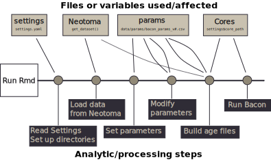

## Introduction

Over the course of working with the Neotoma Paleoecology Database [@williams2017neotoma] and the age modeling software Bacon [@blaauw2011flexible] it has often become neccessary to run a large number of Bacon models in an itterative process (for example the [Stepps-Baconizing GitHub repository](https://github.com/PalEON-Project/stepps-baconizing)).  The process of building and re-building a large number of age models is often complicated and can result in a large amount of code.  This code might involve fine-tuning results for single sites, using information from multiple runs, the generation of multiple data files and a set of R code that can span hundreds of lines.  In addition, the complexities of the underlying data (for example, issues with existing chronologies and data structures within Neotoma) may mean that users might unintentionally introduce errors into their workflows.  Data repositories serve a unique position within the research community [@goring2018nexus], and one service they can provide is the distillation and distribution of best-practices documents such as this resource for generating a large number of Bacon age models from Neotoma data.

This repository makes use of experience obtained in working through several projects [@kujawa2016theeffect;@dawson2016quantifying], and uses data from several projects as the basis for establishing certain prior values.  We make an effort in this document to clearly explain the steps neccessary to undertake such a project in a fairly straightforward manner.

### The Workflow

The general workflow is encoded in the Rmd document that can be rendered to an HTML file.  Rmd documents *knit* together descriptive text and R commands ([read more about RMarkdown documents](https://bookdown.org/yihui/rmarkdown/)).  The Rmd document is intended to provide context and guide the user in some best practices for the generation of Bacon outputs in batch.  The Rmd is also intended to operate as a stand-alone tool to generate a number of age records, and output the PDF ghost plots, age files and posterior draws for the cores of interest.  The R code that is embedded in the `Rmd` file does the following:



The key steps of the workflow:

1.  Executing the Rmd file:  This will knit together the text and execute all the R code to generate an HTML file with embedded results, along with the output files from the Bacon runs.
2.  Reading in the `settings.yaml` file.  See the text below for information about the settings that can be used for these runs.
3.  Loading data from Neotoma using the [`neotoma` package](http://github.com/ropensci/neotoma).
4.  Setting default parameters for the Bacon runs (accumulation rates, memory, etc.)
5.  Updating parameters based on past runs (if you have files with alternate settings).
6.  Building Bacon age files (the csv files used by Bacon to record the chronological controls) based on established chronological controls from Neotoma.
7.  Running Bacon.
8.  Revising parameters based on model outputs and re-running step 7.

The final step in this process requires modifying the settings file after the first run of this workflow, and adjusting the the parameters in the parameters file generated by the run, to ensure that the Bacon runs for each core reflect the best possible age models.  When the Rmd is re-run with the `settings.yaml` and parameters file adjusted (see Rmd for details), it is possible to do the batch processing faster, since the script is set to run only cores that have not had successful runs. Since "good" chronologies are excluded from being re-run it is possible to efficiently modify the settings for one or a few cores, while leaving the rest unchanged.

This code is provided as an RMarkdown document to help guide the user.  It can support extensive customization if a user chooses to make changes anywhere in the code, and individuals are welcome to make or suggest changes as they wish.

### Executing the code

#### RStudio

Many people working with R may choose to use [RStudio](http://rstudio.com).  If you are using RStudio you can customize elements of this document (for example, removing this header information) and then use the *knit* button to compile the code into an HTML document, while generating the neccessary output files (see the [README file](https://github.com/neotomadb/bulk-baconizing) in the GitHub repository).

#### R Console

Users who use the R Console without any other editor can move to the appropriate working directory (using `setwd()`) and then run the entire document using the following command:

```R
library(rmarkdown)
render('bulk_baconizing.Rmd')
```

This can be shortened to: `rmarkdown::render('bulk_baconizing.Rmd')`.

#### Terminal

Similarly, if you wish to execute the code from a console or terminal you can navigate to the working directory and execute the following:

```bash
Rscript -e "rmarkdown::render('bulk_baconizing.Rmd')"
```

Note that with the terminal you need to use two different quotation marks when executing.  The inner and outer quotations must be different (*e.g.*, double on the outside, single on the inside, or *vice versa*).  Whether you customize the code, or choose to run it as-is (for just the US state of Utah), these three methods of executing the code are your main options.

### Providing Feedback

If, in any place instructions are not clear or more details are required please feel free to contact us by either [raising a GitHub Issue for this repository](https://github.com/neotomadb/bulk-baconizing), or by mailing me directly at [goring@wisc.edu](mailto:goring@wisc.edu).

## Setting up the System

This document is intended to be used as a template for users, and not as a solution in and of itself.  The process for generating chronologies is itterative, as such, the use of this Rmd script is intended to be an itterative process, whereby you select sites, run Bacon, revise parameters and run the script again.  Each itteration will involve modifying the parameters file (created in the `data/params` folder during your first run), and also the `settings.yaml` file.  Please be sure to check carefully as you do this.  Errors may result in long wait times, or runs that provide no new useful information.

### Defining Your Settings

Because there are a number of elements to this project, it was decided to place some of the main elements into a single, easy to use file.  The project stores these settings in the parent directory in a file called `settings.yaml`.  By default these settings are:


```
#  Should the program remove any existing files in the Cores directory and start again?
 clean_run: true
 bacon: true
 bchron: true
 
 #  What version of the run is this?  This will create a new parameters file if none exists.
 version: 1
 
 # If a parameters file exists with the current version number should that file overwritten?
 reset_parameters: true
 
 # Where will the Bacon core files go?
 core_path: 'Cores'
 
 #  For any records with assigned dates, what date should be used (either 'YYYY-MM-DD' or 'today')
 date: 'today'
 
 # Core top error (if unspecified)
 core_top_err: 2
 
 # Use modern hiatus break:
 modern: true
 
 # Prior thickness
 thickness: data/paleon_thick.csv
 
 # Settlement indicators
 settlement: data/expert_assessment.csv
 
 # In some work we have assignments for accumulation rates set as defauly.  Others may not.
 accumulation: false
 
 # How many processing cores should be used.
 parallel: 3
```

A `yaml` file is a special kind of markup that uses a `key`: `value` pairing, with `#` to indicate a comment.  We assign parameters to the various keys here so that we can define the behaviour of the model runs.  In the following section we explain each parameter and its behaviour:

#### Settings Defined

*   `clean_run`: (default `true`) Should we clear all the files and parameters and start from scratch? Can take either `true` or `false`.

*   `version`: (default `1`) The use of a version key allows you to keep track of your Bacon parameters if, over the course of a project, you make changes in your choices about how you want to run your analysis.  If the version number changes a new parameter file will be generated.  You can assign any value to this parameter.

*   `reset_parameters`: (default `true`) Bulk generation of chronologies is an itterative process.  In general default parameters will be set, and then, over the course of running bacon, parameters for individual cores might be changed.  In the initial stages it might be worth modifying all default values in the code below and then setting `reset_parameters` to `true` so that the full table is re-written.  Otherwise, edit the value to `false` so that the table is not overwritten each time the scripts are run.

*   `core_path`: (default `Cores/`) Bacon needs to output files to a particular location, this tells Bacon where core files will be stored.  You can use any directory in your working folder but that directory must exist.

*   `date`: (default `today`) In cases where files might be overwritten, the default is to overwrite but store the old file with a date-stamp.  The default is to use the current date, but it might be that you want to associate a date stamp with a particular version.  In that case you can change the setting from `today` (which will use the current date) to a date of format `YYYY-MM-DD`.

*   `core_top_err`: (default `2`) An uncertainty to assign the core top age.  While, in principle we often know the date with absolute certainty, Bacon requires uncertainty for all age samples.

*   `modern`: (default `true`) In Goring et al (2012) and elsewhere it is shown that modern sediment often has a higher accumulation rate than earlier sediment.  One solution is to initiate an instantaneous hiatus at an identified "settlement" horizon, and then set the accumulation rate of the upper sediment to a higher `acc.mean` rate.  If `modern` is set to `true`, the program will place a hiatus at the modern horizon.  If `false` it will not.

*   `thickness`: (default `false`) There is a file included in the repository called `data/paleon_thick.csv`, however, it may be the case that in previous runs you have adjusted thickness values.  For example, in `version` 2 of your runs you could point to the `params` file generated in version 1 by pointing to `data/params/bacon_params_v1.csv`.  If you modify thicknesses you must also modify the content of the chunk `prior_thickness` below, so that you point to the correct thickness and dataset ID columns.

*   `settlement`: (default `false`) In Kujawa et al (2017) and in Dawson et al (2018) an expert-assessment exercise was undertaken to evaluate the presence and location of biostratigraphic markers for Euro-American settlement in the Upper Midwestern United States.  This file is included for reference.  With columns indicating `datasetid` and `depth`, if the parameter is set to a file location, such as `data/expert_assessment.csv`, then any indicator of Settlement will be revised, otherwise (e.g., `settlement: false`) the chronological controls for the records will remain as-is.

*   `accumulation`: (default `false`) Similar to thickness, if modifications have been made to accumulation rates, a file can be defined here.

*   `parallel`: (default `true`) Should the code try to run Bacon in parallel?  This is either the value `false` or the maximum number of cores to attempt (e.g., `3`).  This means it is possible to run your script on fewer cores than your system has available to allow you to continue work on other projects.  The code used in this script uses the `mclapply()` function, which means that the parallel operations, which use [parallel forking in R](https://garthtarr.com/parallel-computation-in-r/), are not available for Windows systems.

#### Modifying the Settings

Throughout your workflow you will likely change some of these settings.  For example, if you are changing the search parameters for your dataset search, you may want to keep some prior information, but increment the `version`, or set `clean_run` to `true`, however, as you begin fine tuning your results, you will want to set `clean_run` back to `false`, and `reset_parameters` to `false` as well.  This will prevent unneccessary errors, and reduce the amount of time required for the runs to complete, since it will accept completed runs and not attempt to re-run them.


```r
source('R/setup_runs.R', echo=FALSE, verbose=FALSE)
```

There are a number of libraries used in this project.  It is likely that you may be missing one or several.  If this is the case you might be interested in [this bash script](https://gist.github.com/SimonGoring/fe3b0bf6b4cb9b8f0a2aa6cdce10bb29) for Mac or Linux.  You may also be interested in the [autoinst package for R](https://github.com/jimhester/autoinst). Otherwise, take some time to look at `R/setup_runs.R` and ensure you install all packages listed.

## Getting Core Data from Neotoma

Here we download the sedimentary data.  The key component here is the `get_dataset()` function.  The newest version of `neotoma` (version >= 1.7.3) allows a user to pass in a vector of dataset IDs, so you can either get datasets using a set of parameters in the `get_dataset()` function (see [help for the `get_dataset()` function](https://www.rdocumentation.org/packages/neotoma/versions/1.7.0/topics/get_dataset)), or you can pass in a vector of dataset IDs (for example, if you've already picked a set of sites to be examined).  In this example I am using the state, Michigan, as my search parameter:


```r
# Define using state names here.  Could also use altitudes, locations,
#  dataset types. . .

dataset_list <- get_dataset(datasettype='pollen',
                            gpid = c('Michigan', 'Wisconsin', 'Minnesota'),
                            ageyoung = 0)

#  The load_downloads() function will download the datasets if either:
#  there is not currently a downloaded object saved with the same dataset version
#  or the setup parameter is TRUE, which calls for the whole data file to be re-written.

downloads <- suppressWarnings(load_downloads(dataset_list,
                            version = settings$version,
                            setup = settings$clean_run))
```

It might be the case that you want to do further validation on samples based on parameters in the `downloads` object (*e.g.*, only sites with a certain taxon).  The downloads are required for the generation of the core depths file used by Bacon.  If you want to further adjust the records, do so with the dataset object, not the `downloads`.  For example, you can remove elements of a list by setting them to `NULL`, so if you know you want to remove the dataset in the 5th position, you could assign `dataset_list[[5]] <- NULL`.  You would then need to re-run `load_downloads()` and ensure that `setup` was `TRUE` in `load_downloads()`:

```r
# This code is not run:

dataset_list <- get_dataset(gpid = 'Michigan')

# Only accept sites with a site description:

for (i in length(dataset_list):1) {
  if (is.na(dataset_list[[i]]$site$description)) {
    dataset_list[[i]] <- NULL
  }
}

# We would go from approximately 810 datasets to 502.

downloads <- load_downloads(dataset_list,
                            version = settings$version,
                            setup = TRUE)
```

Using the `neotoma` R package's `plot_leaflet()` function we can generate an interactive map of the dowloaded sites that can be used to explore the data further.


```r
plot_leaflet(dataset_list)
```

<!--html_preserve--><div id="htmlwidget-242c255f633e99a6669c" style="width:672px;height:480px;" class="leaflet html-widget"></div>
<script type="application/json" data-for="htmlwidget-242c255f633e99a6669c">{"x":{"options":{"crs":{"crsClass":"L.CRS.EPSG3857","code":null,"proj4def":null,"projectedBounds":null,"options":{}}},"calls":[{"method":"addProviderTiles","args":["Stamen.TerrainBackground",null,null,{"errorTileUrl":"","noWrap":false,"detectRetina":false}]},{"method":"addCircleMarkers","args":[[44.8036,46.206111,46.18693,46.25,46.416667,45.725,46.7,47.123935,46.128056,45.425,45.425,47.559175,46.27058,47.133333,46.503333,43.083333,46.633611,47.1775,44.296475,45.783333,44.95769,47.924167,46.666667,45.986111,44.70722,45.411111,43.123889,47.172305,45.76101,47.182465,44.7,46.173889,45.275,43.48,45.85,43.4178,43.916944,43.916944,48.183333,47.708333,45.333333,44.47012,43.233056,47.272455,44.75815,46.218889,47.165,42.33,44.945765,44.05,44.2329,44.2329,46.583333,44.883333,47.2036,43.439585,47.133,47.181535,45.460278,46.55,47.958333,48.233333,44.5,47.135556,46.416944,46.416944,45.428085,44.75836,45.3,45.3,44.238056,44.77085,44.77085,45.666667,46.714235,46.353333,47.35,45.6,45.066667,45.42363,45.42363,45.42363,44.79985,45.749444,45.04816,47.286,45.283333,48.142555,48.142555,48.142555,46.719435,44.36044,45.3,47.173975,47.17087,46.427222,46.427222,46.427222,43.1,43.1,47.244755,47.244755,44.226105,46.858935,44.711625,47.982605,48.033333,46.40707,46.068333,46.341585,45.933333,45.03503,45.03503,48.098755,48.098755,48.098755,45.780556,46.966667,44.60587,47.081,43.4,47.190745,46.211944,47.6,46.922222,46.922222,46.583333,45.283333,44.87083,46.131944,47.208889,44.45,44.45,47.916667,44.895835,47.133333,46.662222,45.725,45.572222,46.47,44.626875,45.4,44.891667,44.891667,44.874722,44.15,47.19324,47.19482,45.40895,45.848889,46.184444,43.416667,47.471667,46.95,46.086111,46.086111,46.324305,42.4,46.116667,45.005015,46.429167,45.333333,46.75,46.833333,43.7195,43.56928,45.4935,45.4072,45.377,44.99,46.51205,44.709,46.186,45.45,44.6173,45.324,44.77528,44.30865,46.19165,44.5635,45.80155,46.05545,45.8576,45.6745,45.81725,43.65255,43.65255,43.6176,44.5924,44.21895,45.0265,46.5986,43.92945,45.40595,46.30235,46.3815,45.19145,45.9915,46.21517,45.19932,46.77186,46.542635,46.542635,46.542635,46.542635,45.44376,45.786565,44.19291,44.354435,45.141805,44.709298,44.693385,43.60715,45.16204,44.333485,44.229535,44.65162,44.808755,44.313795,45.421695,45.89346,45.8668,46.2287,47.129415,47.911995,47.18919,47.18919,47.18919,47.18919,47.18919,46.80338,47.22823,45.590765,46.165285,44.87385,47.33732,43.90284,46.95391,44.988845,43.800155,46.34668,46.12683,46.205,45.00373,47.683805,46.089,45.9275,46.405,45.959335,46.50045,43.35538,46.013,44.022755,42.861,46.520515,46.3073,46.11935,46.24378,46.24525,46.24525,46.24525,46.23435,46.140435,47.683165,47.19285,47.19285,47.19285,47.19285,47.19285,42.78895,45.519575,44.919595,46.973155,46.144685,46.61506,43.6774,46.994015,44.0833333333333,45.932,45.901,46.565795,43.60373,43.21822],[-94.5579,-95.293611,-89.702685,-89.9,-92.716667,-93.25,-85.040278,-95.397205,-93.703889,-93.183333,-93.183333,-94.970775,-94.551555,-93.666667,-92.573333,-89.866667,-92.614722,-95.162675,-93.73571,-89.483333,-93.545105,-91.994722,-88.016667,-89.375,-93.497645,-93.197222,-83.241111,-94.938965,-96.01988,-95.73495,-84.958333,-95.915278,-91.475,-85,-89.316667,-89.73205,-89.166944,-89.166944,-92.183333,-91.641667,-93.508333,-93.619035,-88.041944,-96.09405,-93.16449,-94.753333,-95.558333,-83.63,-94.42074,-87.733333,-93.87066,-93.87066,-92.466667,-85.116667,-95.755515,-89.670815,-95.47461,-95.86866,-93.047778,-94.133333,-90.933333,-92.158333,-89.116944,-93.643611,-92.716944,-92.716944,-93.981475,-93.11674,-90.35,-90.35,-87.848056,-93.12255,-93.12255,-87.455,-92.587195,-92.870278,-91.8,-84.316667,-84.783333,-93.690695,-93.690695,-93.690695,-93.15975,-93.364167,-92.823905,-93.600465,-91.483333,-91.11254,-91.11254,-91.11254,-87.97207,-93.61535,-91.45,-94.943965,-95.70266,-84.958333,-84.958333,-84.958333,-89.416667,-89.416667,-95.007715,-95.007715,-93.829815,-94.75542,-93.341105,-93.3853,-91.9,-92.686585,-93.68,-94.408,-89.625,-93.6305,-93.6305,-92.010535,-92.010535,-92.010535,-93.273056,-95.316667,-93.563475,-94.113,-88.1,-95.77364,-95.284167,-96.166667,-95.575,-95.575,-93.6,-91.458333,-93.858975,-85.179167,-95.833333,-87.515556,-87.515556,-91.866667,-94.20414,-93.683333,-96.25,-93.466667,-93.408333,-86.958333,-93.43352,-93.522222,-93.691667,-93.691667,-93.1,-91.45,-95.786645,-96.09332,-93.981715,-93.167778,-95.306944,-84.883333,-91.66,-94.95,-93.102778,-93.102778,-92.78081,-85.383333,-94.116667,-93.57276,-85.661111,-90.083333,-87.95,-87.921389,-95.228,-95.59275,-93.1545,-93.0532,-95.5625,-94.591,-93.66005,-94.4935,-85.3082,-95.24005,-95.68015,-95.27935,-93.44692,-93.92,-95.4687,-93.218805,-95.55285,-95.26345,-95.4609,-95.7125,-95.34235,-93.284,-93.284,-93.43875,-93.4132,-93.84015,-83.61,-96.18675,-93.0815,-95.39015,-91.166,-91.4935,-90.608,-89.62075,-89.32082,-94.878745,-95.896225,-86.037795,-86.037795,-86.037795,-86.037795,-95.272065,-92.21898,-93.63978,-93.365935,-93.73915,-93.926793,-93.3212,-94.473645,-94.0929,-93.212125,-93.665425,-93.460155,-93.93439,-93.914375,-94.075455,-95.47561,-95.80385,-85.380295,-88.3169877777778,-89.0908,-95.21787,-95.21787,-95.21787,-95.21787,-95.21787,-95.88068,-95.27284,-93.06903,-95.32412,-93.63464,-95.16525,-93.417225,-94.66923,-93.556405,-89.59428,-84.857625,-84.77968,-85.0215,-93.574555,-95.398395,-91.939,-92.256,-91.525,-92.10745,-91.4105,-85.3568,-92.125,-85.283325,-85.2115,-86.35387,-91.19829,-92.03985,-89.2758,-89.29409,-89.29409,-89.29409,-89.28155,-89.2553,-96.20294,-95.2339,-95.2339,-95.2339,-95.2339,-95.2339,-88.8432,-89.55507,-88.15694,-94.68138,-86.48299,-88.86036,-94.698115,-94.694575,-94.4166666666667,-92.365,-92.273,-86.0752,-82.86388,-83.45983],10,null,null,{"interactive":true,"draggable":false,"keyboard":true,"title":"","alt":"","zIndexOffset":0,"opacity":1,"riseOnHover":true,"riseOffset":250,"stroke":true,"color":"#03F","weight":5,"opacity.1":0.5,"fill":true,"fillColor":"#03F","fillOpacity":0.2},{"showCoverageOnHover":true,"zoomToBoundsOnClick":true,"spiderfyOnMaxZoom":true,"removeOutsideVisibleBounds":true,"spiderLegPolylineOptions":{"weight":1.5,"color":"#222","opacity":0.5},"freezeAtZoom":false},null,["<b>Lake Allie<\/b><br><b>Description:<\/b> Kettle lake. Physiography: rolling stagnation moraine.<br><a href=http://apps.neotomadb.org/explorer/?siteids=29>Explorer Link<\/a>","<b>Almora Lake<\/b><br><b>Description:<\/b> Lake with emergent reed vegetation. Physiography: Parkers Prairie sandplain. Surrounding vegetation: agriculture.<br><a href=http://apps.neotomadb.org/explorer/?siteids=30>Explorer Link<\/a>","<b>Hell's Kitchen Lake<\/b><br><b>Description:<\/b> Kettle lake. Physiography: steep topography. Surrounding vegetation: Betula, Populus, Acer.<br><a href=http://apps.neotomadb.org/explorer/?siteids=196>Explorer Link<\/a>","<b>Lake Mary<\/b><br><b>Description:<\/b> Meromictic lake on Woodfordian till. Physiography: rolling till plain. Surrounding vegetation: white cedar/alder.<br><a href=http://apps.neotomadb.org/explorer/?siteids=197>Explorer Link<\/a>","<b>Anderson Lake<\/b><br><b>Description:<\/b> Physiography: Nickerson Moraine. Surrounding vegetation: maple-basswood, Juglans cinerea.<br><a href=http://apps.neotomadb.org/explorer/?siteids=202>Explorer Link<\/a>","<b>Andree Bog<\/b><br><b>Description:<\/b> Shallow irregular peat deposit. Physiography: gently rolling ground moraine. Surrounding vegetation: sedge meadow and shrub-carr.<br><a href=http://apps.neotomadb.org/explorer/?siteids=204>Explorer Link<\/a>","<b>Andrus Lake<\/b><br><b>Description:<\/b> Seepage lake. Physiography: flat sandy glacial lake bottom. Surrounding vegetation: Pinus/Betula/Quercus/Acer.<br><a href=http://apps.neotomadb.org/explorer/?siteids=205>Explorer Link<\/a>","<b>Bad Medicine Lake<\/b><br><b>Description:<\/b> Kettle lake. Physiography: Itaska Moraine, rolling. Surrounding vegetation: Pinus banksiana, Populus, Betula.<br><a href=http://apps.neotomadb.org/explorer/?siteids=221>Explorer Link<\/a>","<b>Black Bass Lake<\/b><br><b>Description:<\/b> Kettle lake. Physiography: Mille Lacs Moraine, rolling.<br><a href=http://apps.neotomadb.org/explorer/?siteids=238>Explorer Link<\/a>","<b>Beckman Lake<\/b><br><b>Description:<\/b> Small, shallow lake. Physiography: Anoka Sand Plain. Surrounding vegetation: Quercus/Betula/Picea/Larix.<br><a href=http://apps.neotomadb.org/explorer/?siteids=245>Explorer Link<\/a>","<b>Beckman Lake<\/b><br><b>Description:<\/b> Small, shallow lake. Physiography: Anoka Sand Plain. Surrounding vegetation: Quercus/Betula/Picea/Larix.<br><a href=http://apps.neotomadb.org/explorer/?siteids=245>Explorer Link<\/a>","<b>Big John Pond<\/b><br><b>Description:<\/b> Lake in pitted outwash plain. Physiography: Bemidji Sand Plain (glacial outwash). Surrounding vegetation: Pinus banksiana forest.<br><a href=http://apps.neotomadb.org/explorer/?siteids=266>Explorer Link<\/a>","<b>Billy's Lake<\/b><br><b>Description:<\/b> Shallow depression on St. Croix moraine. Physiography: rugged relief. Surrounding vegetation: white pine/hardwoods.<br><a href=http://apps.neotomadb.org/explorer/?siteids=269>Explorer Link<\/a>","<b>Blandin Pond<\/b><br><b>Description:<\/b> Kettle lake. Physiography: Sugar Hills area, rough rolling topo. Surrounding vegetation: Alnus, Fraxinus, Betula, Thuja, Abies.<br><a href=http://apps.neotomadb.org/explorer/?siteids=274>Explorer Link<\/a>","<b>Blackhoof Site<\/b><br><b>Description:<\/b> Peat accumulation in glacial drainageway. Physiography: generally flat valley floor.<br><a href=http://apps.neotomadb.org/explorer/?siteids=276>Explorer Link<\/a>","<b>Blue Mounds Creek<\/b><br><b>Description:<\/b> NA<br><a href=http://apps.neotomadb.org/explorer/?siteids=281>Explorer Link<\/a>","<b>Bob Lake<\/b><br><b>Description:<\/b> Kettle lake. Physiography: Sawyer-Cloquet Outwash Plain, level.<br><a href=http://apps.neotomadb.org/explorer/?siteids=290>Explorer Link<\/a>","<b>Bog D Pond<\/b><br><b>Description:<\/b> Linear bog with pond. Physiography: Twin Lakes bog complex. Surrounding vegetation: Carex/Larix/Picea.<br><a href=http://apps.neotomadb.org/explorer/?siteids=292>Explorer Link<\/a>","<b>Bossuot Lake<\/b><br><b>Description:<\/b> Kettle lake. Physiography: rolling stagnation moraine.<br><a href=http://apps.neotomadb.org/explorer/?siteids=299>Explorer Link<\/a>","<b>Brown Lake<\/b><br><b>Description:<\/b> NA<br><a href=http://apps.neotomadb.org/explorer/?siteids=306>Explorer Link<\/a>","<b>Brown's Bay, Lake Minnetonka<\/b><br><b>Description:<\/b> Mesotrophic bay in Lake Minnetonka. Physiography: rolling stagnation moraine. Surrounding vegetation: residential/Acer/Quercus/Tilia.<br><a href=http://apps.neotomadb.org/explorer/?siteids=307>Explorer Link<\/a>","<b>Burntside Lake<\/b><br><b>Description:<\/b> Small lake.<br><a href=http://apps.neotomadb.org/explorer/?siteids=318>Explorer Link<\/a>","<b>Camp 11 Lake<\/b><br><b>Description:<\/b> NA<br><a href=http://apps.neotomadb.org/explorer/?siteids=325>Explorer Link<\/a>","<b>Camp 12 Lake<\/b><br><b>Description:<\/b> Seepage lake. Physiography: gently rolling sandy terrain. Surrounding vegetation: Acer/Quercus/Betula/Pinus/Populus.<br><a href=http://apps.neotomadb.org/explorer/?siteids=326>Explorer Link<\/a>","<b>Campbell Lake<\/b><br><b>Description:<\/b> Kettle lake. Physiography: rolling stagnation moraine.<br><a href=http://apps.neotomadb.org/explorer/?siteids=327>Explorer Link<\/a>","<b>Cedar Bog<\/b><br><b>Description:<\/b> Lake surrounded by Larix bog. Physiography: Anoka Sand Plain. Surrounding vegetation: Quercus ellipsoidalis, Thuja, Larix.<br><a href=http://apps.neotomadb.org/explorer/?siteids=344>Explorer Link<\/a>","<b>Chippewa Bog<\/b><br><b>Description:<\/b> NA<br><a href=http://apps.neotomadb.org/explorer/?siteids=360>Explorer Link<\/a>","<b>Cindy Pond<\/b><br><b>Description:<\/b> Kettle lake. Physiography: Lake George Outwash Plain. Surrounding vegetation: Populus, Betula, Quercus forest.<br><a href=http://apps.neotomadb.org/explorer/?siteids=371>Explorer Link<\/a>","<b>Cottonwood Lake<\/b><br><b>Description:<\/b> Kettle lake. Physiography: Fergus Falls Till Plain, gently rolling.<br><a href=http://apps.neotomadb.org/explorer/?siteids=502>Explorer Link<\/a>","<b>Crazy Pond<\/b><br><b>Description:<\/b> Kettle lake. Physiography: Alexandria Moraine, rolling.<br><a href=http://apps.neotomadb.org/explorer/?siteids=508>Explorer Link<\/a>","<b>Cub Lake<\/b><br><b>Description:<\/b> NA<br><a href=http://apps.neotomadb.org/explorer/?siteids=518>Explorer Link<\/a>","<b>Dalton Lake<\/b><br><b>Description:<\/b> Kettle lake. Physiography: Alexandria Moraine complex, rolling.<br><a href=http://apps.neotomadb.org/explorer/?siteids=530>Explorer Link<\/a>","<b>Dark Lake<\/b><br><b>Description:<\/b> Kettle lake with forested slopes. Physiography: end moraine. Surrounding vegetation: Alnus rugosa, Quercus, Betula, Populus.<br><a href=http://apps.neotomadb.org/explorer/?siteids=531>Explorer Link<\/a>","<b>Demont Lake<\/b><br><b>Description:<\/b> NA<br><a href=http://apps.neotomadb.org/explorer/?siteids=661>Explorer Link<\/a>","<b>Denton Lake<\/b><br><b>Description:<\/b> Seepage lake.<br><a href=http://apps.neotomadb.org/explorer/?siteids=663>Explorer Link<\/a>","<b>Devils Lake<\/b><br><b>Description:<\/b> Lake is located in a pre-glacial gorge of the Wisconsin river cut through the Baraboo Hills, a bedrock high. The valley is dammed at both ends by terminal moraines deposited by the Green Bay lobe, which flowed around the Baraboo Hills. Lake is fed by groundwater. Surrounding vegetation: white-black-bur oak.<br><a href=http://apps.neotomadb.org/explorer/?siteids=666>Explorer Link<\/a>","<b>Disterhaft Farm Bog<\/b><br><b>Description:<\/b> Bog in a kettle. Physiography: Green Lake moraine. Surrounding vegetation: Quercus/Betula/Corylus/Sphagnum/Salix.<br><a href=http://apps.neotomadb.org/explorer/?siteids=680>Explorer Link<\/a>","<b>Disterhaft Farm Bog<\/b><br><b>Description:<\/b> Bog in a kettle. Physiography: Green Lake moraine. Surrounding vegetation: Quercus/Betula/Corylus/Sphagnum/Salix.<br><a href=http://apps.neotomadb.org/explorer/?siteids=680>Explorer Link<\/a>","<b>Dogfish Lake<\/b><br><b>Description:<\/b> NA<br><a href=http://apps.neotomadb.org/explorer/?siteids=697>Explorer Link<\/a>","<b>Dunnigan Lake<\/b><br><b>Description:<\/b> Shallow seepage lake. Surrounding vegetation: pine/aspen/spruce.<br><a href=http://apps.neotomadb.org/explorer/?siteids=755>Explorer Link<\/a>","<b>East Twin Lake<\/b><br><b>Description:<\/b> Kettle lake. Physiography: rolling stagnation moraine.<br><a href=http://apps.neotomadb.org/explorer/?siteids=762>Explorer Link<\/a>","<b>Eggert Lake<\/b><br><b>Description:<\/b> Kettle lake. Physiography: rolling ground moraine.<br><a href=http://apps.neotomadb.org/explorer/?siteids=767>Explorer Link<\/a>","<b>Ernst Brother's Pit<\/b><br><b>Description:<\/b> Sand and gravel pit in end moraine. Physiography: rolling end moraine.<br><a href=http://apps.neotomadb.org/explorer/?siteids=786>Explorer Link<\/a>","<b>Faith Pond<\/b><br><b>Description:<\/b> Kettle lake. Physiography: ground moraine. Surrounding vegetation: Populus scrub, cultivated.<br><a href=http://apps.neotomadb.org/explorer/?siteids=795>Explorer Link<\/a>","<b>Farquar Lake<\/b><br><b>Description:<\/b> Kettle lake. Physiography: St. Croix Moraine, rolling.<br><a href=http://apps.neotomadb.org/explorer/?siteids=799>Explorer Link<\/a>","<b>Fawn Lake<\/b><br><b>Description:<\/b> Kettle lake. Physiography: ground moraine.<br><a href=http://apps.neotomadb.org/explorer/?siteids=801>Explorer Link<\/a>","<b>Fox Pond<\/b><br><b>Description:<\/b> Kettle lake. Physiography: Itasca Moraine, rolling.<br><a href=http://apps.neotomadb.org/explorer/?siteids=820>Explorer Link<\/a>","<b>Frains Lake<\/b><br><b>Description:<\/b> NA<br><a href=http://apps.neotomadb.org/explorer/?siteids=821>Explorer Link<\/a>","<b>French Lake<\/b><br><b>Description:<\/b> NA<br><a href=http://apps.neotomadb.org/explorer/?siteids=824>Explorer Link<\/a>","<b>Gass Lake<\/b><br><b>Description:<\/b> NA<br><a href=http://apps.neotomadb.org/explorer/?siteids=833>Explorer Link<\/a>","<b>George Lake<\/b><br><b>Description:<\/b> Kettle lake on stagnation moraine. Original vegetation was the \"Big Woods.\" dominated by Ulmus, Quercus, Acer saccharum, and Tilia americana.<br><a href=http://apps.neotomadb.org/explorer/?siteids=841>Explorer Link<\/a>","<b>George Lake<\/b><br><b>Description:<\/b> Kettle lake on stagnation moraine. Original vegetation was the \"Big Woods.\" dominated by Ulmus, Quercus, Acer saccharum, and Tilia americana.<br><a href=http://apps.neotomadb.org/explorer/?siteids=841>Explorer Link<\/a>","<b>Goldsmith Lake<\/b><br><b>Description:<\/b> Kettle lake. Physiography: Thomsen-Cloquet Moraine, rolling.<br><a href=http://apps.neotomadb.org/explorer/?siteids=938>Explorer Link<\/a>","<b>Green Lake<\/b><br><b>Description:<\/b> NA<br><a href=http://apps.neotomadb.org/explorer/?siteids=952>Explorer Link<\/a>","<b>Grice Pond<\/b><br><b>Description:<\/b> Kettle lake. Physiography: rolling end moraine.<br><a href=http://apps.neotomadb.org/explorer/?siteids=959>Explorer Link<\/a>","<b>Hansen Marsh<\/b><br><b>Description:<\/b> Marsh, southern sedge meadow, located in \"Hanson Basin\". Physiography: borders Driftless Area. Surrounding vegetation: Quercus, Acer, Ulmus, Prunus, Juglans.<br><a href=http://apps.neotomadb.org/explorer/?siteids=973>Explorer Link<\/a>","<b>Hemo Pond<\/b><br><b>Description:<\/b> Kettle lake. Physiography: rolling end moraine.<br><a href=http://apps.neotomadb.org/explorer/?siteids=999>Explorer Link<\/a>","<b>Blocknic Lake [Horse Pond]<\/b><br><b>Description:<\/b> Kettle lake. Physiography: gently rolling ground moraine. Surrounding vegetation: cultivated fields and pasture.<br><a href=http://apps.neotomadb.org/explorer/?siteids=1076>Explorer Link<\/a>","<b>Horseshoe Lake<\/b><br><b>Description:<\/b> Lake in ice-block depression. Physiography: Anoka Sand Plain. Surrounding vegetation: Quercus ellipsoididalis, Q. macrocarpa.<br><a href=http://apps.neotomadb.org/explorer/?siteids=1077>Explorer Link<\/a>","<b>Hostage Lake<\/b><br><b>Description:<\/b> Kettle lake in pitted outwash plain. Physiography: Crow Wing Outwash Plain. Surrounding vegetation: Pinus banksiana forest.<br><a href=http://apps.neotomadb.org/explorer/?siteids=1078>Explorer Link<\/a>","<b>Hug Lake<\/b><br><b>Description:<\/b> Kettle lake. Physiography: gently sloping till plain. Surrounding vegetation: Betula/Populus/Alnus/Corylus.<br><a href=http://apps.neotomadb.org/explorer/?siteids=1101>Explorer Link<\/a>","<b>Hustler Lake<\/b><br><b>Description:<\/b> Drainage lake in Boundary Waters Area. Surrounding vegetation: pine/aspen/spruce.<br><a href=http://apps.neotomadb.org/explorer/?siteids=1105>Explorer Link<\/a>","<b>Iola Bog<\/b><br><b>Description:<\/b> Steep sided kettle pond. Physiography: Cary ground moraine. Surrounding vegetation: moses, Ericaceae, sedges, Laris, Spruce.<br><a href=http://apps.neotomadb.org/explorer/?siteids=1117>Explorer Link<\/a>","<b>Irvin Lake<\/b><br><b>Description:<\/b> Kettle lake. Physiography: Sugar Hills area, rough rolling topo. Surrounding vegetation: Alnus, Fraxinus, Betula, Thuja, Abies.<br><a href=http://apps.neotomadb.org/explorer/?siteids=1119>Explorer Link<\/a>","<b>Jacobson Lake<\/b><br><b>Description:<\/b> Lake w/Calamagrostis fringe on N. end. Physiography: Nickerson Moraine, steep slopes. Surrounding vegetation: Acer, Betula, Fraxinus.<br><a href=http://apps.neotomadb.org/explorer/?siteids=1128>Explorer Link<\/a>","<b>Jacobson Lake<\/b><br><b>Description:<\/b> Lake w/Calamagrostis fringe on N. end. Physiography: Nickerson Moraine, steep slopes. Surrounding vegetation: Acer, Betula, Fraxinus.<br><a href=http://apps.neotomadb.org/explorer/?siteids=1128>Explorer Link<\/a>","<b>Jones Lake<\/b><br><b>Description:<\/b> Ketle lake in outwash on the Mississippi River t3 terrace. Native vegetation on the terrace was prairie surrounded by oak forest and scrub. Today highly agricultural.<br><a href=http://apps.neotomadb.org/explorer/?siteids=1359>Explorer Link<\/a>","<b>Kegan Lake<\/b><br><b>Description:<\/b> Kettle lake. Physiography: St. Croix (end) Moraine, rolling.<br><a href=http://apps.neotomadb.org/explorer/?siteids=1409>Explorer Link<\/a>","<b>Kellys Hollow<\/b><br><b>Description:<\/b> Wet-mesic woodland bog. Physiography: end moraine of Woodfordian drift. Surrounding vegetation: Acer/Betula/Picea/Pinus strobus.<br><a href=http://apps.neotomadb.org/explorer/?siteids=1410>Explorer Link<\/a>","<b>Kellys Hollow<\/b><br><b>Description:<\/b> Wet-mesic woodland bog. Physiography: end moraine of Woodfordian drift. Surrounding vegetation: Acer/Betula/Picea/Pinus strobus.<br><a href=http://apps.neotomadb.org/explorer/?siteids=1410>Explorer Link<\/a>","<b>Kellners Lake<\/b><br><b>Description:<\/b> Kettle lake. Physiography: Valders glacial drift. Surrounding vegetation: cultivated, conifer-hardwood forest.<br><a href=http://apps.neotomadb.org/explorer/?siteids=1411>Explorer Link<\/a>","<b>Kirchner Marsh<\/b><br><b>Description:<\/b> Marsh on St. Croix Moraine. Physiography: ice block depression in hilly terrain. Surrounding vegetation: white/red/and bur oak.<br><a href=http://apps.neotomadb.org/explorer/?siteids=1483>Explorer Link<\/a>","<b>Kirchner Marsh<\/b><br><b>Description:<\/b> Marsh on St. Croix Moraine. Physiography: ice block depression in hilly terrain. Surrounding vegetation: white/red/and bur oak.<br><a href=http://apps.neotomadb.org/explorer/?siteids=1483>Explorer Link<\/a>","<b>Kitchner Lake<\/b><br><b>Description:<\/b> NA<br><a href=http://apps.neotomadb.org/explorer/?siteids=1486>Explorer Link<\/a>","<b>Kotiranta Lake<\/b><br><b>Description:<\/b> Lake with floating sedge mat rim. Physiography: Sawyer outwash plain. Surrounding vegetation: Picea mariana.<br><a href=http://apps.neotomadb.org/explorer/?siteids=1510>Explorer Link<\/a>","<b>Kryzewinski Lake<\/b><br><b>Description:<\/b> Kettle lake. Physiography: Thomsen-Cloquet Moraine, rolling.<br><a href=http://apps.neotomadb.org/explorer/?siteids=1514>Explorer Link<\/a>","<b>Kylen Lake<\/b><br><b>Description:<\/b> NA<br><a href=http://apps.neotomadb.org/explorer/?siteids=1526>Explorer Link<\/a>","<b>Lake Sixteen<\/b><br><b>Description:<\/b> Small lake in peatland. Physiography: low relief with sand ridges. Surrounding vegetation: Pinus/Quercus/Betula/Populus.<br><a href=http://apps.neotomadb.org/explorer/?siteids=1540>Explorer Link<\/a>","<b>Lake 27<\/b><br><b>Description:<\/b> NA<br><a href=http://apps.neotomadb.org/explorer/?siteids=1541>Explorer Link<\/a>","<b>Lake Ann<\/b><br><b>Description:<\/b> Lake in parabolic dune field. Physiography: Anoka Sand Plain. Surrounding vegetation: agriculture/pines/hardwoods.<br><a href=http://apps.neotomadb.org/explorer/?siteids=1544>Explorer Link<\/a>","<b>Lake Ann<\/b><br><b>Description:<\/b> Lake in parabolic dune field. Physiography: Anoka Sand Plain. Surrounding vegetation: agriculture/pines/hardwoods.<br><a href=http://apps.neotomadb.org/explorer/?siteids=1544>Explorer Link<\/a>","<b>Lake Ann<\/b><br><b>Description:<\/b> Lake in parabolic dune field. Physiography: Anoka Sand Plain. Surrounding vegetation: agriculture/pines/hardwoods.<br><a href=http://apps.neotomadb.org/explorer/?siteids=1544>Explorer Link<\/a>","<b>Lake Carlson<\/b><br><b>Description:<\/b> Lake on St. Croix moraine. Physiography: hilly terrain. Surrounding vegetation: pin oak/white oak/bur oak/ red oak.<br><a href=http://apps.neotomadb.org/explorer/?siteids=1548>Explorer Link<\/a>","<b>Lewis Lake<\/b><br><b>Description:<\/b> Kettle lake. Physiography: McGrath Till Plain, gently rolling.<br><a href=http://apps.neotomadb.org/explorer/?siteids=1582>Explorer Link<\/a>","<b>Lily Lake<\/b><br><b>Description:<\/b> NA<br><a href=http://apps.neotomadb.org/explorer/?siteids=1586>Explorer Link<\/a>","<b>Little Bass Lake<\/b><br><b>Description:<\/b> Kettle lake in mixed coniferous-deciduous forest  on sandy outwash deposited by St Louis sub-lobe of Des Moines lobe.<br><a href=http://apps.neotomadb.org/explorer/?siteids=1590>Explorer Link<\/a>","<b>Little Pine Lake<\/b><br><b>Description:<\/b> Lake with forested slopes. Physiography: end moraine. Surrounding vegetation: Alnus rugosa, Quercus, Betula.<br><a href=http://apps.neotomadb.org/explorer/?siteids=1593>Explorer Link<\/a>","<b>Lake of the Clouds<\/b><br><b>Description:<\/b> Lake with two basins. Physiography: rugged, steep slopes and cliffs. Surrounding vegetation: Pinus banksiana, Fraxinus, Acer, Alnus, Cornus.<br><a href=http://apps.neotomadb.org/explorer/?siteids=1598>Explorer Link<\/a>","<b>Lake of the Clouds<\/b><br><b>Description:<\/b> Lake with two basins. Physiography: rugged, steep slopes and cliffs. Surrounding vegetation: Pinus banksiana, Fraxinus, Acer, Alnus, Cornus.<br><a href=http://apps.neotomadb.org/explorer/?siteids=1598>Explorer Link<\/a>","<b>Lake of the Clouds<\/b><br><b>Description:<\/b> Lake with two basins. Physiography: rugged, steep slopes and cliffs. Surrounding vegetation: Pinus banksiana, Fraxinus, Acer, Alnus, Cornus.<br><a href=http://apps.neotomadb.org/explorer/?siteids=1598>Explorer Link<\/a>","<b>Lost Lake<\/b><br><b>Description:<\/b> NA<br><a href=http://apps.neotomadb.org/explorer/?siteids=1613>Explorer Link<\/a>","<b>Lake Mabel<\/b><br><b>Description:<\/b> Kettle lake. Physiography: stagnation moraine, rolling.<br><a href=http://apps.neotomadb.org/explorer/?siteids=1630>Explorer Link<\/a>","<b>Stewart's Dark Lake<\/b><br><b>Description:<\/b> NA<br><a href=http://apps.neotomadb.org/explorer/?siteids=1645>Explorer Link<\/a>","<b>Martin Pond<\/b><br><b>Description:<\/b> Pond in center of treeless bog. Physiography: Itasca Moraine. Surrounding vegetation: Sphagnum/Chamaedaphne.<br><a href=http://apps.neotomadb.org/explorer/?siteids=1652>Explorer Link<\/a>","<b>McCraney Lake<\/b><br><b>Description:<\/b> Kettle lake. Physiography: stagnation moraine, rolling.<br><a href=http://apps.neotomadb.org/explorer/?siteids=1664>Explorer Link<\/a>","<b>McNearney Lake<\/b><br><b>Description:<\/b> Seepage lake. Physiography: gently rolling terrain. Surrounding vegetation: Pinus/Tsuga/Acer/Fagus/Populus.<br><a href=http://apps.neotomadb.org/explorer/?siteids=1669>Explorer Link<\/a>","<b>McNearney Lake<\/b><br><b>Description:<\/b> Seepage lake. Physiography: gently rolling terrain. Surrounding vegetation: Pinus/Tsuga/Acer/Fagus/Populus.<br><a href=http://apps.neotomadb.org/explorer/?siteids=1669>Explorer Link<\/a>","<b>McNearney Lake<\/b><br><b>Description:<\/b> Seepage lake. Physiography: gently rolling terrain. Surrounding vegetation: Pinus/Tsuga/Acer/Fagus/Populus.<br><a href=http://apps.neotomadb.org/explorer/?siteids=1669>Explorer Link<\/a>","<b>Lake Mendota<\/b><br><b>Description:<\/b> NA<br><a href=http://apps.neotomadb.org/explorer/?siteids=1679>Explorer Link<\/a>","<b>Lake Mendota<\/b><br><b>Description:<\/b> NA<br><a href=http://apps.neotomadb.org/explorer/?siteids=1679>Explorer Link<\/a>","<b>Lake Minnie<\/b><br><b>Description:<\/b> Kettle lake. Physiography: Lake George outwash plain, undulating. Surrounding vegetation: Pinus banksiana, sparse shrub layer.<br><a href=http://apps.neotomadb.org/explorer/?siteids=1701>Explorer Link<\/a>","<b>Lake Minnie<\/b><br><b>Description:<\/b> Kettle lake. Physiography: Lake George outwash plain, undulating. Surrounding vegetation: Pinus banksiana, sparse shrub layer.<br><a href=http://apps.neotomadb.org/explorer/?siteids=1701>Explorer Link<\/a>","<b>Mud Lake<\/b><br><b>Description:<\/b> Kettle lake. Physiography: Waconia-Waseca Moraine, rolling.<br><a href=http://apps.neotomadb.org/explorer/?siteids=1720>Explorer Link<\/a>","<b>Mud Lake<\/b><br><b>Description:<\/b> Kettle lake in drumlin field. Physiography: outwash capped drumlin field. Surrounding vegetation: Pinus banksiana forest.<br><a href=http://apps.neotomadb.org/explorer/?siteids=1721>Explorer Link<\/a>","<b>Murphy Lake<\/b><br><b>Description:<\/b> Kettle lake. Physiography: Prior Lake Moraine, strongly rolling.<br><a href=http://apps.neotomadb.org/explorer/?siteids=1724>Explorer Link<\/a>","<b>Myrtle Lake<\/b><br><b>Description:<\/b> Lake surrounded by peatland. Physiography: Red Lake lowlands. Surrounding vegetation: Sphagnum, Piceto-Chamaedophnetum.<br><a href=http://apps.neotomadb.org/explorer/?siteids=1729>Explorer Link<\/a>","<b>Nels Lake<\/b><br><b>Description:<\/b> Drainage lake. Surrounding vegetation: pine/aspen/spruce.<br><a href=http://apps.neotomadb.org/explorer/?siteids=1735>Explorer Link<\/a>","<b>Nelson Pond<\/b><br><b>Description:<\/b> Pond on red clay till, Nickerson Moraine. Physiography: strongly rolling. Surrounding vegetation: agricultural.<br><a href=http://apps.neotomadb.org/explorer/?siteids=1736>Explorer Link<\/a>","<b>Lake Onamia<\/b><br><b>Description:<\/b> Kettle lake. Physiography: Mille Lacs Moraine Complex, rolling.<br><a href=http://apps.neotomadb.org/explorer/?siteids=1771>Explorer Link<\/a>","<b>Ondris Pond<\/b><br><b>Description:<\/b> Depression in Crow Wing outwash plain. Physiography: little relief. Surrounding vegetation: oak woods.<br><a href=http://apps.neotomadb.org/explorer/?siteids=1772>Explorer Link<\/a>","<b>Otto Mielke Lake<\/b><br><b>Description:<\/b> Seepage lake.<br><a href=http://apps.neotomadb.org/explorer/?siteids=1781>Explorer Link<\/a>","<b>Pogonia Bog Pond<\/b><br><b>Description:<\/b> Pond surrounded by Sphagnum/Larix fen. Physiography: Owatonna moraine complex. Surrounding vegetation: Ulmus/Acer/Cornus/Sphagnum/Typha/Lemna.<br><a href=http://apps.neotomadb.org/explorer/?siteids=1814>Explorer Link<\/a>","<b>Pogonia Bog Pond<\/b><br><b>Description:<\/b> Pond surrounded by Sphagnum/Larix fen. Physiography: Owatonna moraine complex. Surrounding vegetation: Ulmus/Acer/Cornus/Sphagnum/Typha/Lemna.<br><a href=http://apps.neotomadb.org/explorer/?siteids=1814>Explorer Link<\/a>","<b>Third Lake<\/b><br><b>Description:<\/b> Lake with surrounding bog. Physiography: low relief. Surrounding vegetation: Pinus/Populus/Abies/Sphagnum.<br><a href=http://apps.neotomadb.org/explorer/?siteids=1815>Explorer Link<\/a>","<b>Third Lake<\/b><br><b>Description:<\/b> Lake with surrounding bog. Physiography: low relief. Surrounding vegetation: Pinus/Populus/Abies/Sphagnum.<br><a href=http://apps.neotomadb.org/explorer/?siteids=1815>Explorer Link<\/a>","<b>Third Lake<\/b><br><b>Description:<\/b> Lake with surrounding bog. Physiography: low relief. Surrounding vegetation: Pinus/Populus/Abies/Sphagnum.<br><a href=http://apps.neotomadb.org/explorer/?siteids=1815>Explorer Link<\/a>","<b>Pennington Lake<\/b><br><b>Description:<\/b> Kettle lake. Physiography: McGrath Till Plain, gently rolling.<br><a href=http://apps.neotomadb.org/explorer/?siteids=1820>Explorer Link<\/a>","<b>Peterson Slough<\/b><br><b>Description:<\/b> Typha marsh with 1 ha open water. Physiography: Park Rapids Outwash Plain. Surrounding vegetation: Pinus banksiana/Quercus forest.<br><a href=http://apps.neotomadb.org/explorer/?siteids=1827>Explorer Link<\/a>","<b>Pleasant Lake<\/b><br><b>Description:<\/b> Kettle lake. Physiography: Waconia-Waseca Moraine, rolling.<br><a href=http://apps.neotomadb.org/explorer/?siteids=1891>Explorer Link<\/a>","<b>Portage Lake<\/b><br><b>Description:<\/b> Kettle lake. Physiography: stagnation moraine, rolling.<br><a href=http://apps.neotomadb.org/explorer/?siteids=1901>Explorer Link<\/a>","<b>Radtke Lake<\/b><br><b>Description:<\/b> NA<br><a href=http://apps.neotomadb.org/explorer/?siteids=1944>Explorer Link<\/a>","<b>Reichow Pond<\/b><br><b>Description:<\/b> Kettle lake. Physiography: stagnation moraine. Surrounding vegetation: Acer saccharum, Tilia, Populus, Ostrya.<br><a href=http://apps.neotomadb.org/explorer/?siteids=1978>Explorer Link<\/a>","<b>Reidel Lake<\/b><br><b>Description:<\/b> Kettle lake in Parkers Prairie sandplain. Physiography: outwash plain, local relief 6 m. Surrounding vegetation: oak woodland.<br><a href=http://apps.neotomadb.org/explorer/?siteids=1979>Explorer Link<\/a>","<b>Rholl Lake<\/b><br><b>Description:<\/b> Kettle lake. Physiography: ground moraine.<br><a href=http://apps.neotomadb.org/explorer/?siteids=1988>Explorer Link<\/a>","<b>Rice Lake<\/b><br><b>Description:<\/b> Kettle lake. Physiography: Alexandria Moraine complex, rolling.<br><a href=http://apps.neotomadb.org/explorer/?siteids=1991>Explorer Link<\/a>","<b>Rice Lake<\/b><br><b>Description:<\/b> Kettle lake. Physiography: Alexandria Moraine complex, rolling.<br><a href=http://apps.neotomadb.org/explorer/?siteids=1991>Explorer Link<\/a>","<b>Rossburg Bog<\/b><br><b>Description:<\/b> Peat bog. Physiography: rolling Wisconsin ground moraine. Surrounding vegetation: Sphagnum moss.<br><a href=http://apps.neotomadb.org/explorer/?siteids=2213>Explorer Link<\/a>","<b>Ruby Lake<\/b><br><b>Description:<\/b> Lake with forested slopes. Physiography: end moraine. Surrounding vegetation: Alnus rugosa, Quercus, Betula.<br><a href=http://apps.neotomadb.org/explorer/?siteids=2231>Explorer Link<\/a>","<b>Rutz Lake<\/b><br><b>Description:<\/b> Kettle lake. Physiography: gently rolling moraine (Des Moines Lobe). Surrounding vegetation: agricultural.<br><a href=http://apps.neotomadb.org/explorer/?siteids=2235>Explorer Link<\/a>","<b>Ryerse Lake<\/b><br><b>Description:<\/b> NA<br><a href=http://apps.neotomadb.org/explorer/?siteids=2239>Explorer Link<\/a>","<b>Sedivy Lake<\/b><br><b>Description:<\/b> Kettle lake. Physiography: ground moraine.<br><a href=http://apps.neotomadb.org/explorer/?siteids=2273>Explorer Link<\/a>","<b>Seidel<\/b><br><b>Description:<\/b> Lake in enclosed hollow. Physiography: ground moraine of the Valders substage. Surrounding vegetation: agricultural/Alnus/Cornus/Betula/Larix.<br><a href=http://apps.neotomadb.org/explorer/?siteids=2274>Explorer Link<\/a>","<b>Seidel<\/b><br><b>Description:<\/b> Lake in enclosed hollow. Physiography: ground moraine of the Valders substage. Surrounding vegetation: agricultural/Alnus/Cornus/Betula/Larix.<br><a href=http://apps.neotomadb.org/explorer/?siteids=2274>Explorer Link<\/a>","<b>Shagawa Lake<\/b><br><b>Description:<\/b> LGLA. Physiography: rolling glacial moriane and bedrock.<br><a href=http://apps.neotomadb.org/explorer/?siteids=2293>Explorer Link<\/a>","<b>Silver Lake<\/b><br><b>Description:<\/b> Kettle lake. Physiography: Waconia-Waseca Moraine, rolling.<br><a href=http://apps.neotomadb.org/explorer/?siteids=2301>Explorer Link<\/a>","<b>Siseebakwet South<\/b><br><b>Description:<\/b> Kettle lake. Physiography: Sugar Hills area, rough rolling topo. Surrounding vegetation: Alnus, Fraxinus, Betula, Thuja, Abies.<br><a href=http://apps.neotomadb.org/explorer/?siteids=2310>Explorer Link<\/a>","<b>Solum Lake<\/b><br><b>Description:<\/b> Kettle lake. Physiography: ground moraine, gently rolling.<br><a href=http://apps.neotomadb.org/explorer/?siteids=2497>Explorer Link<\/a>","<b>South Stanchfield Lake<\/b><br><b>Description:<\/b> Kettle lake. Physiography: McGrath Till Plain, gently rolling.<br><a href=http://apps.neotomadb.org/explorer/?siteids=2500>Explorer Link<\/a>","<b>Spectacle Lake<\/b><br><b>Description:<\/b> Kettle lake. Physiography: Anoka Sand Plain, undulating.<br><a href=http://apps.neotomadb.org/explorer/?siteids=2501>Explorer Link<\/a>","<b>Spirit Lake<\/b><br><b>Description:<\/b> Lake with floating mat.<br><a href=http://apps.neotomadb.org/explorer/?siteids=2502>Explorer Link<\/a>","<b>St. Catherines Lake<\/b><br><b>Description:<\/b> Kettle lake. Physiography: Prior Lake Moraine, strongly rolling.<br><a href=http://apps.neotomadb.org/explorer/?siteids=2514>Explorer Link<\/a>","<b>Stone Lake<\/b><br><b>Description:<\/b> Kettle lake. Physiography: Anoka Sand Plain, undulating.<br><a href=http://apps.neotomadb.org/explorer/?siteids=2518>Explorer Link<\/a>","<b>Stone Lake Tamarack Swamp<\/b><br><b>Description:<\/b> Larix swamp. Physiography: low rolling relief. Surrounding vegetation: Larix/Salix/Cornus/Typha.<br><a href=http://apps.neotomadb.org/explorer/?siteids=2519>Explorer Link<\/a>","<b>Stone Lake Tamarack Swamp<\/b><br><b>Description:<\/b> Larix swamp. Physiography: low rolling relief. Surrounding vegetation: Larix/Salix/Cornus/Typha.<br><a href=http://apps.neotomadb.org/explorer/?siteids=2519>Explorer Link<\/a>","<b>Sunfish Lake<\/b><br><b>Description:<\/b> Kettle lake. Physiography: St. Croix Moraine, rolling.<br><a href=http://apps.neotomadb.org/explorer/?siteids=2524>Explorer Link<\/a>","<b>Tamarack Creek<\/b><br><b>Description:<\/b> NA<br><a href=http://apps.neotomadb.org/explorer/?siteids=2534>Explorer Link<\/a>","<b>Quallen Lake [Terhell Pond]<\/b><br><b>Description:<\/b> Kettle lake. Physiography: stagnation moraine, rolling. Surrounding vegetation: maple-basswood forest, cultivated fields.<br><a href=http://apps.neotomadb.org/explorer/?siteids=2548>Explorer Link<\/a>","<b>Thompson Pond<\/b><br><b>Description:<\/b> Kettle Lake.<br><a href=http://apps.neotomadb.org/explorer/?siteids=2550>Explorer Link<\/a>","<b>Toenjes Lake<\/b><br><b>Description:<\/b> Kettle lake. Physiography: Mississippi Valley Outwash, level.<br><a href=http://apps.neotomadb.org/explorer/?siteids=2557>Explorer Link<\/a>","<b>Twin Lakes<\/b><br><b>Description:<\/b> Kettle lake. Physiography: McGrath Till Plain, gently rolling.<br><a href=http://apps.neotomadb.org/explorer/?siteids=2786>Explorer Link<\/a>","<b>Upper Graven Lake<\/b><br><b>Description:<\/b> Kettle lake in Parkers Prairie sandplain. Physiography: outwash plain, local relief 6 m. Surrounding vegetation: oak woodland.<br><a href=http://apps.neotomadb.org/explorer/?siteids=2792>Explorer Link<\/a>","<b>Vestaburg Bog<\/b><br><b>Description:<\/b> NA<br><a href=http://apps.neotomadb.org/explorer/?siteids=2814>Explorer Link<\/a>","<b>Weber Lake<\/b><br><b>Description:<\/b> NA<br><a href=http://apps.neotomadb.org/explorer/?siteids=2849>Explorer Link<\/a>","<b>Wentzel's Pond<\/b><br><b>Description:<\/b> Pond in meltwater channel. Physiography: Park Rapids Outwash Plain. Surrounding vegetation: Pinus banksiana, Quercus macrocarpa.<br><a href=http://apps.neotomadb.org/explorer/?siteids=2851>Explorer Link<\/a>","<b>White Lily Lake<\/b><br><b>Description:<\/b> Ice block depression, kettle lake. Physiography: McGrath Till Plain, gently rolling.<br><a href=http://apps.neotomadb.org/explorer/?siteids=2855>Explorer Link<\/a>","<b>White Lily Lake<\/b><br><b>Description:<\/b> Ice block depression, kettle lake. Physiography: McGrath Till Plain, gently rolling.<br><a href=http://apps.neotomadb.org/explorer/?siteids=2855>Explorer Link<\/a>","<b>Willow River Pond<\/b><br><b>Description:<\/b> Kettle lake on sandy outwash plain. Physiography: moderately hilly. Surrounding vegetation: jack pine/white pine/aspen.<br><a href=http://apps.neotomadb.org/explorer/?siteids=2859>Explorer Link<\/a>","<b>Wintergreen Lake<\/b><br><b>Description:<\/b> NA<br><a href=http://apps.neotomadb.org/explorer/?siteids=2864>Explorer Link<\/a>","<b>Wolf Creek<\/b><br><b>Description:<\/b> NA<br><a href=http://apps.neotomadb.org/explorer/?siteids=2932>Explorer Link<\/a>","<b>Wolsfeld Lake<\/b><br><b>Description:<\/b> Kettle lake. Physiography: rolling stagnation moraine. Surrounding vegetation: elm-maple-basswood-oak forest.<br><a href=http://apps.neotomadb.org/explorer/?siteids=2933>Explorer Link<\/a>","<b>Wolverine Lake<\/b><br><b>Description:<\/b> NA<br><a href=http://apps.neotomadb.org/explorer/?siteids=2934>Explorer Link<\/a>","<b>Wood Lake<\/b><br><b>Description:<\/b> Kettle lake. Physiography: rolling end moraine; Woodfordian drift. Surrounding vegetation: Alnus rugosa/Betula pap./Pinus strobus.<br><a href=http://apps.neotomadb.org/explorer/?siteids=2937>Explorer Link<\/a>","<b>Yellow Dog Pond<\/b><br><b>Description:<\/b> NA<br><a href=http://apps.neotomadb.org/explorer/?siteids=2948>Explorer Link<\/a>","<b>Canyon Lake<\/b><br><b>Description:<\/b> NA<br><a href=http://apps.neotomadb.org/explorer/?siteids=2956>Explorer Link<\/a>","<b>South Heron Lake<\/b><br><b>Description:<\/b> large shallow kettle lake. Original vegetation tall-grass prairie.<br><a href=http://apps.neotomadb.org/explorer/?siteids=6506>Explorer Link<\/a>","<b>Ocheda Lake<\/b><br><b>Description:<\/b> Large shallow glacial kettle lake. Original vegetation tall-grass prairie. Agricultural today.<br><a href=http://apps.neotomadb.org/explorer/?siteids=6507>Explorer Link<\/a>","<b>Blomford Lake<\/b><br><b>Description:<\/b> Glacial kettle lake.<br><a href=http://apps.neotomadb.org/explorer/?siteids=6511>Explorer Link<\/a>","<b>Fawn Lake<\/b><br><b>Description:<\/b> Glacial kettle lake.<br><a href=http://apps.neotomadb.org/explorer/?siteids=6512>Explorer Link<\/a>","<b>Frovold Lake<\/b><br><b>Description:<\/b> Glacial kettle lake.<br><a href=http://apps.neotomadb.org/explorer/?siteids=6513>Explorer Link<\/a>","<b>Goose Lake<\/b><br><b>Description:<\/b> Glacial kettle lake.<br><a href=http://apps.neotomadb.org/explorer/?siteids=6514>Explorer Link<\/a>","<b>Olson Lake<\/b><br><b>Description:<\/b> Glacial kettle lake.<br><a href=http://apps.neotomadb.org/explorer/?siteids=6515>Explorer Link<\/a>","<b>Round Grove Lake<\/b><br><b>Description:<\/b> NA<br><a href=http://apps.neotomadb.org/explorer/?siteids=6521>Explorer Link<\/a>","<b>Little Dollar Lake<\/b><br><b>Description:<\/b> Little Dollar Lake lies in a shallow depression in an area of kettle and kame topography. Surrounding vegetation: Northern hardwoods forest dominated by Acer saccharum. Also Betula sp., Fagus grandifolia, Pinus sp., Acer rubrum, Abies balsamea, Tsuga canadensis. Prunus serotina, Pice glauca, and Tilia americana. Among the shrubs and small trees are Acer sp., Lonicera sp., Sorbus americana, and vaccinium sp. In the herb layer are Pteridium aquilinum, Cornus canadensis, Viola sp., Botrychium virginianum, Lycopodium sp., Linnaea borealis. The lake is bordered by a fen.<br><a href=http://apps.neotomadb.org/explorer/?siteids=7529>Explorer Link<\/a>","<b>Last Lake<\/b><br><b>Description:<\/b> NA<br><a href=http://apps.neotomadb.org/explorer/?siteids=7531>Explorer Link<\/a>","<b>Cottonwood Lake<\/b><br><b>Description:<\/b> NA<br><a href=http://apps.neotomadb.org/explorer/?siteids=7532>Explorer Link<\/a>","<b>Monson Lake<\/b><br><b>Description:<\/b> NA<br><a href=http://apps.neotomadb.org/explorer/?siteids=7533>Explorer Link<\/a>","<b>Deans Lake<\/b><br><b>Description:<\/b> Lake is on a river terrace formed by Glacial River Warren and is probably in an old river channel. It may also be partly formed by dune sands.<br><a href=http://apps.neotomadb.org/explorer/?siteids=7534>Explorer Link<\/a>","<b>Lake Emily<\/b><br><b>Description:<\/b> NA<br><a href=http://apps.neotomadb.org/explorer/?siteids=7535>Explorer Link<\/a>","<b>Perch Lake<\/b><br><b>Description:<\/b> NA<br><a href=http://apps.neotomadb.org/explorer/?siteids=7536>Explorer Link<\/a>","<b>Chub Lake<\/b><br><b>Description:<\/b> NA<br><a href=http://apps.neotomadb.org/explorer/?siteids=7537>Explorer Link<\/a>","<b>Lake Rachel<\/b><br><b>Description:<\/b> Kettle lake on the Alexandria Moraine. Originally near the prairie-forest border in deciduous forest (Acer saccharum, Tilia americana, Quercus). Today mostly cleared for agriculture.<br><a href=http://apps.neotomadb.org/explorer/?siteids=7538>Explorer Link<\/a>","<b>Ziebell Lake<\/b><br><b>Description:<\/b> NA<br><a href=http://apps.neotomadb.org/explorer/?siteids=7539>Explorer Link<\/a>","<b>Mud Lake<\/b><br><b>Description:<\/b> NA<br><a href=http://apps.neotomadb.org/explorer/?siteids=7540>Explorer Link<\/a>","<b>Lybeck Lake<\/b><br><b>Description:<\/b> NA<br><a href=http://apps.neotomadb.org/explorer/?siteids=7541>Explorer Link<\/a>","<b>Union Lake<\/b><br><b>Description:<\/b> NA<br><a href=http://apps.neotomadb.org/explorer/?siteids=7542>Explorer Link<\/a>","<b>Albert Lea Lake<\/b><br><b>Description:<\/b> NA<br><a href=http://apps.neotomadb.org/explorer/?siteids=7543>Explorer Link<\/a>","<b>Albert Lea Lake<\/b><br><b>Description:<\/b> NA<br><a href=http://apps.neotomadb.org/explorer/?siteids=7543>Explorer Link<\/a>","<b>Everhart Lake<\/b><br><b>Description:<\/b> NA<br><a href=http://apps.neotomadb.org/explorer/?siteids=7549>Explorer Link<\/a>","<b>Sharkey Lake<\/b><br><b>Description:<\/b> Kettle lake. Physiography: stagnation moraine. Surrounding vegetation: oak woodland, agriculture.<br><a href=http://apps.neotomadb.org/explorer/?siteids=8551>Explorer Link<\/a>","<b>Kimble Pond<\/b><br><b>Description:<\/b> Kettle lake. Physiography: stagnation moraine. Surrounding vegetation: oak woodland, bigwoods, agriculture.<br><a href=http://apps.neotomadb.org/explorer/?siteids=8552>Explorer Link<\/a>","<b>Irwin Smith Bog<\/b><br><b>Description:<\/b> Ombrotrophic peatland located near Lake Huron. Surrounding vegetation: Sphagnum mosses, various graminoids (mainly Carex), low-growing ericaceous shrubs (Kalmia polifolia, Chamaedaphne calyculata), and scattered trees (Larix laricina, Picea mariana, Pinus strobus) characterize the hummock-hollow topography of the bog surface. Regional vegetation before 19th century land clearance comprised a mosaic of mixed conifer/hardwood forests, pine forests, and conifer swamps.<br><a href=http://apps.neotomadb.org/explorer/?siteids=8559>Explorer Link<\/a>","<b>West Olaf Lake<\/b><br><b>Description:<\/b> Prairie-forest border. Surrounding vegetation (pre-settlement): Quercus macrocarpa, Quercus ellipsoidalis, Populus tremuloides, Corylus cornuta, upland tall-grass prairie openings.<br><a href=http://apps.neotomadb.org/explorer/?siteids=8561>Explorer Link<\/a>","<b>Oak Glen Lake<\/b><br><b>Description:<\/b> Kettle lake in surrounded by agricultural fields (maize and soybeans).<br><a href=http://apps.neotomadb.org/explorer/?siteids=8565>Explorer Link<\/a>","<b>Camp Lake<\/b><br><b>Description:<\/b> Kettle lake on the Alexandria moraine. Rolling topography. Land mostly in agriculture, although woodland around much of the lake.<br><a href=http://apps.neotomadb.org/explorer/?siteids=8566>Explorer Link<\/a>","<b>Adeline Lake<\/b><br><b>Description:<\/b> NA<br><a href=http://apps.neotomadb.org/explorer/?siteids=8567>Explorer Link<\/a>","<b>Elevenses Lake<\/b><br><b>Description:<\/b> NA<br><a href=http://apps.neotomadb.org/explorer/?siteids=8572>Explorer Link<\/a>","<b>Eska Lake<\/b><br><b>Description:<\/b> NA<br><a href=http://apps.neotomadb.org/explorer/?siteids=8573>Explorer Link<\/a>","<b>Fallison Lake<\/b><br><b>Description:<\/b> NA<br><a href=http://apps.neotomadb.org/explorer/?siteids=8574>Explorer Link<\/a>","<b>Glimmerglass Lake<\/b><br><b>Description:<\/b> Small basin and peatland. Surrounding vegetation: sphagnum dominated peatland.<br><a href=http://apps.neotomadb.org/explorer/?siteids=8586>Explorer Link<\/a>","<b>Bass Lake<\/b><br><b>Description:<\/b> Prairie type vegetation.<br><a href=http://apps.neotomadb.org/explorer/?siteids=9688>Explorer Link<\/a>","<b>Lake Sallie<\/b><br><b>Description:<\/b> Kettle lake in outwash gravels of the Alexandria Moraine complex.<br><a href=http://apps.neotomadb.org/explorer/?siteids=9735>Explorer Link<\/a>","<b>Tower Lake<\/b><br><b>Description:<\/b> A small endorheic kettle pond on sandy glacial till. Surrounding second-growth forests are dominated by Acer saccharum, Betula alleghaniensis, Fagus grandifolia, Pinus strobus, and Tsuga canadensis, generally similar in composition to those before 19th century logging.<br><a href=http://apps.neotomadb.org/explorer/?siteids=9738>Explorer Link<\/a>","<b>Tower Lake<\/b><br><b>Description:<\/b> A small endorheic kettle pond on sandy glacial till. Surrounding second-growth forests are dominated by Acer saccharum, Betula alleghaniensis, Fagus grandifolia, Pinus strobus, and Tsuga canadensis, generally similar in composition to those before 19th century logging.<br><a href=http://apps.neotomadb.org/explorer/?siteids=9738>Explorer Link<\/a>","<b>Tower Lake<\/b><br><b>Description:<\/b> A small endorheic kettle pond on sandy glacial till. Surrounding second-growth forests are dominated by Acer saccharum, Betula alleghaniensis, Fagus grandifolia, Pinus strobus, and Tsuga canadensis, generally similar in composition to those before 19th century logging.<br><a href=http://apps.neotomadb.org/explorer/?siteids=9738>Explorer Link<\/a>","<b>Tower Lake<\/b><br><b>Description:<\/b> A small endorheic kettle pond on sandy glacial till. Surrounding second-growth forests are dominated by Acer saccharum, Betula alleghaniensis, Fagus grandifolia, Pinus strobus, and Tsuga canadensis, generally similar in composition to those before 19th century logging.<br><a href=http://apps.neotomadb.org/explorer/?siteids=9738>Explorer Link<\/a>","<b>Johnson Lake<\/b><br><b>Description:<\/b> Kettle lake on the Alexandria Moraine.<br><a href=http://apps.neotomadb.org/explorer/?siteids=9762>Explorer Link<\/a>","<b>Hell Hole Lake<\/b><br><b>Description:<\/b> Kettle lake on glacial outwash plain. Native vegetation: Pinus resinosa, P. banksiana, P. strobus, and Quercus spp.<br><a href=http://apps.neotomadb.org/explorer/?siteids=9768>Explorer Link<\/a>","<b>Lily Lake<\/b><br><b>Description:<\/b> NA<br><a href=http://apps.neotomadb.org/explorer/?siteids=9824>Explorer Link<\/a>","<b>Kelly-Dudley Lake<\/b><br><b>Description:<\/b> NA<br><a href=http://apps.neotomadb.org/explorer/?siteids=9825>Explorer Link<\/a>","<b>Martha Lake<\/b><br><b>Description:<\/b> NA<br><a href=http://apps.neotomadb.org/explorer/?siteids=9826>Explorer Link<\/a>","<b>Norwood<\/b><br><b>Description:<\/b> The site is located on the North bank of a drainage ditch leading to Bevens Creek 6.6 km south of Norwood, Minnesota<br><a href=http://apps.neotomadb.org/explorer/?siteids=9860>Explorer Link<\/a>","<b>Minnreg<\/b><br><b>Description:<\/b> NA<br><a href=http://apps.neotomadb.org/explorer/?siteids=9867>Explorer Link<\/a>","<b>Amber Lake<\/b><br><b>Description:<\/b> Lake is one of several in a chain of lakes occupying a former glacial meltwater channel or tunnel valley.<br><a href=http://apps.neotomadb.org/explorer/?siteids=9869>Explorer Link<\/a>","<b>Camp Lake<\/b><br><b>Description:<\/b> NA<br><a href=http://apps.neotomadb.org/explorer/?siteids=9870>Explorer Link<\/a>","<b>Crystal Lake<\/b><br><b>Description:<\/b> NA<br><a href=http://apps.neotomadb.org/explorer/?siteids=9871>Explorer Link<\/a>","<b>Fish Lake<\/b><br><b>Description:<\/b> NA<br><a href=http://apps.neotomadb.org/explorer/?siteids=9872>Explorer Link<\/a>","<b>Fish Lake<\/b><br><b>Description:<\/b> NA<br><a href=http://apps.neotomadb.org/explorer/?siteids=9873>Explorer Link<\/a>","<b>Eagle Lake<\/b><br><b>Description:<\/b> NA<br><a href=http://apps.neotomadb.org/explorer/?siteids=9874>Explorer Link<\/a>","<b>Lake Emily, Northeast Basin<\/b><br><b>Description:<\/b> Core obtained from a side basin in Lake Emily.<br><a href=http://apps.neotomadb.org/explorer/?siteids=9875>Explorer Link<\/a>","<b>Fuller Lake<\/b><br><b>Description:<\/b> NA<br><a href=http://apps.neotomadb.org/explorer/?siteids=9876>Explorer Link<\/a>","<b>Lake Mina<\/b><br><b>Description:<\/b> Lake occupies a basin in a tunnel-valley system at the edge of the Alexandria Moraine.<br><a href=http://apps.neotomadb.org/explorer/?siteids=9953>Explorer Link<\/a>","<b>Elk Lake<\/b><br><b>Description:<\/b> Lake has an extensive shallow littoral zone and a small profundal area. It  lies in subglacial tunnel valley in an otherwise hummocky till plain. It has no permanent inflowing or outflowing stream. Original vegetation at European settlement was prairie with small stnads of oak near the lakes.<br><a href=http://apps.neotomadb.org/explorer/?siteids=9987>Explorer Link<\/a>","<b>Nelson Lake<\/b><br><b>Description:<\/b> Spring fed lakeon the Niagara Escarpment  dammed by remnant beach. Surrounding vegetation: Acer saccharum, Fagus grandifolia, Betula allegheniensis, Ulmus americana, Tsuga canadensis, and Abies balsamea.<br><a href=http://apps.neotomadb.org/explorer/?siteids=9993>Explorer Link<\/a>","<b>Mud Lake<\/b><br><b>Description:<\/b> Mud Lake occupies a shallow depression on the eastern side of teh Keweenaw Peninusla in Upper Michigan. Surrounding vegetation: Pinus strobus, Picea mariana, Picea glauca, Acer saccharum, Betula papyrifera, and Betula alleghaniensis. Myrica gale and Alnus rugosa are common around the lake border. Abundant aquatic plants (Pontedaria cordata, Potamogeton, Nymphaea odorata, Carex) inhabit shallower areas of the lake.<br><a href=http://apps.neotomadb.org/explorer/?siteids=10034>Explorer Link<\/a>","<b>Lily Lake<\/b><br><b>Description:<\/b> Kettle lakel. Surrounding vegetation: Forest dominated by Betula alleghaniensis, with Acer saccharum, Pinus strobus, Thuja occidentalis, and occasional Quercus rubra.<br><a href=http://apps.neotomadb.org/explorer/?siteids=10036>Explorer Link<\/a>","<b>Elk Lake<\/b><br><b>Description:<\/b> Kettle lake located in the Itasca moraine. Surrounding vegetation: Mixed coniferous-deciduous forest and the secondary forest that developed after selective logging of white pine.<br><a href=http://apps.neotomadb.org/explorer/?siteids=10091>Explorer Link<\/a>","<b>Elk Lake<\/b><br><b>Description:<\/b> Kettle lake located in the Itasca moraine. Surrounding vegetation: Mixed coniferous-deciduous forest and the secondary forest that developed after selective logging of white pine.<br><a href=http://apps.neotomadb.org/explorer/?siteids=10091>Explorer Link<\/a>","<b>Elk Lake<\/b><br><b>Description:<\/b> Kettle lake located in the Itasca moraine. Surrounding vegetation: Mixed coniferous-deciduous forest and the secondary forest that developed after selective logging of white pine.<br><a href=http://apps.neotomadb.org/explorer/?siteids=10091>Explorer Link<\/a>","<b>Elk Lake<\/b><br><b>Description:<\/b> Kettle lake located in the Itasca moraine. Surrounding vegetation: Mixed coniferous-deciduous forest and the secondary forest that developed after selective logging of white pine.<br><a href=http://apps.neotomadb.org/explorer/?siteids=10091>Explorer Link<\/a>","<b>Elk Lake<\/b><br><b>Description:<\/b> Kettle lake located in the Itasca moraine. Surrounding vegetation: Mixed coniferous-deciduous forest and the secondary forest that developed after selective logging of white pine.<br><a href=http://apps.neotomadb.org/explorer/?siteids=10091>Explorer Link<\/a>","<b>St. Clair Lake<\/b><br><b>Description:<\/b> Kettle lake on the Alexandria Moraine. Upland vegetation: north central hardwood forest, much of it cleared for agriculture. Drainage ditches dug in 1915 partially drained the lake and reduced the area from ~243 ha to 57.5 ha.<br><a href=http://apps.neotomadb.org/explorer/?siteids=10121>Explorer Link<\/a>","<b>Ozawindib Lake<\/b><br><b>Description:<\/b> Kettle lake with complex morphometry on the Itasca Moraine. Surrounding vegetation: Populus-Betula and northern hardwoods. Prior to logging beginning in 1905, Pinus dominated the catchment.<br><a href=http://apps.neotomadb.org/explorer/?siteids=10132>Explorer Link<\/a>","<b>Little Horseshoe Lake<\/b><br><b>Description:<\/b> Kettle lake. Native vegetation: northern hardwoods. Today mostly cleared for agriculture.<br><a href=http://apps.neotomadb.org/explorer/?siteids=10134>Explorer Link<\/a>","<b>Cora Lake<\/b><br><b>Description:<\/b> Kettle lake on the Parkers Prairie sandplalin. Native vegetation was a mosaic of prairie and oak scrub, mostly agricultural today.<br><a href=http://apps.neotomadb.org/explorer/?siteids=10135>Explorer Link<\/a>","<b>Tamarack Lake<\/b><br><b>Description:<\/b> Small deep kettle lake with two basins on Des Moines lobe stagnation moraine. Original vegetation: Acer, Tilia, Ulmus, Quercus forest (Big Woods). Larix in wetlands near lake. Now mostly suburban.<br><a href=http://apps.neotomadb.org/explorer/?siteids=10140>Explorer Link<\/a>","<b>LaSalle Lake<\/b><br><b>Description:<\/b> Deep lake in a tunnel valley. Vegetation: Pine-northern hardwoods forest.<br><a href=http://apps.neotomadb.org/explorer/?siteids=10142>Explorer Link<\/a>","<b>Saint Olaf Lake<\/b><br><b>Description:<\/b> Lake lies at the head of a meltwater channel in stagnation moraine. Native vegetation oak scrub and tall-grass prairie. Today highly agricultural.<br><a href=http://apps.neotomadb.org/explorer/?siteids=10144>Explorer Link<\/a>","<b>Williams Lake<\/b><br><b>Description:<\/b> Kettle lake in hummocky terrain. Surrounding vegetation: Second-growth mixed conifer/hardwood forest.<br><a href=http://apps.neotomadb.org/explorer/?siteids=10146>Explorer Link<\/a>","<b>Long Lake<\/b><br><b>Description:<\/b> kettle lake on rolling stagnation moraine. Native vegetation was the 'Big Woods' dominated by Ulums, Acer saccharum, Tilia americana, and Quercus. Today the area lies in the town of Orono, western suburb of Minneapolis.<br><a href=http://apps.neotomadb.org/explorer/?siteids=10156>Explorer Link<\/a>","<b>Emrick Lake<\/b><br><b>Description:<\/b> Kettle hole formed within a recessional moraine. Surrounding vegetation: Quercus dominated mixed forest with Pinus in high abundance. Other trees include Betula, Tsuga, Larix, Ulmus, and Acer. Herbaceous species include Artemisia, Poaceae, and Asteraceae.<br><a href=http://apps.neotomadb.org/explorer/?siteids=10160>Explorer Link<\/a>","<b>East Soldier Lake<\/b><br><b>Description:<\/b> East Soldier Lake is a kettle hole with no surface streams draining into or out of it. Surrounding vegetation: Pinus banksiana and P. resinosa are most abundant. Scattered among them are Populus grandidentata and Acer rubrum. Betula papyrifera is abundant on the west side of the lake. Common shrubs are Vaccinium, Myrica, Amelanchier, and Prunus.<br><a href=http://apps.neotomadb.org/explorer/?siteids=10163>Explorer Link<\/a>","<b>Guard Lake<\/b><br><b>Description:<\/b> Guard lake is a roughly triangular basin situated among a group of limestone hills. Surrounding vegetation: Acer saccharum forest surrounds most of the lake. In wet areas the forest is more Acer rubrum, Betula sp., Fraxinus sp., Abies balsamea, Thuja occidentalis, and Ulmus americana. Nearby there is also a dense thicket of Alnus rugosa.<br><a href=http://apps.neotomadb.org/explorer/?siteids=10164>Explorer Link<\/a>","<b>Trout Lake Bog<\/b><br><b>Description:<\/b> Open conifer swamp on the north side of a dune ridge. Surrounding vegetation: Pinus banksiana hardwoods forest.<br><a href=http://apps.neotomadb.org/explorer/?siteids=10168>Explorer Link<\/a>","<b>Wolsfeld Woods Marsh<\/b><br><b>Description:<\/b> Small fen covered with a dense stand of Carex utriculata. Two sphagnum hummucks each supportiing a tree of Larx laricina occur near the cneter of the fen. Fen lies in a remnant of the 'Big Woods' dominated by Acer saccharum, Ostrya virginiana, Tilia americana, Quercus rubra, and Q. alba. At the time of sampling Ulums americana was rappidly succumbing to Dutch Elm Disease. Physiography: rolling stagnation moraine.<br><a href=http://apps.neotomadb.org/explorer/?siteids=10169>Explorer Link<\/a>","<b>Deep Lake<\/b><br><b>Description:<\/b> Topographically closed basin. Lake is located in a moraine approximately 45 km east of the prairie-forest border.<br><a href=http://apps.neotomadb.org/explorer/?siteids=10211>Explorer Link<\/a>","<b>Adventure Lake<\/b><br><b>Description:<\/b> NA<br><a href=http://apps.neotomadb.org/explorer/?siteids=10226>Explorer Link<\/a>","<b>Benach Lake<\/b><br><b>Description:<\/b> NA<br><a href=http://apps.neotomadb.org/explorer/?siteids=10229>Explorer Link<\/a>","<b>BlueJ Lake<\/b><br><b>Description:<\/b> NA<br><a href=http://apps.neotomadb.org/explorer/?siteids=10233>Explorer Link<\/a>","<b>Brozie Lake<\/b><br><b>Description:<\/b> NA<br><a href=http://apps.neotomadb.org/explorer/?siteids=10234>Explorer Link<\/a>","<b>Camp Two Lake<\/b><br><b>Description:<\/b> NA<br><a href=http://apps.neotomadb.org/explorer/?siteids=10235>Explorer Link<\/a>","<b>Cowden Lake<\/b><br><b>Description:<\/b> Lake located in the forest tension zone, an ecotone between the mixed coniferous-deciduous forest and the eastern broadleaf forest in the Lower Peninsula of Michigan.<br><a href=http://apps.neotomadb.org/explorer/?siteids=10239>Explorer Link<\/a>","<b>Ferry Lake<\/b><br><b>Description:<\/b> The modern vegetation within 5 km of Ferry Lake is 19% unforested, 17% oak, 12% jack pine, 8% red pine, 9% other conifers, 6% aspen, 14% mixed deciduous and 16% mixed\r\ndeciduous/coniferous forest<br><a href=http://apps.neotomadb.org/explorer/?siteids=10240>Explorer Link<\/a>","<b>Hicks Lake<\/b><br><b>Description:<\/b> Lake located in the forest tension zone, an ecotone between the mixed coniferous-deciduous forest and the eastern broadleaf forest in the Lower Peninsula of Michigan.<br><a href=http://apps.neotomadb.org/explorer/?siteids=10242>Explorer Link<\/a>","<b>Morrison Lake<\/b><br><b>Description:<\/b> Lake located in the forest tension zone, an ecotone between the mixed coniferous-deciduous forest and the eastern broadleaf forest in the Lower Peninsula of Michigan.<br><a href=http://apps.neotomadb.org/explorer/?siteids=10251>Explorer Link<\/a>","<b>Buck Lake<\/b><br><b>Description:<\/b> NA<br><a href=http://apps.neotomadb.org/explorer/?siteids=10316>Explorer Link<\/a>","<b>Hemlock Lake<\/b><br><b>Description:<\/b> Kettle lake on sandy till. Surrounding vegetation: Hemlock, sugar maple, yellow birch, white pine.<br><a href=http://apps.neotomadb.org/explorer/?siteids=10352>Explorer Link<\/a>","<b>Warner Lake<\/b><br><b>Description:<\/b> Warner Lake is located on a pitted glacial outwash plain. Surrounding vegetation: Narrow band of sedge meadows and alder thickets immediately giving way to dense mixed white, red, and jack pine and paper birch forest on the surrounding slope.<br><a href=http://apps.neotomadb.org/explorer/?siteids=10412>Explorer Link<\/a>","<b>Kerr Lake<\/b><br><b>Description:<\/b> Mixed hardwood conifer forest.  Sugar maple, eastern hemlock, and yellow birch are the most common trees, and are found along with white, red, and jack pine, white spruce, balsam fir, and paper birch<br><a href=http://apps.neotomadb.org/explorer/?siteids=10428>Explorer Link<\/a>","<b>Crooked Lake<\/b><br><b>Description:<\/b> Kettle Lake on the Winegar Moraine. Surrounding vegetation: Mixed hardwood conifer forest.  Sugar maple, eastern hemlock, and yellow birch are the most common trees, and are found along with white, red, and jack pine, white spruce, balsam fir, and paper birch.<br><a href=http://apps.neotomadb.org/explorer/?siteids=10429>Explorer Link<\/a>","<b>Crooked Lake<\/b><br><b>Description:<\/b> Kettle Lake on the Winegar Moraine. Surrounding vegetation: Mixed hardwood conifer forest.  Sugar maple, eastern hemlock, and yellow birch are the most common trees, and are found along with white, red, and jack pine, white spruce, balsam fir, and paper birch.<br><a href=http://apps.neotomadb.org/explorer/?siteids=10429>Explorer Link<\/a>","<b>Crooked Lake<\/b><br><b>Description:<\/b> Kettle Lake on the Winegar Moraine. Surrounding vegetation: Mixed hardwood conifer forest.  Sugar maple, eastern hemlock, and yellow birch are the most common trees, and are found along with white, red, and jack pine, white spruce, balsam fir, and paper birch.<br><a href=http://apps.neotomadb.org/explorer/?siteids=10429>Explorer Link<\/a>","<b>Jay Lake<\/b><br><b>Description:<\/b> Kettle lake. Physiography: Ontonagon Lobe outwash till. Surrounding vegetation: Hemlock, pine, mesic hardwoods.<br><a href=http://apps.neotomadb.org/explorer/?siteids=10430>Explorer Link<\/a>","<b>Lake O' Pines<\/b><br><b>Description:<\/b> Kettle lake. Physiography: Ontonagon Lobe outwash. Surrounding vegetation: Pine and birch.<br><a href=http://apps.neotomadb.org/explorer/?siteids=10431>Explorer Link<\/a>","<b>Qually Pond<\/b><br><b>Description:<\/b> Situated in an inter-beach depression. Physiography: Herman Beach complex. Surrounding vegetation: Sparganium and Typha, marsh.<br><a href=http://apps.neotomadb.org/explorer/?siteids=10448>Explorer Link<\/a>","<b>Itasca Bison Kill Site<\/b><br><b>Description:<\/b> Peat bog with underlying lake deposits. Physiography: end and ground moraines, outwash plain. Surrounding vegetation: sedge, black spruce, larch, alder, fir.<br><a href=http://apps.neotomadb.org/explorer/?siteids=10457>Explorer Link<\/a>","<b>Itasca Bison Kill Site<\/b><br><b>Description:<\/b> Peat bog with underlying lake deposits. Physiography: end and ground moraines, outwash plain. Surrounding vegetation: sedge, black spruce, larch, alder, fir.<br><a href=http://apps.neotomadb.org/explorer/?siteids=10457>Explorer Link<\/a>","<b>Itasca Bison Kill Site<\/b><br><b>Description:<\/b> Peat bog with underlying lake deposits. Physiography: end and ground moraines, outwash plain. Surrounding vegetation: sedge, black spruce, larch, alder, fir.<br><a href=http://apps.neotomadb.org/explorer/?siteids=10457>Explorer Link<\/a>","<b>Itasca Bison Kill Site<\/b><br><b>Description:<\/b> Peat bog with underlying lake deposits. Physiography: end and ground moraines, outwash plain. Surrounding vegetation: sedge, black spruce, larch, alder, fir.<br><a href=http://apps.neotomadb.org/explorer/?siteids=10457>Explorer Link<\/a>","<b>Itasca Bison Kill Site<\/b><br><b>Description:<\/b> Peat bog with underlying lake deposits. Physiography: end and ground moraines, outwash plain. Surrounding vegetation: sedge, black spruce, larch, alder, fir.<br><a href=http://apps.neotomadb.org/explorer/?siteids=10457>Explorer Link<\/a>","<b>Lima Bog<\/b><br><b>Description:<\/b> Bog. Physiography: located between drumlins. Surrounding vegetation: oak, hickory, walnut, elm forest.<br><a href=http://apps.neotomadb.org/explorer/?siteids=10506>Explorer Link<\/a>","<b>Capitola Lake<\/b><br><b>Description:<\/b> Small lake on sandy till. Surrounding vegetation: Hemlock, sugar maple, yellow birch, white pine.<br><a href=http://apps.neotomadb.org/explorer/?siteids=11563>Explorer Link<\/a>","<b>Beaver Lake<\/b><br><b>Description:<\/b> Kettle Lake. <br><a href=http://apps.neotomadb.org/explorer/?siteids=11602>Explorer Link<\/a>","<b>Steel Lake<\/b><br><b>Description:<\/b> Lake is located within the Itasca moraine in the Shingobee River watershed. Surrounding vegetation: Central dry-mesic pine-hardwood forest. Dominated by Pinus resinosa and P. strobus with smaller amounts of Betula papyrifera, Populus tremuloides, Acer rubrum, P. banksiana, Quercus borealis, Q. macrocarpa.<br><a href=http://apps.neotomadb.org/explorer/?siteids=11606>Explorer Link<\/a>","<b>Lorraine Lake<\/b><br><b>Description:<\/b> Kettle lake.<br><a href=http://apps.neotomadb.org/explorer/?siteids=11610>Explorer Link<\/a>","<b>Penegor Lake<\/b><br><b>Description:<\/b> Small deep kette Lake.<br><a href=http://apps.neotomadb.org/explorer/?siteids=11611>Explorer Link<\/a>","<b>Fox Lake<\/b><br><b>Description:<\/b> Fox Lake formed during the retreat of the Des Moines Lobe at the end of the Wisconsin glaciation about 12,000 years ago. Surrounding vegetation: row crop agriculture and some mixed deciduous trees (Quercus macrocarpa, Salix nigra, and Fraxinus pennsylvanica), grasses, and forbs at the lake edges.<br><a href=http://apps.neotomadb.org/explorer/?siteids=11620>Explorer Link<\/a>","<b>Little Shingobee Lake<\/b><br><b>Description:<\/b> Little Shingobee Lake occupies a basin on the floor of glacial Lake Willobee. <br><a href=http://apps.neotomadb.org/explorer/?siteids=11855>Explorer Link<\/a>","<b>Madelia<\/b><br><b>Description:<\/b> Drained wetland in a small depression in ground moraine.<br><a href=http://apps.neotomadb.org/explorer/?siteids=13287>Explorer Link<\/a>","<b>Lone Star Lake<\/b><br><b>Description:<\/b> NA<br><a href=http://apps.neotomadb.org/explorer/?siteids=13348>Explorer Link<\/a>","<b>Lily Lake<\/b><br><b>Description:<\/b> NA<br><a href=http://apps.neotomadb.org/explorer/?siteids=13349>Explorer Link<\/a>","<b>South Rhody peatland<\/b><br><b>Description:<\/b> Kettle peatland. Open except for a few Pinus strobus trees growing on hummocks. Vegetation dominated by Sphagnum, Carex oligosperma, C. limosa, Chamaedaphne calyculata, and Vaccinium ocycoccos. Second-growth forest dominated by Pinus strobus, Acer saccharum, Tsuga canadensis, Picea mariana, and Fagus grandifolia surrounds the peatland.<br><a href=http://apps.neotomadb.org/explorer/?siteids=13528>Explorer Link<\/a>","<b>Minden Bog<\/b><br><b>Description:<\/b> Ombrotrophic, raised bog. Central portion dominated by low-growing shrubs (Chamaedaphne calyculata, Kalmia polifolia), widely scattered trees (Larix laricina, Betula papyrifera) and a dense groundcover of Sphagnum. Upland vegetation dominated by Betula papyrifera, Populus tremuloides, Alnus incana and Aronia prunifolia. Peat in the center of the bog is at least 7.5 m deep. Northern half of the bog has been mined for peat.<br><a href=http://apps.neotomadb.org/explorer/?siteids=13582>Explorer Link<\/a>","<b>Otter Lake<\/b><br><b>Description:<\/b> Otter Lake is a medium sized kettle lake located in southeastern lower Michigan, and consisting of two sub-basins that are separated by a sill. The most common species in the wetlands surrounding Otter Lake are Larix laricina, Thuja occidentalis, Salix discolor, and a variety of Carex species. Dominant forest trees in the area are Fagus grandifolia, Acer rubrum, Cornus foemina, Ulmus americana, Quercus bicolor, and Juglans nigra in mesic soiles, while Quercus alba and Carya cordiformis are common in drier soils. <br><a href=http://apps.neotomadb.org/explorer/?siteids=16313>Explorer Link<\/a>"],null,null,{"interactive":false,"permanent":false,"direction":"auto","opacity":1,"offset":[0,0],"textsize":"10px","textOnly":false,"className":"","sticky":true},null]}],"limits":{"lat":[42.33,48.233333],"lng":[-96.25,-82.86388]}},"evals":[],"jsHooks":[]}</script><!--/html_preserve-->

Click on any point to obtain more information about the site.  Note that this rendering is only interactive when the document is knit to an HTML file.

## Default Bacon Parameters

The Baconizing tool records parameters in a parameter `data.frame` called `params`.  This `data.frame` is generated and the saved to file to ensure that errors in the Bacon run do not affect any information stored in the parameters.  The `data.frame` includes a number of columns.

One unique element in this workflow is the use of two accumulation rates, one identified as `mod` and one identified as `old`.  This comes from work by Goring et al. [-@goring2012deposition] and Dawson et al [-@dawson2016quantifying] who identifiy a break in accumulation rates at or around a European settlement horizon.  This treatment of modern sediments is the default, however, the `modern` flag in the `settings.yaml` file can be set to `false` if you do not wish to use these modern/historical settings.

| Column | Default | Purpose |
| -------- | -------- | ---------------------------------------------------- |
|  **`handle`**  | none | The unique text identifer for the dataset collection unit. |
|  **datasetid**  | none | The unique dataset identifier. |
|  **acc.mean.mod**  | 3.02 | Accumulation rate for *modern* sediment (above an identified Settlement Horizon).  If the `settings.yaml` flag `modern` is set to `false` this will be the same as `acc.mean.old`. |
|  **acc.mean.old**  | 15 | Accumulation rate for sediment if no horizon is identified, or the `modern` flag is set to `false`. |
|  **acc.shape.mod**  | 0.53 | Shape parameter for modern sediment (as above). |
|  **acc.shape.old**  | 0.9 | Shape parameter for sediement (as above). |
|  **mem.strength**  | 2 | Memory (accumulation autocorrelation parameter) |
|  **mem.mean**  | 0.5 | Mean value for memory. |
|  **`hiatus`**  | NA | Location of a hiatus, either set at settlement, or a known hiatus. |
|  **`thick`**  | 5 | Section thickness (cm) to be used by Bacon. |
|  **`age.type`**  | NA | From the dataset, what is the original age type for the core chronology. |
|  **`run`**  |  NA | Has the model been run by Bacon? |
|  **`suitable`**  | NA | Is the model suitable for a Bacon run? |
|  **`ndates`**  | NA | How many dates are used in the chronology? |
|  **`success`**  | NA | Did Bacon run and return a result successfully? |
|  **`notes`**  | `.` | Any notes associated with the run. |

Any of these parameters can be changed by altering the values in the code chunk below (in the Rmd file) before running the document.  If you have already run the document using a set of parameters and decide to change defaults, you can either change the `version` in `settings.yaml` or choose to set `reset_parameters` to `true`.  Once you have run the full script and you have produced Bacon files you can manually edit individual sites by opening the `data/params/bacon_params_version.csv` file.

### Modifying the Parameters

After your first run of the script you can open the file at data/params/bacon_params_v1.csv to change the settings if the Bacon model appears poorly suited to the default settings.  In this case you would change the appropriate setting (e.g., `thick`), and also change `run` to `NA` and `success` to `NA`.  This will


```r
existing_params <- file.exists(paste0('data/params/bacon_params_v', settings$version, '.csv'))

if ((!existing_params) | settings$reset_parameters == TRUE) {

  message("Writing a new parameters file.")

  if (existing_params) {
    file.copy(paste0('data/params/bacon_params_v', settings$version, '.csv'),
              paste0('data/params/bacon_params_v', settings$version, '_', lubridate::round_date(lubridate::now("UTC"), unit="day"),'.csv'))
  }
  ds_handles <- sapply(dataset_list, function(x) { x$dataset.meta$collection.handle })
  ds_ids <- as.integer(sapply(dataset_list, function(x) { x$dataset.meta$dataset.id }))

  params <- data.frame(handle = ds_handles,
                       datasetid = ds_ids,
                       core_top = NA,
                       acc.mean.mod = 3.02,
                       acc.mean.old = 15.,
                       acc.shape.mod = 0.53,
                       acc.shape.old = 0.9,
                       mem.strength = 2.,
                       mem.mean = 0.5,
                       hiatus = as.numeric(NA),
                       thick = 5.,
                       age.type = as.character(NA),
                       run = FALSE,
                       suitable = NA,
                       ndates = as.integer(NA),
                       success = NA,
                       reliableold = NA,
                       reliableyoung = NA,
                       notes = ".",
                       stringsAsFactors = FALSE)

  default <- params

  readr::write_csv(x = params,
                   path = paste0('data/params/bacon_params_v', settings$version, '.csv'))
} else {
  params <- suppressMessages(readr::read_csv(paste0('data/params/bacon_params_v', settings$version, '.csv'),
                            col_types = paste0(c('c','i', rep('n',8),'c', 'l','l','i','l','c', 'c','c'), collapse='')))
}
```

```
## Writing a new parameters file.
```

### Prior thicknesses

In the case that there has been a prior run or some prior assessment of thicknesses the user should set the `thickness` value of `settings.yaml` to point to the correct file location.  Otherwise the value should be set to `false`.


```r
  if(is.null(settings$thickness) | settings$thickness == FALSE | "character" %in% class(settings$thickness)) {

    if ("character" %in% class(settings$thickness)) {
      if (file.exists(settings$thickness)) {
        params <- add_thickness(file = settings$thickness,
                                id_col = 1,
                                thick_col = 4,
                                parameters = params)
          readr::write_csv(x = params,
                     path = paste0('data/params/bacon_params_v', settings$version, '.csv'))

      } else {
        stop("The file defined in `settings.yaml` does not exist.")
      }
    } else {
      message("No thickness file is defined.")
    }
  } else {
    stop("The setting for thickness in `settings.yaml` is not set correctly.")
  }
```

```
## Modifying 67 records to update thicknesses.
```

### Prior accumulations

In the case that there has been a prior run or some prior assessment of accumulation rates the user should set the `accumulation` value of `settings.yaml` to point to the correct file location.  Otherwise the value should be set to `false`.


```r
if(is.null(settings$accumulation) | settings$accumulation == FALSE | "character" %in% class(settings$accumulation)) {

  if ("character" %in% class(settings$accumulation)) {
    if (file.exists(settings$accumulation)) {
      params <- add_accumulation(file = settings$accumulation,
                              id_col = 1,
                              accum_col = 4,
                              parameters = params)
    } else {
      stop("The file defined in `settings.yaml` does not exist.")
    }
  } else {
    message("No accumulation file is defined.")
  }
} else {
  stop("The setting for accumulations in `settings.yaml` is not set correctly.")
}
```

```
## No accumulation file is defined.
```

## Generate Core Age and Depth Files

Here we begin to generate the `csv` files for the cores to allow Bacon to run.  This requires calling Neotoma's API and then resolving the return so that it is turned into a `csv`.  There are several decisions that go into the construction of the CSV file.  These decisions are documented both using the `notes` column of the parameter file, and also commented in the file `R/build_agefiles.R`.  The main decisions are:

1.  Given the age model precedence for chronologies in Neotoma (*Calendar years BP > Calibrated radiocarbon years BP > Varve years BP > Calendar years BP (Ma) > Radiocarbon years BP*), always choose the chronological controls used for the "best" age type.  **This is the default and no message is raised in the `notes` field**.
2.  Given that each age type has a default model, choose the chronologies used in the default model for the best age type. **This is the default and no message is raised in the `notes` field**.
3.  In cases where a chronology exists for the best age type, but there is no assigned default model, choose the chonology that is most recent, based either on creation date or chronology id. **Raises a message in `notes`**
4.  In cases where a chronology exists for the best age type, but there are multiple assigned default model, choose the chonology that is most recent, based either on creation date or chronology id. **Raises a message in `notes`**


```r
ageorder <- get_table('agetypes')

for (i in 1:nrow(params)) {

  params[i, ] <- build_agefiles(param = params[i, ],
                                ageorder = ageorder,
                                datasets = dataset_list,
                                downloads = downloads,
                                settings = settings)
  readr::write_csv(x = params,
                 path = paste0("data/params/bacon_params_v", settings$version, ".csv"))

}
```

```
## Annual laminations defined in the age models but ages and depths not aligned.
```

```
## Annual laminations defined in the age models.
## Annual laminations defined in the age models.
```

```
## Annual laminations defined in the age models but ages and depths not aligned.
## Annual laminations defined in the age models but ages and depths not aligned.
## Annual laminations defined in the age models but ages and depths not aligned.
## Annual laminations defined in the age models but ages and depths not aligned.
```

```
## There are multiple default models defined for the best age type.
```

```
## Annual laminations defined in the age models.
```

```
## Annual laminations defined in the age models but ages and depths not aligned.
```

## Possible warnings raised

The script is set up so that places where there is an objective choice, a clear notation of that choice is made and added to the parameter file's `notes` column as a semi-colon separated list.  In addition to notes regarding the choice of age file, notes are also raised if:

*   There are significantly high accumulation rates (more than 100yr/cm)
*   There are adjusted indicators for Euro-american settlement (defined in a file reported in `settings.yaml`.)
*   If there is a core top with missing age information (age is assigned `-60`, to be adjusted by the user).
*   If there are no uncertainty constraints on an age that is not associated with geochronological information (uncertainties are assigned to `0`).
*   If the chronological control is not associated with a geochronological object and comes from an age estimate such as `Guess`, or `Deglaciation` (age is dropped)
*   If a geochronological object does not have a proper lab ID associated with it.
*   If the geochronological object has a NULL age.
*   If a 210Pb age has an assigned age greater than 500 (may have been assigned years AD/BC)
*   If there was no uncertainty associated with a 210Pb age.
*   If there was no uncertainty associated with a geochronological age other than 210Pb.
*   If there is only one chronological constraint.
*   If core files already existed in the `Cores` directory associated with the record.
*   If for one reason or another something prevented the core file from being written.

## Running Bacon

The final step, once all the files have been written, is to run Bacon.  Using the `rbacon` package we can simplify everything:


```r
params <- run_batch(params, settings = settings)
```

```
## Multiple Bacon output files exist.
```

```
## Multiple Bacon output files exist.
```

```
## Multiple Bacon output files exist.
```

```
## Multiple Bacon output files exist.
```

```
## Multiple Bacon output files exist.
```

```
## Multiple Bacon output files exist.
```

```
## Multiple Bacon output files exist.
```

```
## Multiple Bacon output files exist.
```

```
## Multiple Bacon output files exist.
```

```
## Multiple Bacon output files exist.
```

```
## Multiple Bacon output files exist.
```

```
## Multiple Bacon output files exist.
```

```
## Multiple Bacon output files exist.
```

```
## Multiple Bacon output files exist.
```

```
## Multiple Bacon output files exist.
```

```
## Multiple Bacon output files exist.
```

```
## Multiple Bacon output files exist.
```

```
## Multiple Bacon output files exist.
```

```
## Multiple Bacon output files exist.
```

```
## Multiple Bacon output files exist.
```

```
## Multiple Bacon output files exist.
```

```
## Multiple Bacon output files exist.
```

```
## Multiple Bacon output files exist.
```

```
## Multiple Bacon output files exist.
```

```
## Multiple Bacon output files exist.
```

```
## Multiple Bacon output files exist.
```

```
## Multiple Bacon output files exist.
```

```
## Multiple Bacon output files exist.
```

```
## Multiple Bacon output files exist.
```

```
## Multiple Bacon output files exist.
```

```
## Multiple Bacon output files exist.
```

```
## Multiple Bacon output files exist.
```

```
## Multiple Bacon output files exist.
```

```
## Multiple Bacon output files exist.
```

```
## Multiple Bacon output files exist.
```

```
## Multiple Bacon output files exist.
```

```
## Multiple Bacon output files exist.
```

```
## Multiple Bacon output files exist.
```

```
## Multiple Bacon output files exist.
```

```
## Multiple Bacon output files exist.
```

```
## Multiple Bacon output files exist.
```

```
## Multiple Bacon output files exist.
```

```
## Multiple Bacon output files exist.
```

```
## Multiple Bacon output files exist.
```

```
## Multiple Bacon output files exist.
```

```
## Multiple Bacon output files exist.
```

```
## Multiple Bacon output files exist.
```

```
## Multiple Bacon output files exist.
```

```
## Multiple Bacon output files exist.
```

```
## Multiple Bacon output files exist.
```

```
## Multiple Bacon output files exist.
```

```
## Multiple Bacon output files exist.
```

```
## Multiple Bacon output files exist.
```

```
## Multiple Bacon output files exist.
```

```
## Multiple Bacon output files exist.
```

```
## Multiple Bacon output files exist.
```

```
## Multiple Bacon output files exist.
```

```
## Multiple Bacon output files exist.
```

```
## Multiple Bacon output files exist.
```

```
## Multiple Bacon output files exist.
```

```
## Multiple Bacon output files exist.
```

```
## Multiple Bacon output files exist.
```

```
## Multiple Bacon output files exist.
```

```
## Multiple Bacon output files exist.
```

```
## Multiple Bacon output files exist.
```

```
## Multiple Bacon output files exist.
```

```
## Multiple Bacon output files exist.
```

```
## Multiple Bacon output files exist.
```

```
## Multiple Bacon output files exist.
```

```
## Multiple Bacon output files exist.
```

```
## Multiple Bacon output files exist.
```

```
## Multiple Bacon output files exist.
```

```
## Multiple Bacon output files exist.
```

```
## Multiple Bacon output files exist.
```

```
## Multiple Bacon output files exist.
```

```
## Multiple Bacon output files exist.
```

```
## Multiple Bacon output files exist.
```

```
## Multiple Bacon output files exist.
```

```
## Multiple Bacon output files exist.
```

```
## Multiple Bacon output files exist.
```

```
## Multiple Bacon output files exist.
```

```
## Multiple Bacon output files exist.
```

```
## Multiple Bacon output files exist.
```

```
## Multiple Bacon output files exist.
```

```
## Multiple Bacon output files exist.
```

```
## Multiple Bacon output files exist.
```

```
## Multiple Bacon output files exist.
```

```
## Multiple Bacon output files exist.
```

```
## Multiple Bacon output files exist.
```

```
## Multiple Bacon output files exist.
```

```
## Multiple Bacon output files exist.
```

```
## Multiple Bacon output files exist.
```

```
## Multiple Bacon output files exist.
```

```
## Multiple Bacon output files exist.
```

```
## Multiple Bacon output files exist.
```

```
## Multiple Bacon output files exist.
```

```
## Multiple Bacon output files exist.
```

```
## Multiple Bacon output files exist.
```

```
## Multiple Bacon output files exist.
```

```
## Multiple Bacon output files exist.
```

```
## Multiple Bacon output files exist.
```

```
## Multiple Bacon output files exist.
```

```
## Multiple Bacon output files exist.
```

```
## Multiple Bacon output files exist.
```

```
## Multiple Bacon output files exist.
```

```
## Multiple Bacon output files exist.
```

```
## Multiple Bacon output files exist.
```

```
## Multiple Bacon output files exist.
```

```
## Multiple Bacon output files exist.
```

```
## Multiple Bacon output files exist.
```

```
## Multiple Bacon output files exist.
```

```
## Multiple Bacon output files exist.
```

```
## Multiple Bacon output files exist.
```

```
## Multiple Bacon output files exist.
```

```
## Multiple Bacon output files exist.
```

```
## Multiple Bacon output files exist.
```

```
## Multiple Bacon output files exist.
```

```
## Multiple Bacon output files exist.
```

```
## Multiple Bacon output files exist.
```

```
## Multiple Bacon output files exist.
```

```
## Multiple Bacon output files exist.
```

```
## Multiple Bacon output files exist.
```

```
## Multiple Bacon output files exist.
```

```
## Multiple Bacon output files exist.
```

```
## Multiple Bacon output files exist.
```

```
## Multiple Bacon output files exist.
```

```
## Multiple Bacon output files exist.
```

```
## Multiple Bacon output files exist.
```

```
## Multiple Bacon output files exist.
```

```
## Multiple Bacon output files exist.
```

```
## Multiple Bacon output files exist.
```

```
## Multiple Bacon output files exist.
```

```
## Multiple Bacon output files exist.
```

```
## Multiple Bacon output files exist.
```

```
## Multiple Bacon output files exist.
```

```
## Multiple Bacon output files exist.
```

```
## Multiple Bacon output files exist.
```

```
## Multiple Bacon output files exist.
```

```
## Multiple Bacon output files exist.
```

```
## Multiple Bacon output files exist.
```

```
## Multiple Bacon output files exist.
```

```
## Multiple Bacon output files exist.
```

```
## Multiple Bacon output files exist.
```

```
## Multiple Bacon output files exist.
```

```
## Multiple Bacon output files exist.
```

```
## Multiple Bacon output files exist.
```

```
## Multiple Bacon output files exist.
```

```
## Multiple Bacon output files exist.
```

```
## Multiple Bacon output files exist.
```

```
## Multiple Bacon output files exist.
```

```
## Multiple Bacon output files exist.
```

```
## Multiple Bacon output files exist.
```

```
## Multiple Bacon output files exist.
```

```
## Multiple Bacon output files exist.
```

```
## Multiple Bacon output files exist.
```

```
## Multiple Bacon output files exist.
```

```
## Multiple Bacon output files exist.
```

```
## Multiple Bacon output files exist.
```

```
## Multiple Bacon output files exist.
```

```
## Multiple Bacon output files exist.
```

```
## Multiple Bacon output files exist.
```

```
## Multiple Bacon output files exist.
```

```
## Multiple Bacon output files exist.
```

```
## Multiple Bacon output files exist.
```

```
## Multiple Bacon output files exist.
```

```
## Multiple Bacon output files exist.
```

```
## Multiple Bacon output files exist.
```

```
## Multiple Bacon output files exist.
```

```
## Multiple Bacon output files exist.
```

```
## Multiple Bacon output files exist.
```

```
## Multiple Bacon output files exist.
```

```
## Multiple Bacon output files exist.
```

```
## Multiple Bacon output files exist.
```

```
## Multiple Bacon output files exist.
```

```
## Multiple Bacon output files exist.
```

```
## Multiple Bacon output files exist.
```

```
## Multiple Bacon output files exist.
```

```
## Multiple Bacon output files exist.
```

```
## Multiple Bacon output files exist.
```

```
## Multiple Bacon output files exist.
```

```
## Multiple Bacon output files exist.
```

```
## Multiple Bacon output files exist.
```

```
## Multiple Bacon output files exist.
```

```
## Multiple Bacon output files exist.
```

```
## Multiple Bacon output files exist.
```

```
## Multiple Bacon output files exist.
```

```
## Multiple Bacon output files exist.
```

```
## Multiple Bacon output files exist.
```

```
## Multiple Bacon output files exist.
```

```
## Multiple Bacon output files exist.
```

```
## Multiple Bacon output files exist.
```

```
## Multiple Bacon output files exist.
```

```
## Multiple Bacon output files exist.
```

```
## Multiple Bacon output files exist.
```

```
## Multiple Bacon output files exist.
```

```
## Multiple Bacon output files exist.
```

```
## Multiple Bacon output files exist.
```

```
## Multiple Bacon output files exist.
```

```
## Multiple Bacon output files exist.
```

```r
readr::write_csv(x = params,
              path = paste0("data/params/bacon_params_v", settings$version, ".csv"))
```

The ultimate product here is a Cores directory with a folder for each dataset that generates a suitable chronology for Bacon, a parameters file (in `data/params/`) that records the parameters used in the Bacon model, along with any notes about elements that may have been changed or were of note in the Bacon runs.

A file has been added to the standard Bacon output.  In each directory the file **`handle`**`_XXX_posteriorout.csv` represents draws from the posterior provided by Bacon.  You will see NAs in this result (but not in the Bacon `ages` file)

## Run Summary

### Success / Failure

<!--html_preserve--><svg width="400" height="110">
 <rect y="0" x="0" width="377" height="100" style="fill:rgb(102,102,255);stroke-width:1;stroke:rgb(0,0,0)" />
 <rect y="0" x="377" width="23" height="100" style="fill:rgb(255,153,153);stroke-width:1;stroke:rgb(0,0,0)" />
</svg><!--/html_preserve-->

**Figure**. Success (blue; *n* = **377**) and failure (pink; *n* = **23**) rate of the Bacon runs.

Here we summarize some elements of the run that was conducted with this document:

*   Datasets obtained from Neotoma: **283**
*   Datasets with suitable chronologies: **276**
*   Datasets with Bacon runs: **276**
*   Datasets with successful Bacon runs: **267**

### All Dataset Notes

This interactive table allows you to page through your records for each site to examine the notes associated with each record.  You can use the filters at the bottom of the table to search for individual records, or certain fields.  The dataset IDs link to [Neotoma Explorer](http://apps.neotomadb.org/Explorer) and can be used to investigate sites further.

<!--html_preserve--><div id="htmlwidget-2e3b5206b1b67cda55ac" style="width:100%;height:auto;" class="datatables html-widget"></div>
<script type="application/json" data-for="htmlwidget-2e3b5206b1b67cda55ac">{"x":{"filter":"bottom","filterHTML":"<tr>\n  <td><\/td>\n  <td data-type=\"character\" style=\"vertical-align: top;\">\n    <div class=\"form-group has-feedback\" style=\"margin-bottom: auto;\">\n      <input type=\"search\" placeholder=\"All\" class=\"form-control\" style=\"width: 100%;\"/>\n      <span class=\"glyphicon glyphicon-remove-circle form-control-feedback\"><\/span>\n    <\/div>\n  <\/td>\n  <td data-type=\"character\" style=\"vertical-align: top;\">\n    <div class=\"form-group has-feedback\" style=\"margin-bottom: auto;\">\n      <input type=\"search\" placeholder=\"All\" class=\"form-control\" style=\"width: 100%;\"/>\n      <span class=\"glyphicon glyphicon-remove-circle form-control-feedback\"><\/span>\n    <\/div>\n  <\/td>\n  <td data-type=\"number\" style=\"vertical-align: top;\">\n    <div class=\"form-group has-feedback\" style=\"margin-bottom: auto;\">\n      <input type=\"search\" placeholder=\"All\" class=\"form-control\" style=\"width: 100%;\"/>\n      <span class=\"glyphicon glyphicon-remove-circle form-control-feedback\"><\/span>\n    <\/div>\n    <div style=\"display: none; position: absolute; width: 200px;\">\n      <div data-min=\"0\" data-max=\"1\"><\/div>\n      <span style=\"float: left;\"><\/span>\n      <span style=\"float: right;\"><\/span>\n    <\/div>\n  <\/td>\n  <td data-type=\"number\" style=\"vertical-align: top;\">\n    <div class=\"form-group has-feedback\" style=\"margin-bottom: auto;\">\n      <input type=\"search\" placeholder=\"All\" class=\"form-control\" style=\"width: 100%;\"/>\n      <span class=\"glyphicon glyphicon-remove-circle form-control-feedback\"><\/span>\n    <\/div>\n    <div style=\"display: none; position: absolute; width: 200px;\">\n      <div data-min=\"0\" data-max=\"1\"><\/div>\n      <span style=\"float: left;\"><\/span>\n      <span style=\"float: right;\"><\/span>\n    <\/div>\n  <\/td>\n  <td data-type=\"number\" style=\"vertical-align: top;\">\n    <div class=\"form-group has-feedback\" style=\"margin-bottom: auto;\">\n      <input type=\"search\" placeholder=\"All\" class=\"form-control\" style=\"width: 100%;\"/>\n      <span class=\"glyphicon glyphicon-remove-circle form-control-feedback\"><\/span>\n    <\/div>\n    <div style=\"display: none; position: absolute; width: 200px;\">\n      <div data-min=\"0\" data-max=\"1\"><\/div>\n      <span style=\"float: left;\"><\/span>\n      <span style=\"float: right;\"><\/span>\n    <\/div>\n  <\/td>\n  <td data-type=\"character\" style=\"vertical-align: top;\">\n    <div class=\"form-group has-feedback\" style=\"margin-bottom: auto;\">\n      <input type=\"search\" placeholder=\"All\" class=\"form-control\" style=\"width: 100%;\"/>\n      <span class=\"glyphicon glyphicon-remove-circle form-control-feedback\"><\/span>\n    <\/div>\n  <\/td>\n<\/tr>","data":[["1","2","3","4","5","6","7","8","9","10","11","12","13","14","15","16","17","18","19","20","21","22","23","24","25","26","27","28","29","30","31","32","33","34","35","36","37","38","39","40","41","42","43","44","45","46","47","48","49","50","51","52","53","54","55","56","57","58","59","60","61","62","63","64","65","66","67","68","69","70","71","72","73","74","75","76","77","78","79","80","81","82","83","84","85","86","87","88","89","90","91","92","93","94","95","96","97","98","99","100","101","102","103","104","105","106","107","108","109","110","111","112","113","114","115","116","117","118","119","120","121","122","123","124","125","126","127","128","129","130","131","132","133","134","135","136","137","138","139","140","141","142","143","144","145","146","147","148","149","150","151","152","153","154","155","156","157","158","159","160","161","162","163","164","165","166","167","168","169","170","171","172","173","174","175","176","177","178","179","180","181","182","183","184","185","186","187","188","189","190","191","192","193","194","195","196","197","198","199","200","201","202","203","204","205","206","207","208","209","210","211","212","213","214","215","216","217","218","219","220","221","222","223","224","225","226","227","228","229","230","231","232","233","234","235","236","237","238","239","240","241","242","243","244","245","246","247","248","249","250","251","252","253","254","255","256","257","258","259","260","261","262","263","264","265","266","267","268","269","270","271","272","273","274","275","276","277","278","279","280","281","282","283"],["ALLIE","ALMORA1","HELLSKIT","LAKEMARY","ANDERSLK","ANDREE","ANDRUSC2","BADMED","BBASS","BECKMAN","BECKMNBG","BIGJOHN","BILLYS","BLANDIN","BLKHOOF","BLUMOUND","BOBLAKE","BOGD","BOSSUOT","BROWNC12","BROWNSBY","BURNTSDE","CAMP11LK","CAMP12LK","CAMPBELL","CEDARBLK","CHIPPEWA","CINDY","MNGRCL","CRAZY","CUB2","DALTON","DARKLAKE","DEMONTLK","DENTONLK","DEVILSWI","DISTER59","DISTRHFT","DOGFISH","DUNNIGAN","EASTTWIN","EGGERT","ERNSTPIT","FAITH","FARQUAR","FAWNLAKE","FOXPOND","FRAINSLK","FRENCH","GASS","GEORGE","MNBELG","GOLDSMTH","GREENLK","GRICE","HANSEN","HEMOPOND","HORSE","HORSHOHA","HOSTAGE","HUGLAKE","HUSTLER","IOLABOG","IRVIN","JACOBSN1","JACOBSN2","MNSHBL","KEGAN","KELLHOL1","KELLHOL2","KELLNERS","KIRCHNR1","KIRCHNR2","KITCHNER","KOTIRANT","KRYZ","KYLENLK","LAKE16","LAKE27","LAKEANN","LAKEANNF","LAKEANNH","LAKECARL","LEWISLK","LILYLAKE","LITTBASS","LITTLPIN","LKCLDSA","LKCLDSH","LKCLDSSW","LOSTLAKE","MABEL","STWDARK2","MARTINPD","MCCRANEY","MCNRNY2A","MCNRNY3A","MCNRNY4A","MENDOTAC","MENDOTAD","MINNIEN","MINNIEO","MUDLKMN1","MUDLKMN2","MURPHY","MYRTLE","NELSLK","NELSONPD","ONAMIA","ONDRISPD","OTTOMLK","PGONIABG","POGONIA","THIRDLK","THRDBGN","THRDBGW","PENNINGT","PETERSL","PLEASAMN","PORTAGE","RADTKE","REICHOW","REIDEL","RHOLL","RICEMNA","RICEMNB","ROSSBURG","RUBYLAKE","RUTZLAKE","RYERSE","SEDIVY","SEIDEL01","SEIDEL02","SHAGAWA","SILVERMN","SISEEBA","SOLUM","SOSTANCH","SPECTACL","SPIRIT","STCATHER","STONE","STONTAM1","STONTAM2","SUNFISH","TAMARACK","TERHELL","THOMPSON","TOENJES","TWINMN1","UPGRAVEN","VESTABRG","WEBERLK","WENTZEL","WHITLIL1","WHITLILY","WILWRDPD","WINTERGR","WOLFCRK","WOLSFELD","WOLVERIN","WOODLAKE","YELLOWDG","CANYONMI","SOUHERON","OCHEDA","BLOMFORD","FAWNANMN","FROVOLD","GOOSEMN","OLSONMN","RNDGROVE","LTDOLLAR","LASTLAKE","MNLYC2","MONSON","DEANS","EMILY","PERCHMN","CHUBLAKE","MNDLLR","ZIEBELL","MNDLML","LYBECK","UNION","MNFRAL","ALBERTL3","EVRHRTLK","SHARKEY","KIMBLE","IRWINSMT","WESTOLAF","OAKGLEN","CAMPLAKE","ADELINE","ELEVENS","ESKALAKE","FALLISON","GLIMML1","BASSK","SALLIE","TOWER1","TOWER4","TOWER6","TOWER7","MNPPJL","HELLHOLE","LILY","KELLYDUD","MARTHA","NORPOL","MINNREG","AMBER","CAMP","CRYSTAL","FISHL","FISHS","EAGLEL","EMILY_NE","FULLER","LAKEMINA","ELKGR-89","NELSONMI","MUDLKMI","LILYMI","MNCLEB","MNCLEC","MNCLE4","MNCLED","MNCLEL","MNBCSC","MNCLSQ","MNCHLH","MNOTCL","MNCVTL","MNHBLS","MNWSSO","WILLIAMJ","MNHNLL","EMRICK","ESOLDIER","GUARD","TROUTLBG","MNHNWB","DEEPLAKE","ADVENTUR","BENACH","BLUEJ","BROZIE","CAMPTWO","COWDEN","FERRY01","HICKSMI","MORRIMI","BUCKMI","HEMLOCK","WARNERWI","KERRMI","CROOKEDN","CROOKEDR","CROOKEDU","JAYLAKE","OPINES","QUALLY","ITASCALC","ITASCAMB","ITASCAMC","ITASCAMD","ITASCAT2","LIMABOG","CAPITOLA","BEAVERWI","STEELMN","LORRAINE","PENEGOR","FOXMN","LITSHING","MADELIA","LONESTAR","LILY04","SRHODY","MINDEN","OTTERMI"],["<a href=http://apps.neotomadb.org/explorer/?datasetid=29 target='_blank'>29<\/a>","<a href=http://apps.neotomadb.org/explorer/?datasetid=30 target='_blank'>30<\/a>","<a href=http://apps.neotomadb.org/explorer/?datasetid=3131 target='_blank'>3131<\/a>","<a href=http://apps.neotomadb.org/explorer/?datasetid=3473 target='_blank'>3473<\/a>","<a href=http://apps.neotomadb.org/explorer/?datasetid=202 target='_blank'>202<\/a>","<a href=http://apps.neotomadb.org/explorer/?datasetid=204 target='_blank'>204<\/a>","<a href=http://apps.neotomadb.org/explorer/?datasetid=205 target='_blank'>205<\/a>","<a href=http://apps.neotomadb.org/explorer/?datasetid=223 target='_blank'>223<\/a>","<a href=http://apps.neotomadb.org/explorer/?datasetid=241 target='_blank'>241<\/a>","<a href=http://apps.neotomadb.org/explorer/?datasetid=249 target='_blank'>249<\/a>","<a href=http://apps.neotomadb.org/explorer/?datasetid=3062 target='_blank'>3062<\/a>","<a href=http://apps.neotomadb.org/explorer/?datasetid=272 target='_blank'>272<\/a>","<a href=http://apps.neotomadb.org/explorer/?datasetid=275 target='_blank'>275<\/a>","<a href=http://apps.neotomadb.org/explorer/?datasetid=280 target='_blank'>280<\/a>","<a href=http://apps.neotomadb.org/explorer/?datasetid=282 target='_blank'>282<\/a>","<a href=http://apps.neotomadb.org/explorer/?datasetid=287 target='_blank'>287<\/a>","<a href=http://apps.neotomadb.org/explorer/?datasetid=296 target='_blank'>296<\/a>","<a href=http://apps.neotomadb.org/explorer/?datasetid=298 target='_blank'>298<\/a>","<a href=http://apps.neotomadb.org/explorer/?datasetid=305 target='_blank'>305<\/a>","<a href=http://apps.neotomadb.org/explorer/?datasetid=313 target='_blank'>313<\/a>","<a href=http://apps.neotomadb.org/explorer/?datasetid=314 target='_blank'>314<\/a>","<a href=http://apps.neotomadb.org/explorer/?datasetid=325 target='_blank'>325<\/a>","<a href=http://apps.neotomadb.org/explorer/?datasetid=332 target='_blank'>332<\/a>","<a href=http://apps.neotomadb.org/explorer/?datasetid=333 target='_blank'>333<\/a>","<a href=http://apps.neotomadb.org/explorer/?datasetid=334 target='_blank'>334<\/a>","<a href=http://apps.neotomadb.org/explorer/?datasetid=352 target='_blank'>352<\/a>","<a href=http://apps.neotomadb.org/explorer/?datasetid=369 target='_blank'>369<\/a>","<a href=http://apps.neotomadb.org/explorer/?datasetid=382 target='_blank'>382<\/a>","<a href=http://apps.neotomadb.org/explorer/?datasetid=515 target='_blank'>515<\/a>","<a href=http://apps.neotomadb.org/explorer/?datasetid=521 target='_blank'>521<\/a>","<a href=http://apps.neotomadb.org/explorer/?datasetid=532 target='_blank'>532<\/a>","<a href=http://apps.neotomadb.org/explorer/?datasetid=545 target='_blank'>545<\/a>","<a href=http://apps.neotomadb.org/explorer/?datasetid=546 target='_blank'>546<\/a>","<a href=http://apps.neotomadb.org/explorer/?datasetid=679 target='_blank'>679<\/a>","<a href=http://apps.neotomadb.org/explorer/?datasetid=681 target='_blank'>681<\/a>","<a href=http://apps.neotomadb.org/explorer/?datasetid=684 target='_blank'>684<\/a>","<a href=http://apps.neotomadb.org/explorer/?datasetid=700 target='_blank'>700<\/a>","<a href=http://apps.neotomadb.org/explorer/?datasetid=3081 target='_blank'>3081<\/a>","<a href=http://apps.neotomadb.org/explorer/?datasetid=717 target='_blank'>717<\/a>","<a href=http://apps.neotomadb.org/explorer/?datasetid=774 target='_blank'>774<\/a>","<a href=http://apps.neotomadb.org/explorer/?datasetid=781 target='_blank'>781<\/a>","<a href=http://apps.neotomadb.org/explorer/?datasetid=786 target='_blank'>786<\/a>","<a href=http://apps.neotomadb.org/explorer/?datasetid=806 target='_blank'>806<\/a>","<a href=http://apps.neotomadb.org/explorer/?datasetid=817 target='_blank'>817<\/a>","<a href=http://apps.neotomadb.org/explorer/?datasetid=822 target='_blank'>822<\/a>","<a href=http://apps.neotomadb.org/explorer/?datasetid=824 target='_blank'>824<\/a>","<a href=http://apps.neotomadb.org/explorer/?datasetid=846 target='_blank'>846<\/a>","<a href=http://apps.neotomadb.org/explorer/?datasetid=847 target='_blank'>847<\/a>","<a href=http://apps.neotomadb.org/explorer/?datasetid=850 target='_blank'>850<\/a>","<a href=http://apps.neotomadb.org/explorer/?datasetid=860 target='_blank'>860<\/a>","<a href=http://apps.neotomadb.org/explorer/?datasetid=869 target='_blank'>869<\/a>","<a href=http://apps.neotomadb.org/explorer/?datasetid=15245 target='_blank'>15245<\/a>","<a href=http://apps.neotomadb.org/explorer/?datasetid=967 target='_blank'>967<\/a>","<a href=http://apps.neotomadb.org/explorer/?datasetid=982 target='_blank'>982<\/a>","<a href=http://apps.neotomadb.org/explorer/?datasetid=990 target='_blank'>990<\/a>","<a href=http://apps.neotomadb.org/explorer/?datasetid=1004 target='_blank'>1004<\/a>","<a href=http://apps.neotomadb.org/explorer/?datasetid=1032 target='_blank'>1032<\/a>","<a href=http://apps.neotomadb.org/explorer/?datasetid=1109 target='_blank'>1109<\/a>","<a href=http://apps.neotomadb.org/explorer/?datasetid=1110 target='_blank'>1110<\/a>","<a href=http://apps.neotomadb.org/explorer/?datasetid=1111 target='_blank'>1111<\/a>","<a href=http://apps.neotomadb.org/explorer/?datasetid=1134 target='_blank'>1134<\/a>","<a href=http://apps.neotomadb.org/explorer/?datasetid=1138 target='_blank'>1138<\/a>","<a href=http://apps.neotomadb.org/explorer/?datasetid=1151 target='_blank'>1151<\/a>","<a href=http://apps.neotomadb.org/explorer/?datasetid=1153 target='_blank'>1153<\/a>","<a href=http://apps.neotomadb.org/explorer/?datasetid=1163 target='_blank'>1163<\/a>","<a href=http://apps.neotomadb.org/explorer/?datasetid=3138 target='_blank'>3138<\/a>","<a href=http://apps.neotomadb.org/explorer/?datasetid=15274 target='_blank'>15274<\/a>","<a href=http://apps.neotomadb.org/explorer/?datasetid=1446 target='_blank'>1446<\/a>","<a href=http://apps.neotomadb.org/explorer/?datasetid=1447 target='_blank'>1447<\/a>","<a href=http://apps.neotomadb.org/explorer/?datasetid=3452 target='_blank'>3452<\/a>","<a href=http://apps.neotomadb.org/explorer/?datasetid=1448 target='_blank'>1448<\/a>","<a href=http://apps.neotomadb.org/explorer/?datasetid=1520 target='_blank'>1520<\/a>","<a href=http://apps.neotomadb.org/explorer/?datasetid=3455 target='_blank'>3455<\/a>","<a href=http://apps.neotomadb.org/explorer/?datasetid=1524 target='_blank'>1524<\/a>","<a href=http://apps.neotomadb.org/explorer/?datasetid=1548 target='_blank'>1548<\/a>","<a href=http://apps.neotomadb.org/explorer/?datasetid=1552 target='_blank'>1552<\/a>","<a href=http://apps.neotomadb.org/explorer/?datasetid=1564 target='_blank'>1564<\/a>","<a href=http://apps.neotomadb.org/explorer/?datasetid=1580 target='_blank'>1580<\/a>","<a href=http://apps.neotomadb.org/explorer/?datasetid=1581 target='_blank'>1581<\/a>","<a href=http://apps.neotomadb.org/explorer/?datasetid=1584 target='_blank'>1584<\/a>","<a href=http://apps.neotomadb.org/explorer/?datasetid=3468 target='_blank'>3468<\/a>","<a href=http://apps.neotomadb.org/explorer/?datasetid=3469 target='_blank'>3469<\/a>","<a href=http://apps.neotomadb.org/explorer/?datasetid=1588 target='_blank'>1588<\/a>","<a href=http://apps.neotomadb.org/explorer/?datasetid=1629 target='_blank'>1629<\/a>","<a href=http://apps.neotomadb.org/explorer/?datasetid=1633 target='_blank'>1633<\/a>","<a href=http://apps.neotomadb.org/explorer/?datasetid=1639 target='_blank'>1639<\/a>","<a href=http://apps.neotomadb.org/explorer/?datasetid=1643 target='_blank'>1643<\/a>","<a href=http://apps.neotomadb.org/explorer/?datasetid=1649 target='_blank'>1649<\/a>","<a href=http://apps.neotomadb.org/explorer/?datasetid=3482 target='_blank'>3482<\/a>","<a href=http://apps.neotomadb.org/explorer/?datasetid=3483 target='_blank'>3483<\/a>","<a href=http://apps.neotomadb.org/explorer/?datasetid=1665 target='_blank'>1665<\/a>","<a href=http://apps.neotomadb.org/explorer/?datasetid=1685 target='_blank'>1685<\/a>","<a href=http://apps.neotomadb.org/explorer/?datasetid=3781 target='_blank'>3781<\/a>","<a href=http://apps.neotomadb.org/explorer/?datasetid=1708 target='_blank'>1708<\/a>","<a href=http://apps.neotomadb.org/explorer/?datasetid=1720 target='_blank'>1720<\/a>","<a href=http://apps.neotomadb.org/explorer/?datasetid=1725 target='_blank'>1725<\/a>","<a href=http://apps.neotomadb.org/explorer/?datasetid=3485 target='_blank'>3485<\/a>","<a href=http://apps.neotomadb.org/explorer/?datasetid=3486 target='_blank'>3486<\/a>","<a href=http://apps.neotomadb.org/explorer/?datasetid=1735 target='_blank'>1735<\/a>","<a href=http://apps.neotomadb.org/explorer/?datasetid=3488 target='_blank'>3488<\/a>","<a href=http://apps.neotomadb.org/explorer/?datasetid=1757 target='_blank'>1757<\/a>","<a href=http://apps.neotomadb.org/explorer/?datasetid=3492 target='_blank'>3492<\/a>","<a href=http://apps.neotomadb.org/explorer/?datasetid=1777 target='_blank'>1777<\/a>","<a href=http://apps.neotomadb.org/explorer/?datasetid=1778 target='_blank'>1778<\/a>","<a href=http://apps.neotomadb.org/explorer/?datasetid=1781 target='_blank'>1781<\/a>","<a href=http://apps.neotomadb.org/explorer/?datasetid=1786 target='_blank'>1786<\/a>","<a href=http://apps.neotomadb.org/explorer/?datasetid=1793 target='_blank'>1793<\/a>","<a href=http://apps.neotomadb.org/explorer/?datasetid=1794 target='_blank'>1794<\/a>","<a href=http://apps.neotomadb.org/explorer/?datasetid=1830 target='_blank'>1830<\/a>","<a href=http://apps.neotomadb.org/explorer/?datasetid=1831 target='_blank'>1831<\/a>","<a href=http://apps.neotomadb.org/explorer/?datasetid=1840 target='_blank'>1840<\/a>","<a href=http://apps.neotomadb.org/explorer/?datasetid=3541 target='_blank'>3541<\/a>","<a href=http://apps.neotomadb.org/explorer/?datasetid=3558 target='_blank'>3558<\/a>","<a href=http://apps.neotomadb.org/explorer/?datasetid=3784 target='_blank'>3784<\/a>","<a href=http://apps.neotomadb.org/explorer/?datasetid=3786 target='_blank'>3786<\/a>","<a href=http://apps.neotomadb.org/explorer/?datasetid=3788 target='_blank'>3788<\/a>","<a href=http://apps.neotomadb.org/explorer/?datasetid=1884 target='_blank'>1884<\/a>","<a href=http://apps.neotomadb.org/explorer/?datasetid=1891 target='_blank'>1891<\/a>","<a href=http://apps.neotomadb.org/explorer/?datasetid=1955 target='_blank'>1955<\/a>","<a href=http://apps.neotomadb.org/explorer/?datasetid=1966 target='_blank'>1966<\/a>","<a href=http://apps.neotomadb.org/explorer/?datasetid=2011 target='_blank'>2011<\/a>","<a href=http://apps.neotomadb.org/explorer/?datasetid=2051 target='_blank'>2051<\/a>","<a href=http://apps.neotomadb.org/explorer/?datasetid=2053 target='_blank'>2053<\/a>","<a href=http://apps.neotomadb.org/explorer/?datasetid=2062 target='_blank'>2062<\/a>","<a href=http://apps.neotomadb.org/explorer/?datasetid=2066 target='_blank'>2066<\/a>","<a href=http://apps.neotomadb.org/explorer/?datasetid=3568 target='_blank'>3568<\/a>","<a href=http://apps.neotomadb.org/explorer/?datasetid=2290 target='_blank'>2290<\/a>","<a href=http://apps.neotomadb.org/explorer/?datasetid=2309 target='_blank'>2309<\/a>","<a href=http://apps.neotomadb.org/explorer/?datasetid=2314 target='_blank'>2314<\/a>","<a href=http://apps.neotomadb.org/explorer/?datasetid=2318 target='_blank'>2318<\/a>","<a href=http://apps.neotomadb.org/explorer/?datasetid=2354 target='_blank'>2354<\/a>","<a href=http://apps.neotomadb.org/explorer/?datasetid=2355 target='_blank'>2355<\/a>","<a href=http://apps.neotomadb.org/explorer/?datasetid=3620 target='_blank'>3620<\/a>","<a href=http://apps.neotomadb.org/explorer/?datasetid=2375 target='_blank'>2375<\/a>","<a href=http://apps.neotomadb.org/explorer/?datasetid=2383 target='_blank'>2383<\/a>","<a href=http://apps.neotomadb.org/explorer/?datasetid=2394 target='_blank'>2394<\/a>","<a href=http://apps.neotomadb.org/explorer/?datasetid=2581 target='_blank'>2581<\/a>","<a href=http://apps.neotomadb.org/explorer/?datasetid=2584 target='_blank'>2584<\/a>","<a href=http://apps.neotomadb.org/explorer/?datasetid=2585 target='_blank'>2585<\/a>","<a href=http://apps.neotomadb.org/explorer/?datasetid=2586 target='_blank'>2586<\/a>","<a href=http://apps.neotomadb.org/explorer/?datasetid=2600 target='_blank'>2600<\/a>","<a href=http://apps.neotomadb.org/explorer/?datasetid=2605 target='_blank'>2605<\/a>","<a href=http://apps.neotomadb.org/explorer/?datasetid=2607 target='_blank'>2607<\/a>","<a href=http://apps.neotomadb.org/explorer/?datasetid=3780 target='_blank'>3780<\/a>","<a href=http://apps.neotomadb.org/explorer/?datasetid=2613 target='_blank'>2613<\/a>","<a href=http://apps.neotomadb.org/explorer/?datasetid=2624 target='_blank'>2624<\/a>","<a href=http://apps.neotomadb.org/explorer/?datasetid=2638 target='_blank'>2638<\/a>","<a href=http://apps.neotomadb.org/explorer/?datasetid=2640 target='_blank'>2640<\/a>","<a href=http://apps.neotomadb.org/explorer/?datasetid=2648 target='_blank'>2648<\/a>","<a href=http://apps.neotomadb.org/explorer/?datasetid=2881 target='_blank'>2881<\/a>","<a href=http://apps.neotomadb.org/explorer/?datasetid=2888 target='_blank'>2888<\/a>","<a href=http://apps.neotomadb.org/explorer/?datasetid=3831 target='_blank'>3831<\/a>","<a href=http://apps.neotomadb.org/explorer/?datasetid=3837 target='_blank'>3837<\/a>","<a href=http://apps.neotomadb.org/explorer/?datasetid=2948 target='_blank'>2948<\/a>","<a href=http://apps.neotomadb.org/explorer/?datasetid=2952 target='_blank'>2952<\/a>","<a href=http://apps.neotomadb.org/explorer/?datasetid=3841 target='_blank'>3841<\/a>","<a href=http://apps.neotomadb.org/explorer/?datasetid=2956 target='_blank'>2956<\/a>","<a href=http://apps.neotomadb.org/explorer/?datasetid=2961 target='_blank'>2961<\/a>","<a href=http://apps.neotomadb.org/explorer/?datasetid=3029 target='_blank'>3029<\/a>","<a href=http://apps.neotomadb.org/explorer/?datasetid=3031 target='_blank'>3031<\/a>","<a href=http://apps.neotomadb.org/explorer/?datasetid=3032 target='_blank'>3032<\/a>","<a href=http://apps.neotomadb.org/explorer/?datasetid=3035 target='_blank'>3035<\/a>","<a href=http://apps.neotomadb.org/explorer/?datasetid=3047 target='_blank'>3047<\/a>","<a href=http://apps.neotomadb.org/explorer/?datasetid=15682 target='_blank'>15682<\/a>","<a href=http://apps.neotomadb.org/explorer/?datasetid=10970 target='_blank'>10970<\/a>","<a href=http://apps.neotomadb.org/explorer/?datasetid=10971 target='_blank'>10971<\/a>","<a href=http://apps.neotomadb.org/explorer/?datasetid=10973 target='_blank'>10973<\/a>","<a href=http://apps.neotomadb.org/explorer/?datasetid=10974 target='_blank'>10974<\/a>","<a href=http://apps.neotomadb.org/explorer/?datasetid=10975 target='_blank'>10975<\/a>","<a href=http://apps.neotomadb.org/explorer/?datasetid=10976 target='_blank'>10976<\/a>","<a href=http://apps.neotomadb.org/explorer/?datasetid=10977 target='_blank'>10977<\/a>","<a href=http://apps.neotomadb.org/explorer/?datasetid=10983 target='_blank'>10983<\/a>","<a href=http://apps.neotomadb.org/explorer/?datasetid=12001 target='_blank'>12001<\/a>","<a href=http://apps.neotomadb.org/explorer/?datasetid=12004 target='_blank'>12004<\/a>","<a href=http://apps.neotomadb.org/explorer/?datasetid=12005 target='_blank'>12005<\/a>","<a href=http://apps.neotomadb.org/explorer/?datasetid=12006 target='_blank'>12006<\/a>","<a href=http://apps.neotomadb.org/explorer/?datasetid=12007 target='_blank'>12007<\/a>","<a href=http://apps.neotomadb.org/explorer/?datasetid=12008 target='_blank'>12008<\/a>","<a href=http://apps.neotomadb.org/explorer/?datasetid=12009 target='_blank'>12009<\/a>","<a href=http://apps.neotomadb.org/explorer/?datasetid=12010 target='_blank'>12010<\/a>","<a href=http://apps.neotomadb.org/explorer/?datasetid=12011 target='_blank'>12011<\/a>","<a href=http://apps.neotomadb.org/explorer/?datasetid=12012 target='_blank'>12012<\/a>","<a href=http://apps.neotomadb.org/explorer/?datasetid=12013 target='_blank'>12013<\/a>","<a href=http://apps.neotomadb.org/explorer/?datasetid=12014 target='_blank'>12014<\/a>","<a href=http://apps.neotomadb.org/explorer/?datasetid=12015 target='_blank'>12015<\/a>","<a href=http://apps.neotomadb.org/explorer/?datasetid=12016 target='_blank'>12016<\/a>","<a href=http://apps.neotomadb.org/explorer/?datasetid=15248 target='_blank'>15248<\/a>","<a href=http://apps.neotomadb.org/explorer/?datasetid=12024 target='_blank'>12024<\/a>","<a href=http://apps.neotomadb.org/explorer/?datasetid=13029 target='_blank'>13029<\/a>","<a href=http://apps.neotomadb.org/explorer/?datasetid=13032 target='_blank'>13032<\/a>","<a href=http://apps.neotomadb.org/explorer/?datasetid=13047 target='_blank'>13047<\/a>","<a href=http://apps.neotomadb.org/explorer/?datasetid=13051 target='_blank'>13051<\/a>","<a href=http://apps.neotomadb.org/explorer/?datasetid=13056 target='_blank'>13056<\/a>","<a href=http://apps.neotomadb.org/explorer/?datasetid=13057 target='_blank'>13057<\/a>","<a href=http://apps.neotomadb.org/explorer/?datasetid=13060 target='_blank'>13060<\/a>","<a href=http://apps.neotomadb.org/explorer/?datasetid=13069 target='_blank'>13069<\/a>","<a href=http://apps.neotomadb.org/explorer/?datasetid=13071 target='_blank'>13071<\/a>","<a href=http://apps.neotomadb.org/explorer/?datasetid=13073 target='_blank'>13073<\/a>","<a href=http://apps.neotomadb.org/explorer/?datasetid=13097 target='_blank'>13097<\/a>","<a href=http://apps.neotomadb.org/explorer/?datasetid=14270 target='_blank'>14270<\/a>","<a href=http://apps.neotomadb.org/explorer/?datasetid=14403 target='_blank'>14403<\/a>","<a href=http://apps.neotomadb.org/explorer/?datasetid=14410 target='_blank'>14410<\/a>","<a href=http://apps.neotomadb.org/explorer/?datasetid=14443 target='_blank'>14443<\/a>","<a href=http://apps.neotomadb.org/explorer/?datasetid=14889 target='_blank'>14889<\/a>","<a href=http://apps.neotomadb.org/explorer/?datasetid=17993 target='_blank'>17993<\/a>","<a href=http://apps.neotomadb.org/explorer/?datasetid=14435 target='_blank'>14435<\/a>","<a href=http://apps.neotomadb.org/explorer/?datasetid=14446 target='_blank'>14446<\/a>","<a href=http://apps.neotomadb.org/explorer/?datasetid=14535 target='_blank'>14535<\/a>","<a href=http://apps.neotomadb.org/explorer/?datasetid=14537 target='_blank'>14537<\/a>","<a href=http://apps.neotomadb.org/explorer/?datasetid=14539 target='_blank'>14539<\/a>","<a href=http://apps.neotomadb.org/explorer/?datasetid=19316 target='_blank'>19316<\/a>","<a href=http://apps.neotomadb.org/explorer/?datasetid=14626 target='_blank'>14626<\/a>","<a href=http://apps.neotomadb.org/explorer/?datasetid=14631 target='_blank'>14631<\/a>","<a href=http://apps.neotomadb.org/explorer/?datasetid=14633 target='_blank'>14633<\/a>","<a href=http://apps.neotomadb.org/explorer/?datasetid=14635 target='_blank'>14635<\/a>","<a href=http://apps.neotomadb.org/explorer/?datasetid=14637 target='_blank'>14637<\/a>","<a href=http://apps.neotomadb.org/explorer/?datasetid=14639 target='_blank'>14639<\/a>","<a href=http://apps.neotomadb.org/explorer/?datasetid=14641 target='_blank'>14641<\/a>","<a href=http://apps.neotomadb.org/explorer/?datasetid=14643 target='_blank'>14643<\/a>","<a href=http://apps.neotomadb.org/explorer/?datasetid=14645 target='_blank'>14645<\/a>","<a href=http://apps.neotomadb.org/explorer/?datasetid=14839 target='_blank'>14839<\/a>","<a href=http://apps.neotomadb.org/explorer/?datasetid=20311 target='_blank'>20311<\/a>","<a href=http://apps.neotomadb.org/explorer/?datasetid=14933 target='_blank'>14933<\/a>","<a href=http://apps.neotomadb.org/explorer/?datasetid=15032 target='_blank'>15032<\/a>","<a href=http://apps.neotomadb.org/explorer/?datasetid=15035 target='_blank'>15035<\/a>","<a href=http://apps.neotomadb.org/explorer/?datasetid=15167 target='_blank'>15167<\/a>","<a href=http://apps.neotomadb.org/explorer/?datasetid=15168 target='_blank'>15168<\/a>","<a href=http://apps.neotomadb.org/explorer/?datasetid=15169 target='_blank'>15169<\/a>","<a href=http://apps.neotomadb.org/explorer/?datasetid=15219 target='_blank'>15219<\/a>","<a href=http://apps.neotomadb.org/explorer/?datasetid=15269 target='_blank'>15269<\/a>","<a href=http://apps.neotomadb.org/explorer/?datasetid=15228 target='_blank'>15228<\/a>","<a href=http://apps.neotomadb.org/explorer/?datasetid=15252 target='_blank'>15252<\/a>","<a href=http://apps.neotomadb.org/explorer/?datasetid=15254 target='_blank'>15254<\/a>","<a href=http://apps.neotomadb.org/explorer/?datasetid=15256 target='_blank'>15256<\/a>","<a href=http://apps.neotomadb.org/explorer/?datasetid=15266 target='_blank'>15266<\/a>","<a href=http://apps.neotomadb.org/explorer/?datasetid=15270 target='_blank'>15270<\/a>","<a href=http://apps.neotomadb.org/explorer/?datasetid=15273 target='_blank'>15273<\/a>","<a href=http://apps.neotomadb.org/explorer/?datasetid=15281 target='_blank'>15281<\/a>","<a href=http://apps.neotomadb.org/explorer/?datasetid=15294 target='_blank'>15294<\/a>","<a href=http://apps.neotomadb.org/explorer/?datasetid=15302 target='_blank'>15302<\/a>","<a href=http://apps.neotomadb.org/explorer/?datasetid=15309 target='_blank'>15309<\/a>","<a href=http://apps.neotomadb.org/explorer/?datasetid=15311 target='_blank'>15311<\/a>","<a href=http://apps.neotomadb.org/explorer/?datasetid=15316 target='_blank'>15316<\/a>","<a href=http://apps.neotomadb.org/explorer/?datasetid=15318 target='_blank'>15318<\/a>","<a href=http://apps.neotomadb.org/explorer/?datasetid=15403 target='_blank'>15403<\/a>","<a href=http://apps.neotomadb.org/explorer/?datasetid=15460 target='_blank'>15460<\/a>","<a href=http://apps.neotomadb.org/explorer/?datasetid=15463 target='_blank'>15463<\/a>","<a href=http://apps.neotomadb.org/explorer/?datasetid=15477 target='_blank'>15477<\/a>","<a href=http://apps.neotomadb.org/explorer/?datasetid=15478 target='_blank'>15478<\/a>","<a href=http://apps.neotomadb.org/explorer/?datasetid=15479 target='_blank'>15479<\/a>","<a href=http://apps.neotomadb.org/explorer/?datasetid=15487 target='_blank'>15487<\/a>","<a href=http://apps.neotomadb.org/explorer/?datasetid=15489 target='_blank'>15489<\/a>","<a href=http://apps.neotomadb.org/explorer/?datasetid=15492 target='_blank'>15492<\/a>","<a href=http://apps.neotomadb.org/explorer/?datasetid=15511 target='_blank'>15511<\/a>","<a href=http://apps.neotomadb.org/explorer/?datasetid=15660 target='_blank'>15660<\/a>","<a href=http://apps.neotomadb.org/explorer/?datasetid=15740 target='_blank'>15740<\/a>","<a href=http://apps.neotomadb.org/explorer/?datasetid=15882 target='_blank'>15882<\/a>","<a href=http://apps.neotomadb.org/explorer/?datasetid=15916 target='_blank'>15916<\/a>","<a href=http://apps.neotomadb.org/explorer/?datasetid=15919 target='_blank'>15919<\/a>","<a href=http://apps.neotomadb.org/explorer/?datasetid=20695 target='_blank'>20695<\/a>","<a href=http://apps.neotomadb.org/explorer/?datasetid=20697 target='_blank'>20697<\/a>","<a href=http://apps.neotomadb.org/explorer/?datasetid=15922 target='_blank'>15922<\/a>","<a href=http://apps.neotomadb.org/explorer/?datasetid=15925 target='_blank'>15925<\/a>","<a href=http://apps.neotomadb.org/explorer/?datasetid=15965 target='_blank'>15965<\/a>","<a href=http://apps.neotomadb.org/explorer/?datasetid=15985 target='_blank'>15985<\/a>","<a href=http://apps.neotomadb.org/explorer/?datasetid=15989 target='_blank'>15989<\/a>","<a href=http://apps.neotomadb.org/explorer/?datasetid=15992 target='_blank'>15992<\/a>","<a href=http://apps.neotomadb.org/explorer/?datasetid=15998 target='_blank'>15998<\/a>","<a href=http://apps.neotomadb.org/explorer/?datasetid=16002 target='_blank'>16002<\/a>","<a href=http://apps.neotomadb.org/explorer/?datasetid=16129 target='_blank'>16129<\/a>","<a href=http://apps.neotomadb.org/explorer/?datasetid=17304 target='_blank'>17304<\/a>","<a href=http://apps.neotomadb.org/explorer/?datasetid=17387 target='_blank'>17387<\/a>","<a href=http://apps.neotomadb.org/explorer/?datasetid=17396 target='_blank'>17396<\/a>","<a href=http://apps.neotomadb.org/explorer/?datasetid=17404 target='_blank'>17404<\/a>","<a href=http://apps.neotomadb.org/explorer/?datasetid=17406 target='_blank'>17406<\/a>","<a href=http://apps.neotomadb.org/explorer/?datasetid=19834 target='_blank'>19834<\/a>","<a href=http://apps.neotomadb.org/explorer/?datasetid=17947 target='_blank'>17947<\/a>","<a href=http://apps.neotomadb.org/explorer/?datasetid=19812 target='_blank'>19812<\/a>","<a href=http://apps.neotomadb.org/explorer/?datasetid=19931 target='_blank'>19931<\/a>","<a href=http://apps.neotomadb.org/explorer/?datasetid=19933 target='_blank'>19933<\/a>","<a href=http://apps.neotomadb.org/explorer/?datasetid=20397 target='_blank'>20397<\/a>","<a href=http://apps.neotomadb.org/explorer/?datasetid=20512 target='_blank'>20512<\/a>","<a href=http://apps.neotomadb.org/explorer/?datasetid=25306 target='_blank'>25306<\/a>"],[1,1,0,1,1,1,1,1,1,1,1,1,1,1,1,1,1,1,1,1,1,1,1,1,1,1,1,1,1,1,1,1,1,1,1,1,1,1,1,1,1,1,1,1,1,1,1,1,1,1,1,1,1,1,1,1,1,1,1,1,1,1,1,1,1,1,1,1,1,1,1,1,1,1,1,1,1,1,1,1,1,1,1,1,1,1,1,0,0,0,1,null,1,1,1,1,1,1,1,1,1,1,1,1,1,1,1,1,1,1,1,1,1,1,1,1,1,1,1,1,1,1,1,1,1,1,1,0,1,1,1,1,1,1,1,1,1,1,1,1,1,1,1,1,1,1,1,1,1,1,1,1,1,1,1,1,1,1,1,1,1,1,1,1,1,1,1,1,1,1,1,1,1,1,1,1,1,1,1,1,1,1,1,1,1,1,1,1,1,1,1,1,1,1,1,1,1,1,1,1,1,1,1,1,1,1,1,1,1,1,1,1,1,1,1,1,1,1,1,1,1,1,1,1,1,1,1,1,1,1,1,1,1,1,1,0,1,1,1,1,1,1,1,1,1,1,1,1,1,1,1,1,1,1,1,1,1,1,1,1,1,1,1,1,1,1,1,1,1,1,1,1,1,1,1,1,1,1,1,1,1,1,1],[1,1,0,1,1,1,1,1,1,1,1,1,1,1,1,1,1,1,1,1,1,1,1,1,1,1,1,1,1,1,1,1,1,1,1,1,1,1,1,1,1,1,1,1,1,1,1,1,1,1,1,1,1,1,1,1,1,1,1,1,1,1,1,1,1,1,1,1,1,1,1,1,1,1,1,1,1,1,1,1,1,1,1,1,1,1,1,0,0,0,1,0,1,1,1,1,1,1,1,1,1,1,1,1,1,1,1,1,1,1,1,1,1,1,1,1,1,1,1,1,1,1,1,1,1,1,1,0,1,1,1,1,1,1,1,1,1,1,1,1,1,1,1,1,1,1,1,1,1,1,1,1,1,1,1,1,1,1,1,1,1,1,1,1,1,1,1,1,1,1,1,1,1,1,1,1,1,1,1,1,1,1,1,1,1,1,1,1,1,1,1,1,1,1,1,1,1,1,1,1,1,1,1,1,1,1,1,1,1,1,1,1,1,1,1,1,1,1,1,1,1,1,1,1,1,1,1,1,1,1,1,1,1,1,1,0,1,1,1,1,1,1,1,1,1,1,1,1,1,1,1,1,1,1,1,1,1,1,1,1,1,1,1,1,1,1,1,1,1,1,1,1,1,1,1,1,1,1,1,1,1,1,1],[1,1,null,1,1,1,1,1,1,1,1,1,1,1,1,1,1,0,1,1,1,1,1,1,1,1,1,1,1,1,1,1,1,0,1,0,1,1,1,1,1,1,1,1,1,1,1,0,1,1,1,1,1,1,1,1,1,1,1,1,1,1,1,1,1,0,1,1,1,1,1,1,1,1,1,1,1,1,1,1,1,1,1,1,1,0,1,null,null,null,1,null,1,1,1,1,1,1,1,1,1,1,1,1,1,1,1,1,1,1,1,1,1,1,1,1,1,1,1,0,1,1,1,1,1,1,1,null,1,1,1,1,1,1,1,1,1,1,1,1,1,1,1,1,1,1,0,1,1,1,1,1,1,1,1,1,1,1,1,1,1,1,1,1,1,1,1,1,1,1,1,1,1,1,1,1,1,1,1,1,1,1,1,1,1,1,1,1,1,1,1,1,1,1,1,1,1,1,1,1,1,1,1,1,1,1,1,1,1,1,1,1,1,1,1,1,1,1,1,1,1,1,0,1,1,1,1,1,1,1,1,1,1,1,1,null,1,1,1,1,1,1,1,1,1,1,1,1,1,1,1,1,1,1,1,1,1,1,1,1,1,1,1,1,1,1,1,1,1,1,1,1,1,1,1,1,1,1,1,1,1,1,1],["Overwrote prior chronology file.","Overwrote prior chronology file.","Thickness adjusted based on prior work.n Annual laminations defined as an age model but ages and depths not aligned.","Thickness adjusted based on prior work.n Overwrote prior chronology file.","Overwrote prior chronology file.","Overwrote prior chronology file.","No core top assigned in core but lead 210 dates used. Core top assigned to sample at depth 0.2n Overwrote prior chronology file.","Overwrote prior chronology file.","Overwrote prior chronology file.","Thickness adjusted based on prior work.n Overwrote prior chronology file.","Overwrote prior chronology file.","Thickness adjusted based on prior work.n There are no default models defined for the best age type: Age models have same preparation date.  Model with highest chron ID was selectedn Overwrote prior chronology file.","Thickness adjusted based on prior work.n There are no default models defined for the best age type: Default assigned to best age-type by precedence.n Overwrote prior chronology file.","Overwrote prior chronology file.","Overwrote prior chronology file.","Overwrote prior chronology file.","Overwrote prior chronology file.","Overwrote prior chronology file.n Core failed in Bacon run.","Overwrote prior chronology file.","No core top assigned in core but lead 210 dates used. Core top assigned to sample at depth 0.2n Overwrote prior chronology file.","Overwrote prior chronology file.","Overwrote prior chronology file.","Thickness adjusted based on prior work.n Overwrote prior chronology file.","No core top assigned in core but lead 210 dates used. Core top assigned to sample at depth 0.25n Overwrote prior chronology file.","Overwrote prior chronology file.","Thickness adjusted based on prior work.n Overwrote prior chronology file.","Thickness adjusted based on prior work.n Overwrote prior chronology file.","Overwrote prior chronology file.","Overwrote prior chronology file.","Overwrote prior chronology file.","Overwrote prior chronology file.","Overwrote prior chronology file.","Annual laminations defined in the age models.","Overwrote prior chronology file.n Core failed in Bacon run.","No core top assigned in core but lead 210 dates used. Core top assigned to sample at depth 0.2n Overwrote prior chronology file.","Overwrote prior chronology file.n Core failed in Bacon run.","Overwrote prior chronology file.","Thickness adjusted based on prior work.n Overwrote prior chronology file.","Overwrote prior chronology file.","No core top assigned in core but lead 210 dates used. Core top assigned to sample at depth 0.2n Overwrote prior chronology file.","Overwrote prior chronology file.","Overwrote prior chronology file.","Overwrote prior chronology file.","Overwrote prior chronology file.","Overwrote prior chronology file.","Overwrote prior chronology file.","Overwrote prior chronology file.","Overwrote prior chronology file.n Core failed in Bacon run.","Thickness adjusted based on prior work.n There are no default models defined for the best age type: Most recently generated model chosenn Overwrote prior chronology file.","Thickness adjusted based on prior work.n Overwrote prior chronology file.","Overwrote prior chronology file.","Overwrote prior chronology file.","Overwrote prior chronology file.","Overwrote prior chronology file.","Overwrote prior chronology file.","High accumulation rates for the core detected: Assigning default accumulation rate to 100.n Overwrote prior chronology file.","Overwrote prior chronology file.","Overwrote prior chronology file.","Thickness adjusted based on prior work.n Overwrote prior chronology file.","Thickness adjusted based on prior work.n Overwrote prior chronology file.","Overwrote prior chronology file.","No core top assigned in core but lead 210 dates used. Core top assigned to sample at depth 0.75n High accumulation rates for the core detected: Assigning default accumulation rate to 100.n Overwrote prior chronology file.","Overwrote prior chronology file.","Thickness adjusted based on prior work.n Overwrote prior chronology file.","Overwrote prior chronology file.","Overwrote prior chronology file.n Core failed in Bacon run.","Overwrote prior chronology file.","Overwrote prior chronology file.","Thickness adjusted based on prior work.n Overwrote prior chronology file.","Thickness adjusted based on prior work.n Overwrote prior chronology file.","Thickness adjusted based on prior work.n Overwrote prior chronology file.","Overwrote prior chronology file.","Thickness adjusted based on prior work.n Overwrote prior chronology file.","Overwrote prior chronology file.","Thickness adjusted based on prior work.n Overwrote prior chronology file.","Overwrote prior chronology file.","Thickness adjusted based on prior work.n Overwrote prior chronology file.","Thickness adjusted based on prior work.n Overwrote prior chronology file.","Overwrote prior chronology file.","Overwrote prior chronology file.","Thickness adjusted based on prior work.n Overwrote prior chronology file.","Overwrote prior chronology file.","Overwrote prior chronology file.","Overwrote prior chronology file.","Thickness adjusted based on prior work.n Overwrote prior chronology file.","Overwrote prior chronology file.n Core failed in Bacon run.","Annual laminations defined in the age models.","Annual laminations defined as an age model but ages and depths not aligned.","Annual laminations defined as an age model but ages and depths not aligned.","Annual laminations defined as an age model but ages and depths not aligned.","Overwrote prior chronology file.","Only one age constraint exists for the record.n Overwrote prior chronology file.","Thickness adjusted based on prior work.n Overwrote prior chronology file.","Overwrote prior chronology file.","Overwrote prior chronology file.","No core top assigned in core but lead 210 dates used. Core top assigned to sample at depth 0.25n Overwrote prior chronology file.","No core top assigned in core but lead 210 dates used. Core top assigned to sample at depth 0.75n Overwrote prior chronology file.","No core top assigned in core but lead 210 dates used. Core top assigned to sample at depth 0.75n Overwrote prior chronology file.","Overwrote prior chronology file.","Overwrote prior chronology file.","Overwrote prior chronology file.","Thickness adjusted based on prior work.n Overwrote prior chronology file.","Overwrote prior chronology file.","Thickness adjusted based on prior work.n Overwrote prior chronology file.","Overwrote prior chronology file.","Thickness adjusted based on prior work.n Overwrote prior chronology file.","No core top assigned in core but lead 210 dates used. Core top assigned to sample at depth 0.2n Overwrote prior chronology file.","Overwrote prior chronology file.","Overwrote prior chronology file.","Overwrote prior chronology file.","No core top assigned in core but lead 210 dates used. Core top assigned to sample at depth 0.8n Overwrote prior chronology file.","Overwrote prior chronology file.","Thickness adjusted based on prior work.n Overwrote prior chronology file.","Overwrote prior chronology file.","Overwrote prior chronology file.","Overwrote prior chronology file.","Overwrote prior chronology file.","Thickness adjusted based on prior work.n Overwrote prior chronology file.","Overwrote prior chronology file.","Overwrote prior chronology file.n Core failed in Bacon run.","Thickness adjusted based on prior work.n Overwrote prior chronology file.","Overwrote prior chronology file.","Overwrote prior chronology file.","Overwrote prior chronology file.","Overwrote prior chronology file.","Thickness adjusted based on prior work.n Overwrote prior chronology file.","Thickness adjusted based on prior work.n Overwrote prior chronology file.","Thickness adjusted based on prior work.n Annual laminations defined as an age model but ages and depths not aligned.","Thickness adjusted based on prior work.n Overwrote prior chronology file.","Thickness adjusted based on prior work.n High accumulation rates for the core detected: Assigning default accumulation rate to 100.n Overwrote prior chronology file.","Overwrote prior chronology file.","Thickness adjusted based on prior work.n Overwrote prior chronology file.","Overwrote prior chronology file.","Overwrote prior chronology file.","Overwrote prior chronology file.","Overwrote prior chronology file.","Overwrote prior chronology file.","Overwrote prior chronology file.","Overwrote prior chronology file.","Thickness adjusted based on prior work.n Overwrote prior chronology file.","Overwrote prior chronology file.","Overwrote prior chronology file.","Overwrote prior chronology file.","Overwrote prior chronology file.","Overwrote prior chronology file.","Overwrote prior chronology file.","Overwrote prior chronology file.n Core failed in Bacon run.","Overwrote prior chronology file.","Overwrote prior chronology file.","Overwrote prior chronology file.","Overwrote prior chronology file.","Overwrote prior chronology file.","Thickness adjusted based on prior work.n Overwrote prior chronology file.","Overwrote prior chronology file.","Overwrote prior chronology file.","Overwrote prior chronology file.","Overwrote prior chronology file.","Thickness adjusted based on prior work.n Overwrote prior chronology file.","Thickness adjusted based on prior work.n Overwrote prior chronology file.","Thickness adjusted based on prior work.n Overwrote prior chronology file.","Overwrote prior chronology file.","Thickness adjusted based on prior work.n Overwrote prior chronology file.","Thickness adjusted based on prior work.n Overwrote prior chronology file.","Overwrote prior chronology file.","Overwrote prior chronology file.","Overwrote prior chronology file.","Overwrote prior chronology file.","Overwrote prior chronology file.","Overwrote prior chronology file.","Overwrote prior chronology file.","Thickness adjusted based on prior work.n Overwrote prior chronology file.","Overwrote prior chronology file.","Overwrote prior chronology file.","Overwrote prior chronology file.","Overwrote prior chronology file.","Overwrote prior chronology file.","Overwrote prior chronology file.","Overwrote prior chronology file.","Overwrote prior chronology file.","Overwrote prior chronology file.","Thickness adjusted based on prior work.n Overwrote prior chronology file.","Thickness adjusted based on prior work.n Overwrote prior chronology file.","Overwrote prior chronology file.","Thickness adjusted based on prior work.n Overwrote prior chronology file.","Overwrote prior chronology file.","Overwrote prior chronology file.","Overwrote prior chronology file.","Overwrote prior chronology file.","Thickness adjusted based on prior work.n Overwrote prior chronology file.","Thickness adjusted based on prior work.n Overwrote prior chronology file.","Overwrote prior chronology file.","Thickness adjusted based on prior work.n Overwrote prior chronology file.","Thickness adjusted based on prior work.n Overwrote prior chronology file.","Overwrote prior chronology file.","There are multiple default models defined for the best age type: Default assigned to most recent modeln Overwrote prior chronology file.","Overwrote prior chronology file.","Overwrote prior chronology file.","Overwrote prior chronology file.","Thickness adjusted based on prior work.n Overwrote prior chronology file.","Overwrote prior chronology file.","Overwrote prior chronology file.","Overwrote prior chronology file.","Overwrote prior chronology file.","Overwrote prior chronology file.","Overwrote prior chronology file.","Overwrote prior chronology file.","Overwrote prior chronology file.","Overwrote prior chronology file.","Overwrote prior chronology file.","Overwrote prior chronology file.","Overwrote prior chronology file.","Overwrote prior chronology file.","Overwrote prior chronology file.","Overwrote prior chronology file.","Overwrote prior chronology file.","Overwrote prior chronology file.","Overwrote prior chronology file.","Overwrote prior chronology file.","Overwrote prior chronology file.","Overwrote prior chronology file.","Annual laminations defined in the age models.","Overwrote prior chronology file.","Thickness adjusted based on prior work.n Overwrote prior chronology file.n Core failed in Bacon run.","Thickness adjusted based on prior work.n Overwrote prior chronology file.","Thickness adjusted based on prior work.n Overwrote prior chronology file.","Overwrote prior chronology file.","Overwrote prior chronology file.","Overwrote prior chronology file.","Overwrote prior chronology file.","Overwrote prior chronology file.","Overwrote prior chronology file.","Thickness adjusted based on prior work.n Overwrote prior chronology file.","Overwrote prior chronology file.","Overwrote prior chronology file.","Overwrote prior chronology file.","Annual laminations defined as an age model but ages and depths not aligned.","Overwrote prior chronology file.","Overwrote prior chronology file.","Overwrote prior chronology file.","Thickness adjusted based on prior work.n Overwrote prior chronology file.","Overwrote prior chronology file.","High accumulation rates for the core detected: Assigning default accumulation rate to 100.n Overwrote prior chronology file.","Thickness adjusted based on prior work.n Overwrote prior chronology file.","Overwrote prior chronology file.","Thickness adjusted based on prior work.n Overwrote prior chronology file.","Overwrote prior chronology file.","Overwrote prior chronology file.","Overwrote prior chronology file.","Overwrote prior chronology file.","Overwrote prior chronology file.","Thickness adjusted based on prior work.n Overwrote prior chronology file.","Thickness adjusted based on prior work.n Overwrote prior chronology file.","Thickness adjusted based on prior work.n Overwrote prior chronology file.","Thickness adjusted based on prior work.n Overwrote prior chronology file.","Thickness adjusted based on prior work.n Overwrote prior chronology file.","Overwrote prior chronology file.","Overwrote prior chronology file.","High accumulation rates for the core detected: Assigning default accumulation rate to 100.n Overwrote prior chronology file.","Overwrote prior chronology file.","Overwrote prior chronology file.","Overwrote prior chronology file.","Overwrote prior chronology file.","Overwrote prior chronology file.","Overwrote prior chronology file.","Overwrote prior chronology file.","Overwrote prior chronology file.","Overwrote prior chronology file.","Overwrote prior chronology file.","Overwrote prior chronology file.","Overwrote prior chronology file.","Overwrote prior chronology file.","Overwrote prior chronology file.","Overwrote prior chronology file.","Thickness adjusted based on prior work.n Overwrote prior chronology file.","Overwrote prior chronology file.","Overwrote prior chronology file.","Overwrote prior chronology file.","High accumulation rates for the core detected: Assigning default accumulation rate to 100.n Overwrote prior chronology file.","Overwrote prior chronology file.","Overwrote prior chronology file.","Thickness adjusted based on prior work.n Overwrote prior chronology file.","Thickness adjusted based on prior work.n Overwrote prior chronology file.","Overwrote prior chronology file."]],"container":"<table class=\"display\">\n  <thead>\n    <tr>\n      <th> <\/th>\n      <th>handle<\/th>\n      <th>datasetid<\/th>\n      <th>suitable<\/th>\n      <th>run<\/th>\n      <th>success<\/th>\n      <th>notes<\/th>\n    <\/tr>\n  <\/thead>\n<\/table>","options":{"columnDefs":[{"className":"dt-right","targets":[3,4,5]},{"orderable":false,"targets":0}],"order":[],"autoWidth":false,"orderClasses":false,"rowCallback":"function(row, data) {\n}"}},"evals":["options.rowCallback"],"jsHooks":[]}</script><!--/html_preserve-->

### Successful Runs

<!--html_preserve--><div id="htmlwidget-749537fd8b0b5a03bc88" style="width:100%;height:auto;" class="datatables html-widget"></div>
<script type="application/json" data-for="htmlwidget-749537fd8b0b5a03bc88">{"x":{"filter":"bottom","filterHTML":"<tr>\n  <td><\/td>\n  <td data-type=\"character\" style=\"vertical-align: top;\">\n    <div class=\"form-group has-feedback\" style=\"margin-bottom: auto;\">\n      <input type=\"search\" placeholder=\"All\" class=\"form-control\" style=\"width: 100%;\"/>\n      <span class=\"glyphicon glyphicon-remove-circle form-control-feedback\"><\/span>\n    <\/div>\n  <\/td>\n  <td data-type=\"character\" style=\"vertical-align: top;\">\n    <div class=\"form-group has-feedback\" style=\"margin-bottom: auto;\">\n      <input type=\"search\" placeholder=\"All\" class=\"form-control\" style=\"width: 100%;\"/>\n      <span class=\"glyphicon glyphicon-remove-circle form-control-feedback\"><\/span>\n    <\/div>\n  <\/td>\n  <td data-type=\"number\" style=\"vertical-align: top;\">\n    <div class=\"form-group has-feedback\" style=\"margin-bottom: auto;\">\n      <input type=\"search\" placeholder=\"All\" class=\"form-control\" style=\"width: 100%;\"/>\n      <span class=\"glyphicon glyphicon-remove-circle form-control-feedback\"><\/span>\n    <\/div>\n    <div style=\"display: none; position: absolute; width: 200px;\">\n      <div data-min=\"-195\" data-max=\"10577\"><\/div>\n      <span style=\"float: left;\"><\/span>\n      <span style=\"float: right;\"><\/span>\n    <\/div>\n  <\/td>\n  <td data-type=\"number\" style=\"vertical-align: top;\">\n    <div class=\"form-group has-feedback\" style=\"margin-bottom: auto;\">\n      <input type=\"search\" placeholder=\"All\" class=\"form-control\" style=\"width: 100%;\"/>\n      <span class=\"glyphicon glyphicon-remove-circle form-control-feedback\"><\/span>\n    <\/div>\n    <div style=\"display: none; position: absolute; width: 200px;\">\n      <div data-min=\"-66\" data-max=\"19364\"><\/div>\n      <span style=\"float: left;\"><\/span>\n      <span style=\"float: right;\"><\/span>\n    <\/div>\n  <\/td>\n  <td data-type=\"character\" style=\"vertical-align: top;\">\n    <div class=\"form-group has-feedback\" style=\"margin-bottom: auto;\">\n      <input type=\"search\" placeholder=\"All\" class=\"form-control\" style=\"width: 100%;\"/>\n      <span class=\"glyphicon glyphicon-remove-circle form-control-feedback\"><\/span>\n    <\/div>\n  <\/td>\n<\/tr>","data":[["1","2","3","4","5","6","7","8","9","10","11","12","13","14","15","16","17","18","19","20","21","22","23","24","25","26","27","28","29","30","31","32","33","34","35","36","37","38","39","40","41","42","43","44","45","46","47","48","49","50","51","52","53","54","55","56","57","58","59","60","61","62","63","64","65","66","67","68","69","70","71","72","73","74","75","76","77","78","79","80","81","82","83","84","85","86","87","88","89","90","91","92","93","94","95","96","97","98","99","100","101","102","103","104","105","106","107","108","109","110","111","112","113","114","115","116","117","118","119","120","121","122","123","124","125","126","127","128","129","130","131","132","133","134","135","136","137","138","139","140","141","142","143","144","145","146","147","148","149","150","151","152","153","154","155","156","157","158","159","160","161","162","163","164","165","166","167","168","169","170","171","172","173","174","175","176","177","178","179","180","181","182","183","184","185","186","187","188","189","190","191","192","193","194","195","196","197","198","199","200","201","202","203","204","205","206","207","208","209","210","211","212","213","214","215","216","217","218","219","220","221","222","223","224","225","226","227","228","229","230","231","232","233","234","235","236","237","238","239","240","241","242","243","244","245","246","247","248","249","250","251","252","253","254","255","256","257","258","259","260","261","262","263","264","265","266","267"],["ALLIE","ALMORA1","LAKEMARY","ANDERSLK","ANDREE","ANDRUSC2","BADMED","BBASS","BECKMAN","BECKMNBG","BIGJOHN","BILLYS","BLANDIN","BLKHOOF","BLUMOUND","BOBLAKE","BOSSUOT","BROWNC12","BROWNSBY","BURNTSDE","CAMP11LK","CAMP12LK","CAMPBELL","CEDARBLK","CHIPPEWA","CINDY","MNGRCL","CRAZY","CUB2","DALTON","DARKLAKE","DENTONLK","DISTER59","DISTRHFT","DOGFISH","DUNNIGAN","EASTTWIN","EGGERT","ERNSTPIT","FAITH","FARQUAR","FAWNLAKE","FOXPOND","FRENCH","GASS","GEORGE","MNBELG","GOLDSMTH","GREENLK","GRICE","HANSEN","HEMOPOND","HORSE","HORSHOHA","HOSTAGE","HUGLAKE","HUSTLER","IOLABOG","IRVIN","JACOBSN1","MNSHBL","KEGAN","KELLHOL1","KELLHOL2","KELLNERS","KIRCHNR1","KIRCHNR2","KITCHNER","KOTIRANT","KRYZ","KYLENLK","LAKE16","LAKE27","LAKEANN","LAKEANNF","LAKEANNH","LAKECARL","LEWISLK","LILYLAKE","LITTLPIN","LOSTLAKE","STWDARK2","MARTINPD","MCCRANEY","MCNRNY2A","MCNRNY3A","MCNRNY4A","MENDOTAC","MENDOTAD","MINNIEN","MINNIEO","MUDLKMN1","MUDLKMN2","MURPHY","MYRTLE","NELSLK","NELSONPD","ONAMIA","ONDRISPD","OTTOMLK","PGONIABG","POGONIA","THIRDLK","THRDBGN","THRDBGW","PENNINGT","PETERSL","PLEASAMN","RADTKE","REICHOW","REIDEL","RHOLL","RICEMNA","RICEMNB","ROSSBURG","RUTZLAKE","RYERSE","SEDIVY","SEIDEL01","SEIDEL02","SHAGAWA","SILVERMN","SISEEBA","SOLUM","SOSTANCH","SPECTACL","SPIRIT","STCATHER","STONE","STONTAM1","STONTAM2","SUNFISH","TAMARACK","THOMPSON","TOENJES","TWINMN1","UPGRAVEN","VESTABRG","WEBERLK","WENTZEL","WHITLIL1","WHITLILY","WILWRDPD","WINTERGR","WOLFCRK","WOLSFELD","WOLVERIN","WOODLAKE","YELLOWDG","CANYONMI","SOUHERON","OCHEDA","BLOMFORD","FAWNANMN","FROVOLD","GOOSEMN","OLSONMN","RNDGROVE","LTDOLLAR","LASTLAKE","MNLYC2","MONSON","DEANS","EMILY","PERCHMN","CHUBLAKE","MNDLLR","ZIEBELL","MNDLML","LYBECK","UNION","MNFRAL","ALBERTL3","EVRHRTLK","SHARKEY","KIMBLE","IRWINSMT","WESTOLAF","OAKGLEN","CAMPLAKE","ADELINE","ELEVENS","ESKALAKE","FALLISON","GLIMML1","BASSK","SALLIE","TOWER1","TOWER4","TOWER6","TOWER7","MNPPJL","HELLHOLE","LILY","KELLYDUD","MARTHA","NORPOL","MINNREG","AMBER","CAMP","CRYSTAL","FISHL","FISHS","EAGLEL","EMILY_NE","FULLER","LAKEMINA","ELKGR-89","MUDLKMI","LILYMI","MNCLEB","MNCLEC","MNCLE4","MNCLED","MNCLEL","MNBCSC","MNCLSQ","MNCHLH","MNOTCL","MNCVTL","MNWSSO","WILLIAMJ","MNHNLL","EMRICK","ESOLDIER","GUARD","TROUTLBG","MNHNWB","DEEPLAKE","ADVENTUR","BENACH","BLUEJ","BROZIE","CAMPTWO","COWDEN","FERRY01","HICKSMI","MORRIMI","BUCKMI","HEMLOCK","WARNERWI","KERRMI","CROOKEDN","CROOKEDR","CROOKEDU","JAYLAKE","OPINES","QUALLY","ITASCALC","ITASCAMB","ITASCAMC","ITASCAMD","ITASCAT2","LIMABOG","CAPITOLA","BEAVERWI","STEELMN","LORRAINE","PENEGOR","FOXMN","LITSHING","MADELIA","LONESTAR","LILY04","SRHODY","MINDEN","OTTERMI"],["<a href=http://apps.neotomadb.org/explorer/?datasetid=29 target=\"_blank\">29<\/a>","<a href=http://apps.neotomadb.org/explorer/?datasetid=30 target=\"_blank\">30<\/a>","<a href=http://apps.neotomadb.org/explorer/?datasetid=3473 target=\"_blank\">3473<\/a>","<a href=http://apps.neotomadb.org/explorer/?datasetid=202 target=\"_blank\">202<\/a>","<a href=http://apps.neotomadb.org/explorer/?datasetid=204 target=\"_blank\">204<\/a>","<a href=http://apps.neotomadb.org/explorer/?datasetid=205 target=\"_blank\">205<\/a>","<a href=http://apps.neotomadb.org/explorer/?datasetid=223 target=\"_blank\">223<\/a>","<a href=http://apps.neotomadb.org/explorer/?datasetid=241 target=\"_blank\">241<\/a>","<a href=http://apps.neotomadb.org/explorer/?datasetid=249 target=\"_blank\">249<\/a>","<a href=http://apps.neotomadb.org/explorer/?datasetid=3062 target=\"_blank\">3062<\/a>","<a href=http://apps.neotomadb.org/explorer/?datasetid=272 target=\"_blank\">272<\/a>","<a href=http://apps.neotomadb.org/explorer/?datasetid=275 target=\"_blank\">275<\/a>","<a href=http://apps.neotomadb.org/explorer/?datasetid=280 target=\"_blank\">280<\/a>","<a href=http://apps.neotomadb.org/explorer/?datasetid=282 target=\"_blank\">282<\/a>","<a href=http://apps.neotomadb.org/explorer/?datasetid=287 target=\"_blank\">287<\/a>","<a href=http://apps.neotomadb.org/explorer/?datasetid=296 target=\"_blank\">296<\/a>","<a href=http://apps.neotomadb.org/explorer/?datasetid=305 target=\"_blank\">305<\/a>","<a href=http://apps.neotomadb.org/explorer/?datasetid=313 target=\"_blank\">313<\/a>","<a href=http://apps.neotomadb.org/explorer/?datasetid=314 target=\"_blank\">314<\/a>","<a href=http://apps.neotomadb.org/explorer/?datasetid=325 target=\"_blank\">325<\/a>","<a href=http://apps.neotomadb.org/explorer/?datasetid=332 target=\"_blank\">332<\/a>","<a href=http://apps.neotomadb.org/explorer/?datasetid=333 target=\"_blank\">333<\/a>","<a href=http://apps.neotomadb.org/explorer/?datasetid=334 target=\"_blank\">334<\/a>","<a href=http://apps.neotomadb.org/explorer/?datasetid=352 target=\"_blank\">352<\/a>","<a href=http://apps.neotomadb.org/explorer/?datasetid=369 target=\"_blank\">369<\/a>","<a href=http://apps.neotomadb.org/explorer/?datasetid=382 target=\"_blank\">382<\/a>","<a href=http://apps.neotomadb.org/explorer/?datasetid=515 target=\"_blank\">515<\/a>","<a href=http://apps.neotomadb.org/explorer/?datasetid=521 target=\"_blank\">521<\/a>","<a href=http://apps.neotomadb.org/explorer/?datasetid=532 target=\"_blank\">532<\/a>","<a href=http://apps.neotomadb.org/explorer/?datasetid=545 target=\"_blank\">545<\/a>","<a href=http://apps.neotomadb.org/explorer/?datasetid=546 target=\"_blank\">546<\/a>","<a href=http://apps.neotomadb.org/explorer/?datasetid=681 target=\"_blank\">681<\/a>","<a href=http://apps.neotomadb.org/explorer/?datasetid=700 target=\"_blank\">700<\/a>","<a href=http://apps.neotomadb.org/explorer/?datasetid=3081 target=\"_blank\">3081<\/a>","<a href=http://apps.neotomadb.org/explorer/?datasetid=717 target=\"_blank\">717<\/a>","<a href=http://apps.neotomadb.org/explorer/?datasetid=774 target=\"_blank\">774<\/a>","<a href=http://apps.neotomadb.org/explorer/?datasetid=781 target=\"_blank\">781<\/a>","<a href=http://apps.neotomadb.org/explorer/?datasetid=786 target=\"_blank\">786<\/a>","<a href=http://apps.neotomadb.org/explorer/?datasetid=806 target=\"_blank\">806<\/a>","<a href=http://apps.neotomadb.org/explorer/?datasetid=817 target=\"_blank\">817<\/a>","<a href=http://apps.neotomadb.org/explorer/?datasetid=822 target=\"_blank\">822<\/a>","<a href=http://apps.neotomadb.org/explorer/?datasetid=824 target=\"_blank\">824<\/a>","<a href=http://apps.neotomadb.org/explorer/?datasetid=846 target=\"_blank\">846<\/a>","<a href=http://apps.neotomadb.org/explorer/?datasetid=850 target=\"_blank\">850<\/a>","<a href=http://apps.neotomadb.org/explorer/?datasetid=860 target=\"_blank\">860<\/a>","<a href=http://apps.neotomadb.org/explorer/?datasetid=869 target=\"_blank\">869<\/a>","<a href=http://apps.neotomadb.org/explorer/?datasetid=15245 target=\"_blank\">15245<\/a>","<a href=http://apps.neotomadb.org/explorer/?datasetid=967 target=\"_blank\">967<\/a>","<a href=http://apps.neotomadb.org/explorer/?datasetid=982 target=\"_blank\">982<\/a>","<a href=http://apps.neotomadb.org/explorer/?datasetid=990 target=\"_blank\">990<\/a>","<a href=http://apps.neotomadb.org/explorer/?datasetid=1004 target=\"_blank\">1004<\/a>","<a href=http://apps.neotomadb.org/explorer/?datasetid=1032 target=\"_blank\">1032<\/a>","<a href=http://apps.neotomadb.org/explorer/?datasetid=1109 target=\"_blank\">1109<\/a>","<a href=http://apps.neotomadb.org/explorer/?datasetid=1110 target=\"_blank\">1110<\/a>","<a href=http://apps.neotomadb.org/explorer/?datasetid=1111 target=\"_blank\">1111<\/a>","<a href=http://apps.neotomadb.org/explorer/?datasetid=1134 target=\"_blank\">1134<\/a>","<a href=http://apps.neotomadb.org/explorer/?datasetid=1138 target=\"_blank\">1138<\/a>","<a href=http://apps.neotomadb.org/explorer/?datasetid=1151 target=\"_blank\">1151<\/a>","<a href=http://apps.neotomadb.org/explorer/?datasetid=1153 target=\"_blank\">1153<\/a>","<a href=http://apps.neotomadb.org/explorer/?datasetid=1163 target=\"_blank\">1163<\/a>","<a href=http://apps.neotomadb.org/explorer/?datasetid=15274 target=\"_blank\">15274<\/a>","<a href=http://apps.neotomadb.org/explorer/?datasetid=1446 target=\"_blank\">1446<\/a>","<a href=http://apps.neotomadb.org/explorer/?datasetid=1447 target=\"_blank\">1447<\/a>","<a href=http://apps.neotomadb.org/explorer/?datasetid=3452 target=\"_blank\">3452<\/a>","<a href=http://apps.neotomadb.org/explorer/?datasetid=1448 target=\"_blank\">1448<\/a>","<a href=http://apps.neotomadb.org/explorer/?datasetid=1520 target=\"_blank\">1520<\/a>","<a href=http://apps.neotomadb.org/explorer/?datasetid=3455 target=\"_blank\">3455<\/a>","<a href=http://apps.neotomadb.org/explorer/?datasetid=1524 target=\"_blank\">1524<\/a>","<a href=http://apps.neotomadb.org/explorer/?datasetid=1548 target=\"_blank\">1548<\/a>","<a href=http://apps.neotomadb.org/explorer/?datasetid=1552 target=\"_blank\">1552<\/a>","<a href=http://apps.neotomadb.org/explorer/?datasetid=1564 target=\"_blank\">1564<\/a>","<a href=http://apps.neotomadb.org/explorer/?datasetid=1580 target=\"_blank\">1580<\/a>","<a href=http://apps.neotomadb.org/explorer/?datasetid=1581 target=\"_blank\">1581<\/a>","<a href=http://apps.neotomadb.org/explorer/?datasetid=1584 target=\"_blank\">1584<\/a>","<a href=http://apps.neotomadb.org/explorer/?datasetid=3468 target=\"_blank\">3468<\/a>","<a href=http://apps.neotomadb.org/explorer/?datasetid=3469 target=\"_blank\">3469<\/a>","<a href=http://apps.neotomadb.org/explorer/?datasetid=1588 target=\"_blank\">1588<\/a>","<a href=http://apps.neotomadb.org/explorer/?datasetid=1629 target=\"_blank\">1629<\/a>","<a href=http://apps.neotomadb.org/explorer/?datasetid=1633 target=\"_blank\">1633<\/a>","<a href=http://apps.neotomadb.org/explorer/?datasetid=1643 target=\"_blank\">1643<\/a>","<a href=http://apps.neotomadb.org/explorer/?datasetid=1665 target=\"_blank\">1665<\/a>","<a href=http://apps.neotomadb.org/explorer/?datasetid=3781 target=\"_blank\">3781<\/a>","<a href=http://apps.neotomadb.org/explorer/?datasetid=1708 target=\"_blank\">1708<\/a>","<a href=http://apps.neotomadb.org/explorer/?datasetid=1720 target=\"_blank\">1720<\/a>","<a href=http://apps.neotomadb.org/explorer/?datasetid=1725 target=\"_blank\">1725<\/a>","<a href=http://apps.neotomadb.org/explorer/?datasetid=3485 target=\"_blank\">3485<\/a>","<a href=http://apps.neotomadb.org/explorer/?datasetid=3486 target=\"_blank\">3486<\/a>","<a href=http://apps.neotomadb.org/explorer/?datasetid=1735 target=\"_blank\">1735<\/a>","<a href=http://apps.neotomadb.org/explorer/?datasetid=3488 target=\"_blank\">3488<\/a>","<a href=http://apps.neotomadb.org/explorer/?datasetid=1757 target=\"_blank\">1757<\/a>","<a href=http://apps.neotomadb.org/explorer/?datasetid=3492 target=\"_blank\">3492<\/a>","<a href=http://apps.neotomadb.org/explorer/?datasetid=1777 target=\"_blank\">1777<\/a>","<a href=http://apps.neotomadb.org/explorer/?datasetid=1778 target=\"_blank\">1778<\/a>","<a href=http://apps.neotomadb.org/explorer/?datasetid=1781 target=\"_blank\">1781<\/a>","<a href=http://apps.neotomadb.org/explorer/?datasetid=1786 target=\"_blank\">1786<\/a>","<a href=http://apps.neotomadb.org/explorer/?datasetid=1793 target=\"_blank\">1793<\/a>","<a href=http://apps.neotomadb.org/explorer/?datasetid=1794 target=\"_blank\">1794<\/a>","<a href=http://apps.neotomadb.org/explorer/?datasetid=1830 target=\"_blank\">1830<\/a>","<a href=http://apps.neotomadb.org/explorer/?datasetid=1831 target=\"_blank\">1831<\/a>","<a href=http://apps.neotomadb.org/explorer/?datasetid=1840 target=\"_blank\">1840<\/a>","<a href=http://apps.neotomadb.org/explorer/?datasetid=3541 target=\"_blank\">3541<\/a>","<a href=http://apps.neotomadb.org/explorer/?datasetid=3558 target=\"_blank\">3558<\/a>","<a href=http://apps.neotomadb.org/explorer/?datasetid=3784 target=\"_blank\">3784<\/a>","<a href=http://apps.neotomadb.org/explorer/?datasetid=3786 target=\"_blank\">3786<\/a>","<a href=http://apps.neotomadb.org/explorer/?datasetid=3788 target=\"_blank\">3788<\/a>","<a href=http://apps.neotomadb.org/explorer/?datasetid=1884 target=\"_blank\">1884<\/a>","<a href=http://apps.neotomadb.org/explorer/?datasetid=1891 target=\"_blank\">1891<\/a>","<a href=http://apps.neotomadb.org/explorer/?datasetid=1955 target=\"_blank\">1955<\/a>","<a href=http://apps.neotomadb.org/explorer/?datasetid=2011 target=\"_blank\">2011<\/a>","<a href=http://apps.neotomadb.org/explorer/?datasetid=2051 target=\"_blank\">2051<\/a>","<a href=http://apps.neotomadb.org/explorer/?datasetid=2053 target=\"_blank\">2053<\/a>","<a href=http://apps.neotomadb.org/explorer/?datasetid=2062 target=\"_blank\">2062<\/a>","<a href=http://apps.neotomadb.org/explorer/?datasetid=2066 target=\"_blank\">2066<\/a>","<a href=http://apps.neotomadb.org/explorer/?datasetid=3568 target=\"_blank\">3568<\/a>","<a href=http://apps.neotomadb.org/explorer/?datasetid=2290 target=\"_blank\">2290<\/a>","<a href=http://apps.neotomadb.org/explorer/?datasetid=2314 target=\"_blank\">2314<\/a>","<a href=http://apps.neotomadb.org/explorer/?datasetid=2318 target=\"_blank\">2318<\/a>","<a href=http://apps.neotomadb.org/explorer/?datasetid=2354 target=\"_blank\">2354<\/a>","<a href=http://apps.neotomadb.org/explorer/?datasetid=2355 target=\"_blank\">2355<\/a>","<a href=http://apps.neotomadb.org/explorer/?datasetid=3620 target=\"_blank\">3620<\/a>","<a href=http://apps.neotomadb.org/explorer/?datasetid=2375 target=\"_blank\">2375<\/a>","<a href=http://apps.neotomadb.org/explorer/?datasetid=2383 target=\"_blank\">2383<\/a>","<a href=http://apps.neotomadb.org/explorer/?datasetid=2394 target=\"_blank\">2394<\/a>","<a href=http://apps.neotomadb.org/explorer/?datasetid=2581 target=\"_blank\">2581<\/a>","<a href=http://apps.neotomadb.org/explorer/?datasetid=2584 target=\"_blank\">2584<\/a>","<a href=http://apps.neotomadb.org/explorer/?datasetid=2585 target=\"_blank\">2585<\/a>","<a href=http://apps.neotomadb.org/explorer/?datasetid=2586 target=\"_blank\">2586<\/a>","<a href=http://apps.neotomadb.org/explorer/?datasetid=2600 target=\"_blank\">2600<\/a>","<a href=http://apps.neotomadb.org/explorer/?datasetid=2605 target=\"_blank\">2605<\/a>","<a href=http://apps.neotomadb.org/explorer/?datasetid=2607 target=\"_blank\">2607<\/a>","<a href=http://apps.neotomadb.org/explorer/?datasetid=3780 target=\"_blank\">3780<\/a>","<a href=http://apps.neotomadb.org/explorer/?datasetid=2613 target=\"_blank\">2613<\/a>","<a href=http://apps.neotomadb.org/explorer/?datasetid=2624 target=\"_blank\">2624<\/a>","<a href=http://apps.neotomadb.org/explorer/?datasetid=2640 target=\"_blank\">2640<\/a>","<a href=http://apps.neotomadb.org/explorer/?datasetid=2648 target=\"_blank\">2648<\/a>","<a href=http://apps.neotomadb.org/explorer/?datasetid=2881 target=\"_blank\">2881<\/a>","<a href=http://apps.neotomadb.org/explorer/?datasetid=2888 target=\"_blank\">2888<\/a>","<a href=http://apps.neotomadb.org/explorer/?datasetid=3831 target=\"_blank\">3831<\/a>","<a href=http://apps.neotomadb.org/explorer/?datasetid=3837 target=\"_blank\">3837<\/a>","<a href=http://apps.neotomadb.org/explorer/?datasetid=2948 target=\"_blank\">2948<\/a>","<a href=http://apps.neotomadb.org/explorer/?datasetid=2952 target=\"_blank\">2952<\/a>","<a href=http://apps.neotomadb.org/explorer/?datasetid=3841 target=\"_blank\">3841<\/a>","<a href=http://apps.neotomadb.org/explorer/?datasetid=2956 target=\"_blank\">2956<\/a>","<a href=http://apps.neotomadb.org/explorer/?datasetid=2961 target=\"_blank\">2961<\/a>","<a href=http://apps.neotomadb.org/explorer/?datasetid=3029 target=\"_blank\">3029<\/a>","<a href=http://apps.neotomadb.org/explorer/?datasetid=3031 target=\"_blank\">3031<\/a>","<a href=http://apps.neotomadb.org/explorer/?datasetid=3032 target=\"_blank\">3032<\/a>","<a href=http://apps.neotomadb.org/explorer/?datasetid=3035 target=\"_blank\">3035<\/a>","<a href=http://apps.neotomadb.org/explorer/?datasetid=3047 target=\"_blank\">3047<\/a>","<a href=http://apps.neotomadb.org/explorer/?datasetid=15682 target=\"_blank\">15682<\/a>","<a href=http://apps.neotomadb.org/explorer/?datasetid=10970 target=\"_blank\">10970<\/a>","<a href=http://apps.neotomadb.org/explorer/?datasetid=10971 target=\"_blank\">10971<\/a>","<a href=http://apps.neotomadb.org/explorer/?datasetid=10973 target=\"_blank\">10973<\/a>","<a href=http://apps.neotomadb.org/explorer/?datasetid=10974 target=\"_blank\">10974<\/a>","<a href=http://apps.neotomadb.org/explorer/?datasetid=10975 target=\"_blank\">10975<\/a>","<a href=http://apps.neotomadb.org/explorer/?datasetid=10976 target=\"_blank\">10976<\/a>","<a href=http://apps.neotomadb.org/explorer/?datasetid=10977 target=\"_blank\">10977<\/a>","<a href=http://apps.neotomadb.org/explorer/?datasetid=10983 target=\"_blank\">10983<\/a>","<a href=http://apps.neotomadb.org/explorer/?datasetid=12001 target=\"_blank\">12001<\/a>","<a href=http://apps.neotomadb.org/explorer/?datasetid=12004 target=\"_blank\">12004<\/a>","<a href=http://apps.neotomadb.org/explorer/?datasetid=12005 target=\"_blank\">12005<\/a>","<a href=http://apps.neotomadb.org/explorer/?datasetid=12006 target=\"_blank\">12006<\/a>","<a href=http://apps.neotomadb.org/explorer/?datasetid=12007 target=\"_blank\">12007<\/a>","<a href=http://apps.neotomadb.org/explorer/?datasetid=12008 target=\"_blank\">12008<\/a>","<a href=http://apps.neotomadb.org/explorer/?datasetid=12009 target=\"_blank\">12009<\/a>","<a href=http://apps.neotomadb.org/explorer/?datasetid=12010 target=\"_blank\">12010<\/a>","<a href=http://apps.neotomadb.org/explorer/?datasetid=12011 target=\"_blank\">12011<\/a>","<a href=http://apps.neotomadb.org/explorer/?datasetid=12012 target=\"_blank\">12012<\/a>","<a href=http://apps.neotomadb.org/explorer/?datasetid=12013 target=\"_blank\">12013<\/a>","<a href=http://apps.neotomadb.org/explorer/?datasetid=12014 target=\"_blank\">12014<\/a>","<a href=http://apps.neotomadb.org/explorer/?datasetid=12015 target=\"_blank\">12015<\/a>","<a href=http://apps.neotomadb.org/explorer/?datasetid=12016 target=\"_blank\">12016<\/a>","<a href=http://apps.neotomadb.org/explorer/?datasetid=15248 target=\"_blank\">15248<\/a>","<a href=http://apps.neotomadb.org/explorer/?datasetid=12024 target=\"_blank\">12024<\/a>","<a href=http://apps.neotomadb.org/explorer/?datasetid=13029 target=\"_blank\">13029<\/a>","<a href=http://apps.neotomadb.org/explorer/?datasetid=13032 target=\"_blank\">13032<\/a>","<a href=http://apps.neotomadb.org/explorer/?datasetid=13047 target=\"_blank\">13047<\/a>","<a href=http://apps.neotomadb.org/explorer/?datasetid=13051 target=\"_blank\">13051<\/a>","<a href=http://apps.neotomadb.org/explorer/?datasetid=13056 target=\"_blank\">13056<\/a>","<a href=http://apps.neotomadb.org/explorer/?datasetid=13057 target=\"_blank\">13057<\/a>","<a href=http://apps.neotomadb.org/explorer/?datasetid=13060 target=\"_blank\">13060<\/a>","<a href=http://apps.neotomadb.org/explorer/?datasetid=13069 target=\"_blank\">13069<\/a>","<a href=http://apps.neotomadb.org/explorer/?datasetid=13071 target=\"_blank\">13071<\/a>","<a href=http://apps.neotomadb.org/explorer/?datasetid=13073 target=\"_blank\">13073<\/a>","<a href=http://apps.neotomadb.org/explorer/?datasetid=13097 target=\"_blank\">13097<\/a>","<a href=http://apps.neotomadb.org/explorer/?datasetid=14270 target=\"_blank\">14270<\/a>","<a href=http://apps.neotomadb.org/explorer/?datasetid=14403 target=\"_blank\">14403<\/a>","<a href=http://apps.neotomadb.org/explorer/?datasetid=14410 target=\"_blank\">14410<\/a>","<a href=http://apps.neotomadb.org/explorer/?datasetid=14443 target=\"_blank\">14443<\/a>","<a href=http://apps.neotomadb.org/explorer/?datasetid=14889 target=\"_blank\">14889<\/a>","<a href=http://apps.neotomadb.org/explorer/?datasetid=17993 target=\"_blank\">17993<\/a>","<a href=http://apps.neotomadb.org/explorer/?datasetid=14435 target=\"_blank\">14435<\/a>","<a href=http://apps.neotomadb.org/explorer/?datasetid=14446 target=\"_blank\">14446<\/a>","<a href=http://apps.neotomadb.org/explorer/?datasetid=14535 target=\"_blank\">14535<\/a>","<a href=http://apps.neotomadb.org/explorer/?datasetid=14537 target=\"_blank\">14537<\/a>","<a href=http://apps.neotomadb.org/explorer/?datasetid=14539 target=\"_blank\">14539<\/a>","<a href=http://apps.neotomadb.org/explorer/?datasetid=19316 target=\"_blank\">19316<\/a>","<a href=http://apps.neotomadb.org/explorer/?datasetid=14626 target=\"_blank\">14626<\/a>","<a href=http://apps.neotomadb.org/explorer/?datasetid=14631 target=\"_blank\">14631<\/a>","<a href=http://apps.neotomadb.org/explorer/?datasetid=14633 target=\"_blank\">14633<\/a>","<a href=http://apps.neotomadb.org/explorer/?datasetid=14635 target=\"_blank\">14635<\/a>","<a href=http://apps.neotomadb.org/explorer/?datasetid=14637 target=\"_blank\">14637<\/a>","<a href=http://apps.neotomadb.org/explorer/?datasetid=14639 target=\"_blank\">14639<\/a>","<a href=http://apps.neotomadb.org/explorer/?datasetid=14641 target=\"_blank\">14641<\/a>","<a href=http://apps.neotomadb.org/explorer/?datasetid=14643 target=\"_blank\">14643<\/a>","<a href=http://apps.neotomadb.org/explorer/?datasetid=14645 target=\"_blank\">14645<\/a>","<a href=http://apps.neotomadb.org/explorer/?datasetid=14839 target=\"_blank\">14839<\/a>","<a href=http://apps.neotomadb.org/explorer/?datasetid=20311 target=\"_blank\">20311<\/a>","<a href=http://apps.neotomadb.org/explorer/?datasetid=15032 target=\"_blank\">15032<\/a>","<a href=http://apps.neotomadb.org/explorer/?datasetid=15035 target=\"_blank\">15035<\/a>","<a href=http://apps.neotomadb.org/explorer/?datasetid=15167 target=\"_blank\">15167<\/a>","<a href=http://apps.neotomadb.org/explorer/?datasetid=15168 target=\"_blank\">15168<\/a>","<a href=http://apps.neotomadb.org/explorer/?datasetid=15169 target=\"_blank\">15169<\/a>","<a href=http://apps.neotomadb.org/explorer/?datasetid=15219 target=\"_blank\">15219<\/a>","<a href=http://apps.neotomadb.org/explorer/?datasetid=15269 target=\"_blank\">15269<\/a>","<a href=http://apps.neotomadb.org/explorer/?datasetid=15228 target=\"_blank\">15228<\/a>","<a href=http://apps.neotomadb.org/explorer/?datasetid=15252 target=\"_blank\">15252<\/a>","<a href=http://apps.neotomadb.org/explorer/?datasetid=15254 target=\"_blank\">15254<\/a>","<a href=http://apps.neotomadb.org/explorer/?datasetid=15256 target=\"_blank\">15256<\/a>","<a href=http://apps.neotomadb.org/explorer/?datasetid=15266 target=\"_blank\">15266<\/a>","<a href=http://apps.neotomadb.org/explorer/?datasetid=15273 target=\"_blank\">15273<\/a>","<a href=http://apps.neotomadb.org/explorer/?datasetid=15281 target=\"_blank\">15281<\/a>","<a href=http://apps.neotomadb.org/explorer/?datasetid=15294 target=\"_blank\">15294<\/a>","<a href=http://apps.neotomadb.org/explorer/?datasetid=15302 target=\"_blank\">15302<\/a>","<a href=http://apps.neotomadb.org/explorer/?datasetid=15309 target=\"_blank\">15309<\/a>","<a href=http://apps.neotomadb.org/explorer/?datasetid=15311 target=\"_blank\">15311<\/a>","<a href=http://apps.neotomadb.org/explorer/?datasetid=15316 target=\"_blank\">15316<\/a>","<a href=http://apps.neotomadb.org/explorer/?datasetid=15318 target=\"_blank\">15318<\/a>","<a href=http://apps.neotomadb.org/explorer/?datasetid=15403 target=\"_blank\">15403<\/a>","<a href=http://apps.neotomadb.org/explorer/?datasetid=15460 target=\"_blank\">15460<\/a>","<a href=http://apps.neotomadb.org/explorer/?datasetid=15463 target=\"_blank\">15463<\/a>","<a href=http://apps.neotomadb.org/explorer/?datasetid=15477 target=\"_blank\">15477<\/a>","<a href=http://apps.neotomadb.org/explorer/?datasetid=15478 target=\"_blank\">15478<\/a>","<a href=http://apps.neotomadb.org/explorer/?datasetid=15479 target=\"_blank\">15479<\/a>","<a href=http://apps.neotomadb.org/explorer/?datasetid=15487 target=\"_blank\">15487<\/a>","<a href=http://apps.neotomadb.org/explorer/?datasetid=15489 target=\"_blank\">15489<\/a>","<a href=http://apps.neotomadb.org/explorer/?datasetid=15492 target=\"_blank\">15492<\/a>","<a href=http://apps.neotomadb.org/explorer/?datasetid=15511 target=\"_blank\">15511<\/a>","<a href=http://apps.neotomadb.org/explorer/?datasetid=15660 target=\"_blank\">15660<\/a>","<a href=http://apps.neotomadb.org/explorer/?datasetid=15740 target=\"_blank\">15740<\/a>","<a href=http://apps.neotomadb.org/explorer/?datasetid=15882 target=\"_blank\">15882<\/a>","<a href=http://apps.neotomadb.org/explorer/?datasetid=15916 target=\"_blank\">15916<\/a>","<a href=http://apps.neotomadb.org/explorer/?datasetid=15919 target=\"_blank\">15919<\/a>","<a href=http://apps.neotomadb.org/explorer/?datasetid=20695 target=\"_blank\">20695<\/a>","<a href=http://apps.neotomadb.org/explorer/?datasetid=20697 target=\"_blank\">20697<\/a>","<a href=http://apps.neotomadb.org/explorer/?datasetid=15922 target=\"_blank\">15922<\/a>","<a href=http://apps.neotomadb.org/explorer/?datasetid=15925 target=\"_blank\">15925<\/a>","<a href=http://apps.neotomadb.org/explorer/?datasetid=15965 target=\"_blank\">15965<\/a>","<a href=http://apps.neotomadb.org/explorer/?datasetid=15985 target=\"_blank\">15985<\/a>","<a href=http://apps.neotomadb.org/explorer/?datasetid=15989 target=\"_blank\">15989<\/a>","<a href=http://apps.neotomadb.org/explorer/?datasetid=15992 target=\"_blank\">15992<\/a>","<a href=http://apps.neotomadb.org/explorer/?datasetid=15998 target=\"_blank\">15998<\/a>","<a href=http://apps.neotomadb.org/explorer/?datasetid=16002 target=\"_blank\">16002<\/a>","<a href=http://apps.neotomadb.org/explorer/?datasetid=16129 target=\"_blank\">16129<\/a>","<a href=http://apps.neotomadb.org/explorer/?datasetid=17304 target=\"_blank\">17304<\/a>","<a href=http://apps.neotomadb.org/explorer/?datasetid=17387 target=\"_blank\">17387<\/a>","<a href=http://apps.neotomadb.org/explorer/?datasetid=17396 target=\"_blank\">17396<\/a>","<a href=http://apps.neotomadb.org/explorer/?datasetid=17404 target=\"_blank\">17404<\/a>","<a href=http://apps.neotomadb.org/explorer/?datasetid=17406 target=\"_blank\">17406<\/a>","<a href=http://apps.neotomadb.org/explorer/?datasetid=19834 target=\"_blank\">19834<\/a>","<a href=http://apps.neotomadb.org/explorer/?datasetid=17947 target=\"_blank\">17947<\/a>","<a href=http://apps.neotomadb.org/explorer/?datasetid=19812 target=\"_blank\">19812<\/a>","<a href=http://apps.neotomadb.org/explorer/?datasetid=19931 target=\"_blank\">19931<\/a>","<a href=http://apps.neotomadb.org/explorer/?datasetid=19933 target=\"_blank\">19933<\/a>","<a href=http://apps.neotomadb.org/explorer/?datasetid=20397 target=\"_blank\">20397<\/a>","<a href=http://apps.neotomadb.org/explorer/?datasetid=20512 target=\"_blank\">20512<\/a>","<a href=http://apps.neotomadb.org/explorer/?datasetid=25306 target=\"_blank\">25306<\/a>"],[null,null,null,null,null,null,null,null,null,null,null,-24,null,null,24,null,null,-32,null,null,null,null,null,null,null,null,null,null,null,null,-140,null,null,926,null,null,null,null,null,null,null,null,null,13,null,null,null,null,3595,null,-14,null,null,null,null,null,null,null,-29,null,null,null,-29,null,-25,-8,null,null,null,null,null,null,88,null,null,null,null,null,-27,-49,null,null,null,null,null,null,null,-22,null,null,null,null,null,null,-13,null,null,null,null,null,null,-24,null,null,null,null,null,null,-3,null,-40,null,null,null,null,-14,null,null,null,null,null,null,null,null,null,null,null,null,null,null,null,null,null,null,null,null,-34,null,11,null,null,null,null,-17,10577,-24,null,-16,11,null,null,null,null,null,null,null,null,null,null,null,null,null,null,null,null,null,null,null,null,null,null,null,null,null,null,-51,null,1286,null,null,-60,-52,-58,-55,null,null,null,null,-54,null,null,null,-53,null,null,null,null,null,null,null,null,null,null,null,null,-42,-195,null,-24,-33,null,null,null,null,null,null,null,null,null,null,null,null,null,null,null,-26,-29,null,9019,-51,-50,-52,-48,-52,-32,414,-29,-28,null,null,-52,null,null,-41,null,-43,-45,null,637,6677,-15,null,null,null,null,-41,-50,null,-34,null,-48,null,-49,-53,-50,-50,1386],[null,null,null,null,null,null,null,null,null,null,null,12415,null,null,11871,null,null,71,null,null,null,null,null,null,null,null,null,null,null,null,930,null,null,12365,null,null,null,null,null,null,null,null,null,3820,null,null,null,null,9834,null,9251,null,null,null,null,null,null,null,10233,null,null,null,10040,null,16628,13808,null,null,null,null,null,null,3037,null,null,null,null,null,14578,690,null,null,null,null,null,null,null,13465,null,null,null,null,null,null,12796,null,null,null,null,null,null,12979,null,null,null,null,null,null,12872,null,15463,null,null,null,null,13719,null,null,null,null,null,null,null,null,null,null,null,null,null,null,null,null,null,null,null,null,10590,null,12946,null,null,null,null,15483,19364,13603,null,15396,10092,null,null,null,null,null,null,null,null,null,null,null,null,null,null,null,null,null,null,null,null,null,null,null,null,null,null,12488,null,72,null,null,4189,3638,3402,7798,null,null,null,null,503,null,null,null,4098,null,null,null,null,null,null,null,null,null,null,null,null,1795,829,null,9681,10596,null,null,null,null,null,null,null,null,null,null,null,null,null,null,null,2871,3070,null,-66,58,85,46,71,101,3056,-54,3395,2647,null,null,1844,null,null,73,null,10275,12818,null,9903,10829,3415,null,null,null,null,6235,12584,null,9574,null,11310,null,4008,4163,10460,3378,-50],["Overwrote prior chronology file.","Overwrote prior chronology file.","Thickness adjusted based on prior work.n Overwrote prior chronology file.","Overwrote prior chronology file.","Overwrote prior chronology file.","No core top assigned in core but lead 210 dates used. Core top assigned to sample at depth 0.2n Overwrote prior chronology file.","Overwrote prior chronology file.","Overwrote prior chronology file.","Thickness adjusted based on prior work.n Overwrote prior chronology file.","Overwrote prior chronology file.","Thickness adjusted based on prior work.n There are no default models defined for the best age type: Age models have same preparation date.  Model with highest chron ID was selectedn Overwrote prior chronology file.","Thickness adjusted based on prior work.n There are no default models defined for the best age type: Default assigned to best age-type by precedence.n Overwrote prior chronology file.","Overwrote prior chronology file.","Overwrote prior chronology file.","Overwrote prior chronology file.","Overwrote prior chronology file.","Overwrote prior chronology file.","No core top assigned in core but lead 210 dates used. Core top assigned to sample at depth 0.2n Overwrote prior chronology file.","Overwrote prior chronology file.","Overwrote prior chronology file.","Thickness adjusted based on prior work.n Overwrote prior chronology file.","No core top assigned in core but lead 210 dates used. Core top assigned to sample at depth 0.25n Overwrote prior chronology file.","Overwrote prior chronology file.","Thickness adjusted based on prior work.n Overwrote prior chronology file.","Thickness adjusted based on prior work.n Overwrote prior chronology file.","Overwrote prior chronology file.","Overwrote prior chronology file.","Overwrote prior chronology file.","Overwrote prior chronology file.","Overwrote prior chronology file.","Annual laminations defined in the age models.","No core top assigned in core but lead 210 dates used. Core top assigned to sample at depth 0.2n Overwrote prior chronology file.","Overwrote prior chronology file.","Thickness adjusted based on prior work.n Overwrote prior chronology file.","Overwrote prior chronology file.","No core top assigned in core but lead 210 dates used. Core top assigned to sample at depth 0.2n Overwrote prior chronology file.","Overwrote prior chronology file.","Overwrote prior chronology file.","Overwrote prior chronology file.","Overwrote prior chronology file.","Overwrote prior chronology file.","Overwrote prior chronology file.","Overwrote prior chronology file.","Thickness adjusted based on prior work.n There are no default models defined for the best age type: Most recently generated model chosenn Overwrote prior chronology file.","Thickness adjusted based on prior work.n Overwrote prior chronology file.","Overwrote prior chronology file.","Overwrote prior chronology file.","Overwrote prior chronology file.","Overwrote prior chronology file.","Overwrote prior chronology file.","High accumulation rates for the core detected: Assigning default accumulation rate to 100.n Overwrote prior chronology file.","Overwrote prior chronology file.","Overwrote prior chronology file.","Thickness adjusted based on prior work.n Overwrote prior chronology file.","Thickness adjusted based on prior work.n Overwrote prior chronology file.","Overwrote prior chronology file.","No core top assigned in core but lead 210 dates used. Core top assigned to sample at depth 0.75n High accumulation rates for the core detected: Assigning default accumulation rate to 100.n Overwrote prior chronology file.","Overwrote prior chronology file.","Thickness adjusted based on prior work.n Overwrote prior chronology file.","Overwrote prior chronology file.","Overwrote prior chronology file.","Overwrote prior chronology file.","Thickness adjusted based on prior work.n Overwrote prior chronology file.","Thickness adjusted based on prior work.n Overwrote prior chronology file.","Thickness adjusted based on prior work.n Overwrote prior chronology file.","Overwrote prior chronology file.","Thickness adjusted based on prior work.n Overwrote prior chronology file.","Overwrote prior chronology file.","Thickness adjusted based on prior work.n Overwrote prior chronology file.","Overwrote prior chronology file.","Thickness adjusted based on prior work.n Overwrote prior chronology file.","Thickness adjusted based on prior work.n Overwrote prior chronology file.","Overwrote prior chronology file.","Overwrote prior chronology file.","Thickness adjusted based on prior work.n Overwrote prior chronology file.","Overwrote prior chronology file.","Overwrote prior chronology file.","Overwrote prior chronology file.","Thickness adjusted based on prior work.n Overwrote prior chronology file.","Annual laminations defined in the age models.","Overwrote prior chronology file.","Thickness adjusted based on prior work.n Overwrote prior chronology file.","Overwrote prior chronology file.","Overwrote prior chronology file.","No core top assigned in core but lead 210 dates used. Core top assigned to sample at depth 0.25n Overwrote prior chronology file.","No core top assigned in core but lead 210 dates used. Core top assigned to sample at depth 0.75n Overwrote prior chronology file.","No core top assigned in core but lead 210 dates used. Core top assigned to sample at depth 0.75n Overwrote prior chronology file.","Overwrote prior chronology file.","Overwrote prior chronology file.","Overwrote prior chronology file.","Thickness adjusted based on prior work.n Overwrote prior chronology file.","Overwrote prior chronology file.","Thickness adjusted based on prior work.n Overwrote prior chronology file.","Overwrote prior chronology file.","Thickness adjusted based on prior work.n Overwrote prior chronology file.","No core top assigned in core but lead 210 dates used. Core top assigned to sample at depth 0.2n Overwrote prior chronology file.","Overwrote prior chronology file.","Overwrote prior chronology file.","Overwrote prior chronology file.","No core top assigned in core but lead 210 dates used. Core top assigned to sample at depth 0.8n Overwrote prior chronology file.","Overwrote prior chronology file.","Thickness adjusted based on prior work.n Overwrote prior chronology file.","Overwrote prior chronology file.","Overwrote prior chronology file.","Overwrote prior chronology file.","Overwrote prior chronology file.","Thickness adjusted based on prior work.n Overwrote prior chronology file.","Overwrote prior chronology file.","Thickness adjusted based on prior work.n Overwrote prior chronology file.","Overwrote prior chronology file.","Overwrote prior chronology file.","Overwrote prior chronology file.","Overwrote prior chronology file.","Thickness adjusted based on prior work.n Overwrote prior chronology file.","Thickness adjusted based on prior work.n Overwrote prior chronology file.","Thickness adjusted based on prior work.n Overwrote prior chronology file.","Thickness adjusted based on prior work.n High accumulation rates for the core detected: Assigning default accumulation rate to 100.n Overwrote prior chronology file.","Overwrote prior chronology file.","Thickness adjusted based on prior work.n Overwrote prior chronology file.","Overwrote prior chronology file.","Overwrote prior chronology file.","Overwrote prior chronology file.","Overwrote prior chronology file.","Overwrote prior chronology file.","Overwrote prior chronology file.","Overwrote prior chronology file.","Thickness adjusted based on prior work.n Overwrote prior chronology file.","Overwrote prior chronology file.","Overwrote prior chronology file.","Overwrote prior chronology file.","Overwrote prior chronology file.","Overwrote prior chronology file.","Overwrote prior chronology file.","Overwrote prior chronology file.","Overwrote prior chronology file.","Overwrote prior chronology file.","Overwrote prior chronology file.","Overwrote prior chronology file.","Thickness adjusted based on prior work.n Overwrote prior chronology file.","Overwrote prior chronology file.","Overwrote prior chronology file.","Overwrote prior chronology file.","Overwrote prior chronology file.","Thickness adjusted based on prior work.n Overwrote prior chronology file.","Thickness adjusted based on prior work.n Overwrote prior chronology file.","Thickness adjusted based on prior work.n Overwrote prior chronology file.","Overwrote prior chronology file.","Thickness adjusted based on prior work.n Overwrote prior chronology file.","Thickness adjusted based on prior work.n Overwrote prior chronology file.","Overwrote prior chronology file.","Overwrote prior chronology file.","Overwrote prior chronology file.","Overwrote prior chronology file.","Overwrote prior chronology file.","Overwrote prior chronology file.","Overwrote prior chronology file.","Thickness adjusted based on prior work.n Overwrote prior chronology file.","Overwrote prior chronology file.","Overwrote prior chronology file.","Overwrote prior chronology file.","Overwrote prior chronology file.","Overwrote prior chronology file.","Overwrote prior chronology file.","Overwrote prior chronology file.","Overwrote prior chronology file.","Overwrote prior chronology file.","Thickness adjusted based on prior work.n Overwrote prior chronology file.","Thickness adjusted based on prior work.n Overwrote prior chronology file.","Overwrote prior chronology file.","Thickness adjusted based on prior work.n Overwrote prior chronology file.","Overwrote prior chronology file.","Overwrote prior chronology file.","Overwrote prior chronology file.","Overwrote prior chronology file.","Thickness adjusted based on prior work.n Overwrote prior chronology file.","Thickness adjusted based on prior work.n Overwrote prior chronology file.","Overwrote prior chronology file.","Thickness adjusted based on prior work.n Overwrote prior chronology file.","Thickness adjusted based on prior work.n Overwrote prior chronology file.","Overwrote prior chronology file.","There are multiple default models defined for the best age type: Default assigned to most recent modeln Overwrote prior chronology file.","Overwrote prior chronology file.","Overwrote prior chronology file.","Overwrote prior chronology file.","Thickness adjusted based on prior work.n Overwrote prior chronology file.","Overwrote prior chronology file.","Overwrote prior chronology file.","Overwrote prior chronology file.","Overwrote prior chronology file.","Overwrote prior chronology file.","Overwrote prior chronology file.","Overwrote prior chronology file.","Overwrote prior chronology file.","Overwrote prior chronology file.","Overwrote prior chronology file.","Overwrote prior chronology file.","Overwrote prior chronology file.","Overwrote prior chronology file.","Overwrote prior chronology file.","Overwrote prior chronology file.","Overwrote prior chronology file.","Overwrote prior chronology file.","Overwrote prior chronology file.","Overwrote prior chronology file.","Overwrote prior chronology file.","Overwrote prior chronology file.","Annual laminations defined in the age models.","Overwrote prior chronology file.","Thickness adjusted based on prior work.n Overwrote prior chronology file.","Thickness adjusted based on prior work.n Overwrote prior chronology file.","Overwrote prior chronology file.","Overwrote prior chronology file.","Overwrote prior chronology file.","Overwrote prior chronology file.","Overwrote prior chronology file.","Overwrote prior chronology file.","Thickness adjusted based on prior work.n Overwrote prior chronology file.","Overwrote prior chronology file.","Overwrote prior chronology file.","Overwrote prior chronology file.","Overwrote prior chronology file.","Overwrote prior chronology file.","Overwrote prior chronology file.","Thickness adjusted based on prior work.n Overwrote prior chronology file.","Overwrote prior chronology file.","High accumulation rates for the core detected: Assigning default accumulation rate to 100.n Overwrote prior chronology file.","Thickness adjusted based on prior work.n Overwrote prior chronology file.","Overwrote prior chronology file.","Thickness adjusted based on prior work.n Overwrote prior chronology file.","Overwrote prior chronology file.","Overwrote prior chronology file.","Overwrote prior chronology file.","Overwrote prior chronology file.","Overwrote prior chronology file.","Thickness adjusted based on prior work.n Overwrote prior chronology file.","Thickness adjusted based on prior work.n Overwrote prior chronology file.","Thickness adjusted based on prior work.n Overwrote prior chronology file.","Thickness adjusted based on prior work.n Overwrote prior chronology file.","Thickness adjusted based on prior work.n Overwrote prior chronology file.","Overwrote prior chronology file.","Overwrote prior chronology file.","High accumulation rates for the core detected: Assigning default accumulation rate to 100.n Overwrote prior chronology file.","Overwrote prior chronology file.","Overwrote prior chronology file.","Overwrote prior chronology file.","Overwrote prior chronology file.","Overwrote prior chronology file.","Overwrote prior chronology file.","Overwrote prior chronology file.","Overwrote prior chronology file.","Overwrote prior chronology file.","Overwrote prior chronology file.","Overwrote prior chronology file.","Overwrote prior chronology file.","Overwrote prior chronology file.","Overwrote prior chronology file.","Overwrote prior chronology file.","Thickness adjusted based on prior work.n Overwrote prior chronology file.","Overwrote prior chronology file.","Overwrote prior chronology file.","Overwrote prior chronology file.","High accumulation rates for the core detected: Assigning default accumulation rate to 100.n Overwrote prior chronology file.","Overwrote prior chronology file.","Overwrote prior chronology file.","Thickness adjusted based on prior work.n Overwrote prior chronology file.","Thickness adjusted based on prior work.n Overwrote prior chronology file.","Overwrote prior chronology file."]],"container":"<table class=\"display\">\n  <thead>\n    <tr>\n      <th> <\/th>\n      <th>handle<\/th>\n      <th>datasetid<\/th>\n      <th>reliableyoung<\/th>\n      <th>reliableold<\/th>\n      <th>notes<\/th>\n    <\/tr>\n  <\/thead>\n<\/table>","options":{"columnDefs":[{"className":"dt-right","targets":[3,4]},{"orderable":false,"targets":0}],"order":[],"autoWidth":false,"orderClasses":false,"rowCallback":"function(row, data) {\n}"}},"evals":["options.rowCallback"],"jsHooks":[]}</script><!--/html_preserve-->

## References
